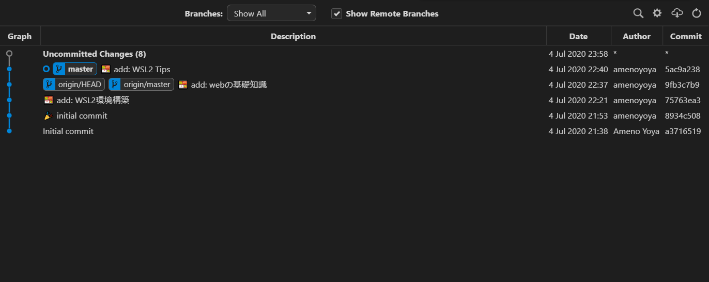

# Git入門

## Environment

- OS: `Ubuntu 20.04`
- Shell: `bash`
- Editor: `VSCode`

### Setup
```bash
# Linuxbrew で git インストール
$ brew install git

# Git 設定
$ git config --global user.name '<username>' # 好きなユーザ名を設定
$ git config --global user.email '<mail@example.dev>' # 自分のメールアドレスを設定
$ git config --global core.editor 'code -w' # VSCodeをデフォルトエディターに（-w オプションをつけないとエディタの終了を待ってくれない）
$ git config --global core.autoCRLF false # 改行コードを勝手に修正するのを無効化
$ git config --global core.quotepath false # 日本語ファイル名等をquoteするのを無効化
```

### Gitとは何か
- 分散型バージョン管理システムの一つで、もともとLinuxのソースコードを効果的に管理するために開発された
- ファイルの状態を好きなときに更新履歴として保存しておくことができる
    - 一度編集したファイルを過去の状態に戻したり、編集箇所の差分を表示したりすることができる
- GitHub や GitLab などの Gitサーバを利用すると、複数人でファイルの共有・編集などを行うことができる
- 複数人で同じファイルを別々に編集した場合、「コンフリクト」という形で警告メッセージが表示されるため、知らない間に他人の編集内容を上書きしてしまう失敗が起こらない

***

## 基本コマンド

### リポジトリの作成
- **リポジトリ**
    - ファイル、プログラム、設定情報等の「保管場所」のこと
    - Gitでは、バージョン管理する上で必要な変更履歴等を保存しておく場所のことを言う
    - リポジトリを作ることで Git によるバージョン管理が可能となる
- ローカルリポジトリとリモートリポジトリ
    - ローカルリポジトリとは、自身のPC上で作成した Git リポジトリのこと
    - リモートリポジトリとは、GitHub や GitLab など、サーバ上に保管されている Git リポジトリのこと
    - 基本的にリモートリポジトリは複数人で作業する場合に利用することが多い
        - 複数人開発の基本的な流れ
            1. 各個人がローカルリポジトリで作業履歴を記録
            2. リモートリポジトリにローカルリポジトリの記録を push（アップロード）
            3. 各個人がリモートリポジトリから最新のコードをローカルリポジトリに pull（ダウンロード）
            4. 1 に戻って、それぞれ作業する

```bash
$ git init
```

- カレントディレクトリをGitのリポジトリ（データ倉庫）にする
- `.git` ディレクトリが作成される
- カレントディレクトリがそのまま作業ディレクトリになる
    - `git init <ディレクトリ名>` で特定のディレクトリをリポジトリにすることも可能

### リポジトリのクローン
```bash
$ git clone <クローン元リポジトリ> [クローン先ディレクトリ]
```

- クローン元リポジトリをクローン先ディレクトリ（指定しない場合はカレントディレクトリに同名ディレクトリを作成）にコピーする
- リモートリポジトリをローカルにダウンロードする場合に使われることが多い

```bash
# 例: GitHub から hogehoge/example.git というリポジトリをダウンロード
$ git clone https://github.com/hogehoge/example.git
# => カレントディレクトリに example ディレクトリが作成され、example.git の中身がクローンされる

# 例: 上記リポジトリを /usr/local/src/example/ にダウンロードしたい場合
$ git clone https://github.com/hogehoge/example.git /usr/local/src/example
```

### Gitの設定
```bash
$ git config --global <設定名> <設定値>
```

- `--global` を省略した場合（もしくは `--local` を指定した場合）は、現在のリポジトリでのみ有効な設定となる
- gitのglobal設定は `~\.gitconfig` ファイルに保存されている
- 基本的な設定値は「Setup」の項に記載した通り

### 設定値の確認・削除
```bash
# 設定値の確認
$ git config [--global] <確認したい設定の名前>

# 全設定の一覧表示
$ git config [--global] --list

# 設定値の削除
$ git config [--global] --unset <削除したい設定の名前>
```

### ステージングへの追加
- **ステージング**
    - 一般的には動作の最終チェック等を行うための場のこと
    - Git においては、作業記録を保存（コミット）する対象のファイルを置いておく場所のこと
    - ステージングがあることにより、1つのコミットに含める変更内容をファイル単位で細かく制御できる

```bash
# 対象のファイル or ディレクトリを作業記録保存（コミット）の対象に追加する
$ git add <ファイル or ディレクトリ>

# 変更のあったすべてのファイル・ディレクトリをステージングに追加
$ git add --all
```

### ステージングに登録した内容を取り消す
```bash
# 対象のファイル・ディレクトリ（省略した場合はすべて）をステージングから下ろす
## コミット対象から外すだけで、変更内容まで消されることはない
$ git reset [ファイル・ディレクトリ]

# 最後の作業記録（コミット）の状態までファイル・ディレクトリを戻したい場合は --hard を指定する
$ git reset --hard [ファイル・ディレクトリ]
```

### コミットする
- **コミット**
    - ステージングに上げられている変更内容を記録すること
    - コミットすることで初めて作業履歴を辿れるようになる

```bash
$ git commit
# => git config core.editor で設定したエディタが立ち上がらる
# => コミットメッセージ（作業記録の内容に関するコメント）を記述するとコミットされる

# エディタを立ち上げずに一行のコミットメッセージを指定して即時コミットする場合
$ git commit -m '<コミットメッセージ>'
```

### 現在の状態を確認
```bash
# 変更状態を確認
## ファイル・ディレクトリを省略した場合は全ての変更状態を取得
## - 赤文字: ステージングに上げられていないが、変更されているファイル・ディレクトリ
## - 緑文字: ステージングに上げられているファイル・ディレクトリ（次のコミットで変更内容が保存されるもの）
$ git status [ファイル・ディレクトリ]

# 変更内容の差分を確認
## ファイル・ディレクトリを省略した場合は全ての変更差分を取得
$ git diff [ファイル・ディレクトリ]
```

- コミットする前に必ず状態を確認しておく癖をつけると良い
- 状態を確認することで、作業記録に一緒につけておきたかった変更がステージングに上げられていないことが分かったり、まだ記録するつもりのなかった変更がコミットされることを防ぐことができる

### コミットログの確認
```bash
$ git log
$ git log -n <表示件数>  # 表示件数を指定
$ git log --oneline  # 1コミット1行で表示
$ git log --grep="<検索パターン>"  # コミットコメントで検索
$ git log <ファイル>  # 特定のファイルのコミットログだけ確認
$ git log --graph  # グラフ形式で表示
```

- コミットログは、コマンドで確認するよりも GUI の Git クライアントを使った方が見やすい
- エディタに VSCode を使っている場合は、`Git Graph` プラグインがオススメである
    - VSCode > `F1` キー > `Git Graph: View Git Graph` から以下のようなコミットログを確認することができる



### ファイル削除
```bash
$ git rm <削除するファイル・ディレクトリ>
```

- リポジトリの管理からファイルを削除する
- 作業ディレクトリからも物理的にファイルが削除される

### 特定のリビジョン（作業履歴）に戻る
```bash
$ git checkout <コミットハッシュ> [ファイル・ディレクトリ]
```

- ファイルの状態を、指定したコミットハッシュの時点まで戻す
- ファイル・ディレクトリを指定した場合は、指定したファイル・ディレクトリのみ特定のリビジョンに戻せる
- コミットハッシュは `git log` で確認

### 過去のコミットを打ち消す
```bash
$ git revert <コミットハッシュ>

# mergeコミットを打ち消したい場合
$ git revert -m 1 <mergeコミットハッシュ>
```

- 過去のコミットを削除するのではなく、打ち消す形で新規にコミットを行う
    - そのため、打ち消した内容を修正してもう一度コミットした場合は revertコミットに対して revertコミットする必要がある
    - 作業が非常に複雑化するため極力使わない
        - 例えば、何らかの feature ブランチで revert を行い、revert の revert を行った状態で develop, master にした場合、develop, master それぞれのブランチでも revert の revert が必要になる
        - これは複数人で開発を行っていると事故の元になるため、避けるべき事案である

### 現在の変更内容を取り消す
```bash
# ファイル・ディレクトリを指定
$ git checkout HEAD <ファイル・ディレクトリ>

# 全ファイル一括で取り消す
$ git reset --hard
```

- 上記コマンドは、リモートリポジトリに push する前の段階で使うべきコマンド
- リモートリポジトリに push してしまった後は、revert で過去のコミットを打ち消すしかない
    - reset を行うと変更履歴が通常と異なる状態になり、リモートリポジトリに保管されている履歴と異なる履歴とみなされてしまうため
    - リモートリポジトリに対する強い編集権限がある場合は、`--force` オプションで強制 push 可能なため、revert するよりは reset => 強制 push した方が良い場合も多い

### リポジトリに登録されていないファイルを削除
```bash
# 削除されるファイルを確認
$ git clean -n

# 登録されていないファイルを全削除
$ git clean -f
```

### ブランチの作成
- **ブランチ**
    - 複数人で並行して作業する際に、履歴の流れを分岐して記録するための仕組み
    - 履歴の本流は `master` ブランチ
        - 最初に `git init` でリポジトリを作った段階で、自動的に `master` ブランチに作業履歴が記録される状態になっている
    - 分岐したブランチは他のブランチとマージすることで一つのブランチにまとめ直すことが可能
    - ブランチの運用方法については [git-flow.md](./git-flow.md) を参照

```bash
$ git branch <ブランチ名>

# ブランチを作る場合、大抵そのブランチで作業を行いたいはずなので
# 以下のコマンドで、ブランチの作成と切り替えを同時に行うことが多い
$ git checkout -b <ブランチ名>
```

### 存在するブランチの確認
```bash
$ git branch
* master
  develop
```

- `-v` オプションを付けると、ブランチのハッシュやコミットコメントも確認可能
- `-a` オプションをつけると、リモートブランチも確認可能

### ブランチの切り替え
```bash
# 対象のブランチのHEAD(最新状態)に切り替え
$ git checkout <ブランチ名>

# 新規ブランチを作成して切り替え
$ git checkout -b <ブランチ名>

# 新規ブランチをリモートブランチと同期して切り替え
$ git checkout -b <ブランチ名> <リモートリポジトリ名>/<ブランチ名>
```

### ブランチのマージ
```bash
$ git merge <マージするブランチ名>
```

- 現在作業しているブランチに対象のブランチをマージする
    - そのため、マージしたいブランチに一度 checkout してから merge を行う必要がある
- 競合（コンフリクト）が発生した場合は、競合を解決してから `git add` => `git commit` する

### ブランチの削除
```bash
$ git branch -d <ブランチ名>
```

- マージしていないコミットがある場合はエラーになるため、マージしてから削除すること
    - もしくは `--force` オプションをつければ強制削除も可能
    - 強制削除した場合、そのブランチで行われた全ての作業履歴が失われるため要注意

### タグの作成
```bash
# 名前だけのタグ(軽量タグ)を作成
$ git tag <タグ名>

# コメント付きのタグ(注釈付きタグ)を作成
$ git tag -a <タグ名> -m "<コメント>"
```

- タグをつけることで重要なコミット（作業記録）を検索しやすくなる
- 一般的には、プログラムをリリースする際に、バージョンをタグにして記録することが多い

### タグの確認
```bash
# 登録タグ一覧確認
$ git tag

# 指定タグの詳細表示
$ git show <タグ名>
```

### タグの削除
```bash
$ git tag -d <タグ名>
```

### リモートリポジトリの登録
```bash
$ git remote add <認識名> <リモートリポジトリURL>
```

- GitHub や GitLab 等のWeb上のリポジトリを登録する
- リモートリポジトリを登録することで、そのリポジトリにローカルの作業履歴を push（アップロード）することができるようになる
- 通常リモートリポジトリは1つしか使わないため、認識名は慣例的に `origin` を使うことが多い
    - `git clone` でリポジトリをクローンした場合、クローン元のリポジトリパス（URL）が `origin` という認識名で登録されている

### 登録されているリモートリポジトリを確認
```bash
$ git remote  # -v オプションを付けると詳細を確認できる
```

### 登録されているリモートリポジトリから最新のコードを取得
```bash
# 認識名を指定するとリモートリポジトリとして登録されているものの中から該当の認識名のリモートリポジトリのコードのみ取得可能
# ブランチ名を指定すると、指定ブランチの最新コードのみ取得可能
$ git pull [認識名] [ブランチ名]
```

### 登録されているリモートリポジトリにローカルリポジトリの作業記録を反映
```bash
$ git push <認識名> <ブランチ名>

# -u で指定認識名をデフォルトの push 先に登録しつつ push 可能
$ git push -u <認識名> <ブランチ名>
# => 以降は git push のみでリモートリポジトリに push できるようになる

# リモートリポジトリに全てのブランチの作業記録を push する場合
$ git push --all <認識名>

# リモートリポジトリのブランチを削除する場合
$ git push --delete <認識名> <削除するブランチ名>
```

### リモートリポジトリの登録削除
```bash
$ git remote remove <認識名>
```

***

## .gitignore

- **.gitignore**
    - Git リポジトリで管理したくないファイルを指定する設定ファイル
    - 個人情報や機密情報を含むファイルなどは記録を残すとセキュリティ上良くないため、gitignore する必要がある
    - ライブラリなど、外部からダウンロードして使うようなファイルも Git 管理しない方が良い
    - その他、Git 管理するには巨大すぎるデータファイルなども gitignore の対象である
- Web開発上の注意点:
    - 基本的にエンジニア以外の人間が追加・編集する可能性のあるファイルは全て gitignore しておく必要がある
        - Git による巻き戻りが発生する可能性があり、余計なトラブルの原因になる
        - Web開発を行う場合は、ファイルの責任所在を明確にしたうえで契約を結ぶべきである

### 基本
- `.gitignore` ファイルを使うと無視する（Git の管理対象外とする）ファイル・ディレクトリを指定できる
- `.gitignore` は複数のディレクトリに置くことができる
    - `.gitignore` は、自身の階層以下のパスに置かれたファイル・ディレクトリに対してのみ効果を発揮する
    - 深い階層の `.gitignore` に書かれた指定の方が優先順位が高い（後に解釈される）
- `.gitignore` 内の記述は上の行から順に以下のように解釈される
    - 先頭に `/` を含まない行（`file` など）
        - `.gitignore` 以下の階層における**全サブディレクトリ下**にある指定名の**ファイル・ディレクトリ**を無視する
    - 末尾以外に `/` を含む行（`/file`, `/path/to/file`, `path/to/file` など）
        - `.gitignore` が置いてあるディレクトリをカレントディレクトリとする**相対パス**で指定される**ファイル・ディレクトリ**を無視する
    - 末尾のみ `/` を含む行（`directory/` など）
        - `.gitignore` 以下の階層における**全サブディレクトリ下**にあるこの名前の**ディレクトリ**を無視する
    - 末尾以外にも末尾にも `/` を含む行（`/directory/`, `/path/to/directory/`, `path/to/directory/` など）
        - `.gitignore` が置いてあるディレクトリをカレントディレクトリとする**相対パス**で指定される**ディレクトリ**を無視する
    - `!` で始まる行（`!/path/to/file` など）
        - `!` 以降のパターン文字列が示すファイル・ディレクトリを**無視しない**
        - 前の無視指定を上書きする
        - 以降の無視指定に上書きされうる
    - 空行 or `#` で始まる行
        - 解釈されない

以下のようなディレクトリ構成の場合、`.gitignore` に`file`とだけ書くと、`file` も `directory/file` も共に無視されることに注意！

```
./
|_ .git/
|_ .gitignore
|_ file
|_ directory/
    |_ file
```

`.gitignore` と同ディレクトリにある `file` のみを無視したい場合は、`/file`と書く必要がある

なお、Gitリポジトリのルート、あるいはOSのルートからの絶対パス指定をする方法はない

`.gitignore` は自身と同じか下の階層のファイル・ディレクトリにしか影響を及ぼさない

### ワイルドカード
`.out` という拡張子のファイルをまとめて無視したい場合 `*.out` のように記述できる

このようなワイルドカードの類には以下のようなものがある

- `*`
    - `/` 以外の0文字以上の文字列にマッチ
    - シェルのパス名展開で使われる `*` と同じ意味
- `?`
    - `/` 以外の1文字にマッチ
    - シェルのパス名展開で使われる `?` と同じ意味
- `[0-9]` など
    - `/` 以外の指定した1文字にマッチ
    - シェルのパス名展開で使われる `[0-9]` などと同じ意味
- `**`
    - 0個以上の**ファイル・ディレクトリ**にマッチ
    - 例:
        - `/a/**`: `/a`, `/a/x`, `/a/x/y` などにマッチ
        - `/**/b`: `/b`, `/x/b`, `/x/y/b` などにマッチ
        - `/a/**/b`: `/a/b`, `/a/x/b`, `/a/x/y/b` などにマッチ
