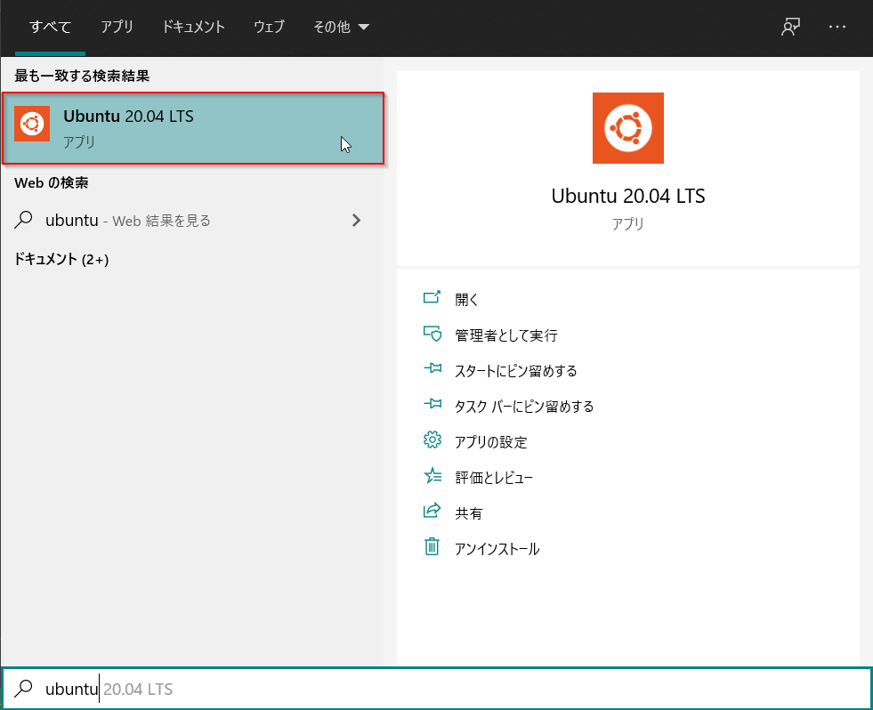
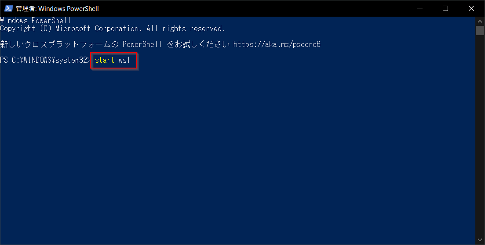
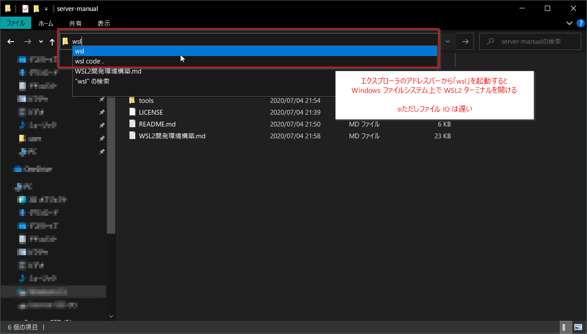
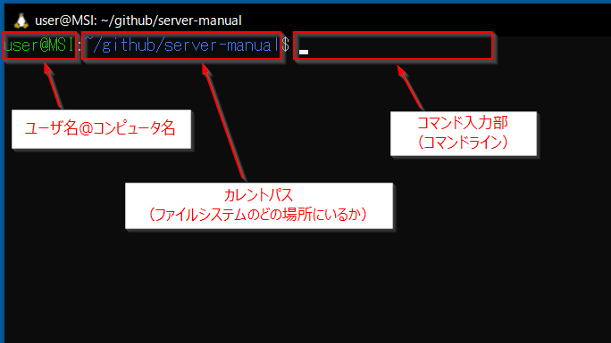
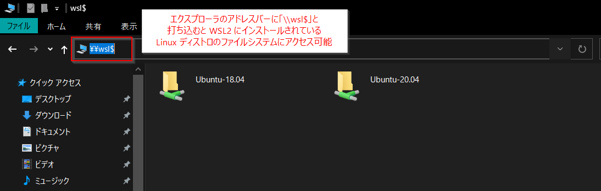
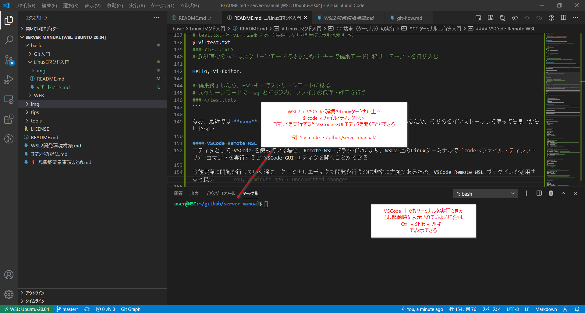
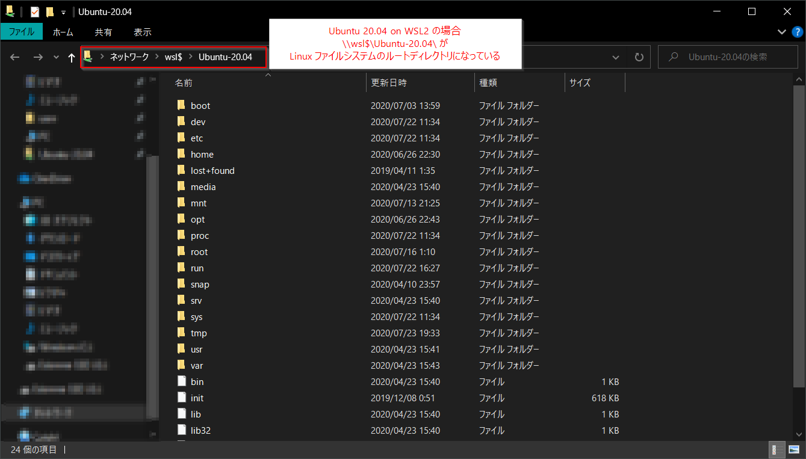
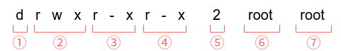

# Linuxコマンド入門

## GUI と CLI

グラフィカルユーザインターフェイス（GUI）は、アイコンやボタンなどにより直観的にコンピュータを扱うことができる

しかしながら GUI では、あらかじめ提供されている機能しか扱えなかったり、柔軟なコンピュータ操作には向いていない

また、操作手順の共有のために画像のマニュアルが必要になるなど、不便なことも多い

一方でコマンドラインインターフェイス（CLI）は、コンピュータをより柔軟に操作する強力な手段であり、手順の共有も容易である

CLI のデメリットとしては、実行したいタスクをコマンドとして入力しなければならないため、覚えるべきことが多かったり、直観的でなかったりすることが挙げられる

しかしながら、操作に慣れてしまえば、コマンドを組み合わせて様々なタスクを柔軟に実行することができるようになる

### コマンドの書き方
以下に典型的なコマンドラインコマンドの例を示す

```bash
$ rm -f foo.txt
```

このコマンドは `foo.txt` を強制的に削除することをコンピュータに命令している

コンピュータは命令を受け、実際に `foo.txt` を削除する

本マニュアルにおけるコマンドの基本的な書き方については [コマンドの記法](../../コマンドの記法.md) を参照すること

***

## 端末（ターミナル）の実行

コマンドラインコマンドを実行するには、最初にターミナル（コマンドラインを提供するプログラム。通称「黒い画面」）を起動する必要がある

※ 本マニュアルは WSL2 仮想環境上に Linux (Ubuntu 20.04) がインストールされている前提で話を進めるため、以降の解説は各環境に合わせて読み替えること

WSL2 では、主に以下のような手順でターミナルを起動することができる

1. Windowsスタートメニュー > `Ubuntu 20.04`
    
2. PowerShell コマンドライン > `start wsl` コマンド実行
    
3. Windowsエクスプローラ > アドレスバー > `wsl` から実行
    

ターミナルの構成要素は下図の通りである



### ファイルシステムの違いについて
上記 3 の方法でターミナルを起動した場合、カレントパスが `/mnt/c/...` という形式になっていることがある

これは、Windowsファイルシステムの `C:\...` を**マウント**したパスである

マウントとは、Linuxファイルシステム上に本来存在しないファイルシステムをLinuxファイルシステム内に取り込む仕組みのことである

この時注意したいのは、Windowsファイルシステムは通常、NTFS と呼ばれるフォーマットで、一般的なLinuxファイルシステムのフォーマットである ext4 と異なるということである

このファイルシステムフォーマットの違いにより、WSL2 をWindowsファイルシステム上で動かすと、ファイルの読み書きが遅いという問題がある

そのため、WSL2 は基本的にLinuxファイルシステム上で動かすことを推奨している

Ubuntu 20.04 on WSL2 の場合、そのLinuxファイルシステムは、Windowsエクスプローラのアドレスバーで `\\wsl$\Ubuntu-20.04` と打ち込んだ時に確認できる




### 最初のコマンド
"Hello, World" をターミナル上に表示する

`echo` コマンドは、引数に文字列を受け取り、その文字列をターミナル上に表示することができる

```bash
# echo ... で ... を表示する
$ echo Hello, World
Hello, World

# '' や "" で囲むことで、それが一つの文字列であることを明示する
$ echo 'Hello, World'
Hello, World

$ echo "Hello, World"
Hello, World

# "" で囲んだ場合、"$変数名" を変数の中身で展開することができる
$ echo "私のユーザIDは $UID です"
私のユーザIDは 1000 です

# ※ ↑のユーザIDは環境により異なる

# '' で囲んだ場合、'$変数名' はそのまま表示される
$ echo '私のユーザIDは $UID です'
私のユーザIDは $UID です

# '' や "" で囲むとき、終わりのクオートを忘れたとき、続きの入力を促される
$ echo 'Hello, World
> # 続きの文字列を入力できる => 終わりのクオートが入力されるまで続く
> # 入力の途中でコマンド実行を中断したい場合は Ctrl + C キーを打つ
```

### マニュアルページ
`man` コマンドは、引数に渡されたコマンドのマニュアルページを表示する

使い方の分からないコマンドがある場合、とりあえず `man <コマンド名>` コマンドを実行すると良い

```bash
# echo コマンドのマニュアルページを表示
$ man echo
# => マニュアルページが開く
### <man>
名前
       echo - 1 行のテキストを表示する

書式
       echo [SHORT-OPTION]... [STRING]...
       echo LONG-OPTION
説明
        :
### </man>

# マニュアルページは q キーを打つことで終了できる
# マニュアルページでのキー操作が分からなくなった場合は h キーでヘルプページを表示できる
```

### ターミナルエディタ入門
ターミナル上でファイルの編集を行いたい場合、ターミナルエディタを使わなければならない場面が出てくる

伝統的なLinuxのターミナルエディタは **vi(vim)** というエディタであり、`vi <ファイル名>` というコマンドで対象ファイルを編集する vi エディタが起動する

この vi エディタは操作方法が独特であり、慣れない内は戸惑うことも多いため、[viチートシート](./viチートシート.md) を見ながら操作すると良いかもしれない

最も基本的な使い方は以下の通りである

```bash
# test.txt を vi で編集する（存在しない場合は新規作成する）
$ vi test.txt
### <test.txt>
# 起動直後の vi はスクリーンモードであるため i キーで編集モードに移り、テキストを打ち込む

Hello, Vi Editor.

# 編集終了したら、Esc キーでスクリーンモードに移る
# スクリーンモードで :wq と打ち込み、ファイルの保存・終了を行う
### </test.txt>
```

なお、最近では **nano** という、よりユーザフレンドリーなターミナルエディタもあるため、そちらをインストールして使っても良いかもしれない

#### VSCode Remote WSL
エディタとして VSCode を使っている場合、Remote WSL プラグインにより、WSL2 上のLinuxターミナルで `code <ファイル・ディレクトリ>` コマンドを実行すると VSCode GUI エディタを開くことができる

今後実際に開発を行っていく際は、ターミナルエディタで開発を行うのは非常に大変であるため、VSCode Remote WSL プラグインを活用すると良い



***

## Linuxファイルシステム

### コマンドライン記法
ここでは、ログインユーザ名と作業ディレクトリ（カレントディレクトリ）を明示するため、以下のように記述する

```bash
# 基本コマンドライン記法
<ユーザ名>@<コンピュータ名> <カレントディレクトリ>$ <コマンド>

# 以下の条件の場合
## ログインユーザ: user
## コンピュータ名: local
## カレントディレクトリ: ホームディレクトリ（~）
user@local ~/$
```

### Linuxのディレクトリ構造
Linuxのディレクトリ構造は `FHS(Filesystem Hierarchy Standard)` という規格によって統一化が図られており、基本的に以下のような構造となっている

```bash
/ # ルートディレクトリ: Linuxシステムの全てがこの中に入っている
| ## このディレクトリを削除するとシステムの全てが消え去るため注意！
|
|_ bin/ # 一般ユーザ向けの基本コマンドを格納
|       ## PATH: /bin/
|
|_ boot/ # システム起動に必要なファイルを格納
|        ## PATH: /boot/
|
|_ dev/ # デバイスファイルを格納
|       ## PATH: /dev/
|
|_ etc/ # 各種設定ファイルを格納 (PATH: /etc/)
|  |_ opt/  # optの設定ファイル格納 (PATH: /etc/opt/)
|  |_ X11/  # X Window System v11用の設定ファイル格納 (PATH: /etc/X11/)
|  |_ sgml/ # SGMLの設定ファイル格納 (PATH: /etc/sgml/)
|  |_ xml/  # XMLの設定ファイル格納 (PATH: /etc/xml/)
|
|_ home/ # ユーザホームディレクトリ (PATH: /home/)
|  |_ <user>/ # ユーザ名ごとのディレクトリがある (PATH: /home/<user>/)
|  :          ## 通常、ログイン中のユーザのホームディレクトリ (~) がここになっている
|             ## 例: fooユーザのホームディレクトリ ~foo = /home/foo/
|
|_ lib/ # 共有ライブラリを格納
|       ## PATH: /lib/
|
|_ mnt/ # ファイルシステムの一時的なマウントポイント用ディレクトリ
|       ## PATH: /mnt/
|
|_ media/ # CD-ROMなどのリムーバブル媒体(media)のマウントポイント
|         ## PATH: /media/
|
|_ opt/ # 実行時に書き換えられないアプリケーションソフトウェアパッケージを格納
|       ## PATH: /opt/
|
|_ proc/ # カーネルやプロセスに関する情報をテキストで表示する仮想ファイルシステム
|        ## PATH: /proc/
|
|_ root/ # rootユーザ用ホームディレクトリ
|        ## PATH: /root/
|
|_ sbin/ # システム管理用コマンドを格納
|        ## PATH: /sbin/
|
|_ tmp/ # ファイルなどを一時的に保管するディレクトリ
|       ## PATH: /tmp/
|
|_ srv/ # システムに提供されたサイト固有のデータを格納
|       ## PATH: /srv/
|
|_ usr/ # プログラムやカーネルソースを格納 (PATH: /usr/)
|  |_ bin/     # /bin/ と同じだが、基本コマンドではない (PATH: /usr/bin/)
|  |_ include/ # 標準includeファイル格納 (PATH: /usr/include/)
|  |_ lib/     # /lib/ と同類 (PATH: /usr/lib/)
|  |_ sbin/    # /sbin/ と同じだが、基本的なシステムコマンドではない (PATH: /usr/sbin/)
|  |_ share/   # アーキテクチャに依存しない共有データ (PATH: /usr/share/)
|  |_ src/     # ソースコード（カーネルのソースコード・ヘッダファイル）(PATH: /usr/src/)
|  |_ X11R6/   # X Window System v11 Release 6 (PATH: /usr/X11R6/)
|  |_ local/   # ホスト固有のローカルデータを格納する第三階層 (PATH: /usr/local/)
|     |_ bin/  # ホスト固有のコマンドを格納 (PATH: /usr/local/bin/)
|
|_ var/ # システムログなどの動的に変化するファイルを格納 (PATH: /var/)
   |_ lock/  # 使用中リソースを保持するファイル格納 (PATH: /var/local/)
   |_ log/   # 各種ログファイル格納 (PATH: /var/log/)
   |_ mail/  # ユーザのメールボックス (PATH: /var/mail/)
   |  |_ <user> # ユーザ名ごとのメールボックスがある (PATH: /var/mail/<user>/)
   |  :
   |
   |_ run/   # ブート以降の走行中システムに関する情報 (PATH: /var/run/)
   |_ spool/ # 処理待ち状態のタスクのスプール (PATH: /var/spool/)
   |  |_ mail/ # 互換のために残された、かつてのユーザメールボックス
   |           ## PATH: /var/spool/mail/
   |
   |_ tmp/   # 一時ファイル置場 (マルチユーザモードではこちらの使用が推奨される)
             ## PATH: /var/tmp/
```



### カレントディレクトリ (current directory)
Linuxのターミナルでコマンドを実行する場合には、ディレクトリツリー内のいずれかのディレクトリにユーザが存在して作業を行うことになる

その作業を行っている現在位置のディレクトリを **カレントディレクトリ** と呼ぶ

別の呼び方として **ワーキングディレクトリ** や **カレントワーキングディレクトリ** などと呼ぶこともある

カレントディレクトリを表示するには `pwd` (Print Working Directory) コマンドを実行する

```bash
# 普通に WSL2 ターミナルを起動した場合、カレントディレクトリはユーザホームディレクトリになっている
# => pwd コマンドを実行すると /home/<ユーザ名> が表示されるはず
user@local ~/$ pwd
/home/user
```

### 絶対パス (absolute path)
絶対パスとは、Linux標準ファイルシステム（FHS）におけるルートディレクトリ（`/`）からの階層位置を表す

このとき、ディレクトリ（階層）は `/` で区切られて表現される

例えば `/var/mail/user/` は、以下のような階層構造の `user` ディレクトリを示している

```bash
/
|_ var/
   |_ mail/
      |_ user/
```

Linuxシステムにおけるファイル・ディレクトリは、必ずルートディレクトリ内のいずれかの階層に存在するため、絶対パスで表記されるファイルシステム位置は一意に決まる

なお、絶対パスのことを **フルパス** と呼ぶこともある

### カレントディレクトリの移動
カレントディレクトリを移動するには `cd` (Current Directory) コマンドを実行する

例えば、ユーザホームディレクトリ（ユーザ名: `user`）の中の `.ssh` というディレクトリに移動するには、以下のコマンドを実行する

```bash
# カレントディレクトリ移動
user@local ~/$ cd /home/user/.ssh/

# カレントディレクトリの絶対パスを表示
user@local ~/.ssh/$ pwd
/home/user/.ssh
```

### 相対パス (relative path)
絶対パスはディレクトリツリー内にあるファイルやディレクトリ全てを表現できる

しかし、カレントディレクトリの下にあるファイル・ディレクトリを表現する度にいちいち絶対パスで表記していては非常に面倒である

そこで、カレントディレクトリを中心として相対的なファイルやディレクトリの位置を指定してそれらを表現できるよう **相対パス** という表記方法が利用される

例えば、カレントディレクトリが自分（ユーザ名: `user`）のホームディレクトリであり、その下にある sample というファイルの名前を記述する場合を考える

絶対パスであれば `/home/user/sample` と書かなければいけないところ、相対パスでは単にファイル名である `sample` と記述するだけで済む

また、相対パス表記では、カレントディレクトリを `.`（ピリオド）で記述するため `sample` は `./sample` と記述することもできる

絶対パスと同じくディレクトリ（階層）の区切り文字が `/` のため、`./sample` は「カレントディレクトリの下の sample」という意味になる原理である

次に、カレントディレクトリよりも上にあるディレクトリへ相対パスでアクセスするための表記について説明する

一つ上のディレクトリ（**親ディレクトリ** とも呼ぶ）は、相対パス表記では、`..`（ピリオド2つ）で表現される

例えば、ユーザホームディレクトリがカレントディレクトリの場合、親ディレクトリである `/home/` へ移動するには、以下のように記述できる

```bash
# カレントディレクトリ確認
user@local ~/$ pwd
/home/user/

# 親ディレクトリに移動
user@local ~/$ cd ..

# カレントディレクトリ表示
user@local /home/$ pwd
/home/
```

### パス指定で利用される記号
| 記号 | 意味 |
| :--: | :-- |
| `/`  | `/` 単体で記述した場合は、ルートディレクトリを意味し、それ以外はディレクトリ（階層）の区切り文字と見なす |
| `.`  | カレントディレクトリを意味する |
| `..` | 一つ上のディレクトリ（親ディレクトリ）を意味する。二つ上のディレクトリは `../..` で表記される |
| `~`  | 自分のホームディレクトリを意味する |
|`~user`| ユーザ名 `user` のホームディレクトリを意味する |

***

## Linuxのファイル操作

### ファイル一覧の確認
カレントディレクトリ内のファイル・ディレクトリ一覧を確認するには `ls` コマンドを実行する

```bash
# 一旦ルートディレクトリに移動
user@local ~/$ cd /

# カレントディレクトリ内のファイル・ディレクトリ一覧を表示
user@local /$ ls
bin  boot  dev  etc  home  init  lib  lib32  lib64  libx32  lost+found  media  mnt  opt  proc  root  run  sbin  snap  srv  sys  tmp  usr  var
```

#### 詳細なファイル一覧表示
ただの `ls` コマンドではファイルとディレクトリの違いが分からないため `-l` オプションと併用することが多い

表示結果の各行の先頭がそのファイル種類を意味する

- `-`: ファイル
- `d`: ディレクトリ
- `l`: リンク（別のファイル・ディレクトリへのショートカット）

```bash
user@local /$ ls -l
lrwxrwxrwx   1 root root      7  4月 23 15:40 bin -> usr/bin
drwxr-xr-x   3 root root   4096  7月  3 13:59 boot
drwxr-xr-x   7 root root   2760  7月 22 11:34 dev
drwxr-xr-x 134 root root  12288  7月 22 11:34 etc
drwxr-xr-x   4 root root   4096  6月 26 22:30 home
-rwxr-xr-x   3 root root 631968 12月  8  2019 init
lrwxrwxrwx   1 root root      7  4月 23 15:40 lib -> usr/lib
lrwxrwxrwx   1 root root      9  4月 23 15:40 lib32 -> usr/lib32
lrwxrwxrwx   1 root root      9  4月 23 15:40 lib64 -> usr/lib64
lrwxrwxrwx   1 root root     10  4月 23 15:40 libx32 -> usr/libx32
drwx------   2 root root  16384  4月 11  2019 lost+found
drwxr-xr-x   2 root root   4096  4月 23 15:40 media
drwxr-xr-x   6 root root   4096  7月 13 21:25 mnt
drwxr-xr-x   3 root root   4096  6月 26 22:43 opt
dr-xr-xr-x 209 root root      0  7月 22 11:34 proc
drwx------   2 root root   4096  7月 16 01:10 root
drwxr-xr-x  10 root root    280  7月 22 16:27 run
lrwxrwxrwx   1 root root      8  4月 23 15:40 sbin -> usr/sbin
drwxr-xr-x   2 root root   4096  4月 10 23:57 snap
drwxr-xr-x   2 root root   4096  4月 23 15:40 srv
dr-xr-xr-x  11 root root      0  7月 22 11:34 sys
drwxrwxrwt  61 root root  32768  7月 23 19:33 tmp
drwxr-xr-x  14 root root   4096  4月 23 15:41 usr
drwxr-xr-x  13 root root   4096  4月 23 15:43 var
```

#### 隠しファイル
Linuxファイルシステムでは `.` から始まるファイル名は **隠しファイル** (Hidden File) と呼ばれる

この時、カレントディレクトリとの違いに注意する

- `./sample`: カレントディレクトリ内の「sample」というファイル（もしくはディレクトリ）
- `.sample`: 「sample」という名前の隠しファイル（もしくは隠しディレクトリ）

隠しファイルは通常の `ls` コマンドでは表示できないため、設定ファイル等のあまり触ってほしくないファイルであることが多い

```bash
# 何も作業を行っていない場合、ユーザホームディレクトリには何も入っていないように見える
user@local ~/$ ls

# 隠しファイル・ディレクトリを表示するには -a オプションをつける
## ファイル・ディレクトリの区別を行うため -l オプションもつける
user@local ~/$ ls -la
drwxr-xr-x 23 user user      4096  7月 23 19:25 .  # カレントディレクトリ
drwxr-xr-x  4 root root      4096  6月 26 22:30 .. # 親ディレクトリ
drwxr-xr-x  3 user user      4096  6月 26 23:07 .ansible
drwxr-xr-x  4 user user      4096  7月  3 13:25 .anyenv
drwxr-xr-x  2 user user      4096  6月 27 00:26 .aws
-rw-------  1 user user    436510  7月 23 19:25 .bash_history
-rw-r--r--  1 user user       220  6月 26 22:20 .bash_logout
-rw-r--r--  1 user user      4241  7月 23 12:18 .bashrc
drwxr-xr-x 12 user user      4096  7月  7 15:42 .cache
drwx------ 13 user user      4096  7月  3 16:24 .config
drwxr-xr-x  6 user user      4096  6月 26 22:36 .cpan
drwx------  3 user user      4096  6月 30 20:51 .dbus
-rw-r--r--  1 user user       114  7月  4 23:26 .gitconfig
drwxr-xr-x  2 user user      4096  6月 26 22:20 .landscape
drwxr-xr-x  3 user user      4096  6月 30 14:11 .local
drwxr-xr-x  2 user user      4096  6月 30 17:47 .mume
drwxr-xr-x  5 user user      4096  7月 20 00:24 .npm
-rw-r--r--  1 user user      1338  7月  3 15:38 .profile
drwxr-xr-x  2 user user      4096  7月 13 15:50 .ssh
```

### ファイル作成
ファイルを新規作成する場合は `touch` コマンドを使う

```bash
# test.txt をカレントディレクトリに新規作成する
user@local ~/$ touch test.txt

# カレントディレクトリ内ファイル一覧を確認
user@local ~/$ ls -l
-rw-r--r--  1 user user        0  7月 23 21:47 test.txt

# test.txt には中身がないので vi ターミナルエディタ等を使って編集する
## touch コマンドを使わずに直接 vi エディタで新規作成することも可能
user@local ~/$ vi test.txt
```

### ファイルコピー
`cp <コピー元ファイル> <コピー先ファイル>` コマンドでファイルをコピーできる

```bash
# カレントディレクトリにある test.txt を test_copy.txt にコピーする
user@local ~/$ cp test.txt test_copy.txt

# カレントディレクトリ内ファイル一覧を確認
user@local ~/$ ls -l
-rw-r--r--  1 user user        0  7月 23 21:47 test.txt
-rw-r--r--  1 user user        0  7月 23 21:50 test_copy.txt
```

### ファイルの移動
コピーではなく移動を行う場合は `mv` コマンドを使う

`mv` コマンドは、ファイルのリネームにも使われるコマンドである

```bash
# カレントディレクトリにある test_copy.txt を test2.txt に移動（リネーム）
user@local ~/$ mv test_copy.txt test2.txt

# カレントディレクトリ内ファイル一覧を確認
user@local ~/$ ls -l
-rw-r--r--  1 user user        0  7月 23 21:47 test.txt
-rw-r--r--  1 user user        0  7月 23 21:50 test2.txt
```

### ファイルリダイレクトとファイル閲覧
通常、`echo <テキスト>` コマンドを実行したとき、テキストはターミナル上に表示される

しかし、これをファイルに反映させることも可能である

コマンドの実行結果をターミナルではなくファイルに反映させる処理を **リダイレクト** と呼ぶ

```bash
# "Hello, World" をターミナル上に表示
user@local ~/$ echo 'Hello, World'
Hello, World

# ターミナルではなく test.txt にリダイレクト
user@local ~/$ echo 'Hello, World' > test.txt
# => ターミナルには何も表示されない

# ファイルの中身を確認する方法には複数の種類があるが
# ここでは cat コマンドで test.txt ファイルの中身を確認する
user@local ~/$ cat test.txt
Hello, World # <= リダイレクトしたテキストがファイルに反映されている

# 通常のリダイレクトではファイルの内容が上書きされてしまうが
# >> リダイレクトを使うとファイルの次の行に内容を追記できる
user@local ~/$ echo 'Next Line' >> test.txt

user@local ~/$ cat test.txt
Hello, World
Next Line # <= 次の行に追記されている

# 通常リダイレクトの場合
user@local ~/$ echo '3rd Line' > test.txt
user@local ~/$ cat test.txt
3rd Line # <= 中身が上書きされている
```

### ファイル削除
`rm` コマンドでファイルを削除できる

```bash
# カレントディレクトリにある test2.txt を削除
user@local ~/$ rm test.txt

# カレントディレクトリ内ファイル一覧を確認
user@local ~/$ ls -l
-rw-r--r--  1 user user        9  7月 23 21:55 test.txt
```

### ディレクトリの操作
ディレクトリの操作は、基本的にファイル操作コマンドと同じものが使えるが、新規作成の際は `mkdir` コマンドを使う必要がある

```bash
# カレントディレクトリに test ディレクトリ作成
user@local ~/$ mkdir test

# カレントディレクトリ内ファイル一覧を確認
user@local ~/$ ls -l
drwxr-xr-x  2 user user     4096  7月 23 21:56 test
-rw-r--r--  1 user user        9  7月 23 21:55 test.txt

# カレントディレクトリにある test.txt を test ディレクトリに移動（test.txt というファイル名のまま）
user@local ~/$ mv test.txt test/test.txt

# カレントディレクトリにある test ディレクトリを test_copy ディレクトリにコピー
## ディレクトリコピーの場合、中にあるファイルも再帰的にコピーする必要があるため
## -r (--recursive) オプションをつける必要がある
user@local ~/$ cp -r test test_copy

# test_copy ディレクトリの中に移動してファイル一覧を確認
user@local ~/$ cd test_copy
user@local ~/test_copy/$ ls -l
-rw-r--r--  1 user user        9  7月 23 22:00 test.txt

# 親ディレクトリに戻って test_copy を test2 ディレクトリに移動（リネーム）
user@local ~/test_copy/$ cd ..
user@local ~/$ mv test_copy test2
user@local ~/$ ls -l
drwxr-xr-x  2 user user     4096  7月 23 21:56 test
drwxr-xr-x  2 user user     4096  7月 23 22:00 test2

# test2 ディレクトリを削除
## cp コマンド同様、中のファイルも再帰的に削除する必要があるため -r オプションをつける
user@local ~/$ rm -r test2
```

***

## ユーザとパーミッション

### ユーザ
Linuxシステムには **ユーザ** という概念があり、ユーザごとに実行できるコマンドに制限があったり、特定のファイル・ディレクトリへのアクセス権限が決まっていたりする

ユーザは大まかに「一般ユーザ」と「rootユーザ」に分けられ、rootユーザはLinuxシステムにおける唯一神である

rootユーザはシステムのあらゆる操作が可能であり、システムそのものを破壊することもできるため、極力使用しないのが一般的である

一般ユーザの中には、rootの権限を借りてコマンド実行する権限を所有しているものもあり、`sudo <コマンド>` という形でroot権限コマンドを実行することができる

```bash
# システム内に定義されているユーザは /etc/passwd というファイルに全て記述されている
## WSL2 の初期ユーザはこのファイルを特に制限なく閲覧できるが、場合によってはroot権限が必要かもしれない
## $ sudo cat /etc/passwd
$ cat /etc/passwd
root:x:0:0:root:/root:/bin/bash
daemon:x:1:1:daemon:/usr/sbin:/usr/sbin/nologin
bin:x:2:2:bin:/bin:/usr/sbin/nologin
sys:x:3:3:sys:/dev:/usr/sbin/nologin
 :
```

### グループ
Linuxシステムには **グループ** という概念があり、複数のユーザを効率的に管理するための仕組みが備わっている

ユーザは必ず一つの「主グループ」に所属し、任意の「副グループ」に所属することができる

主グループは1つだけ設定され、所属必須だが、副グループは0～複数設定可能である

```bash
# システム内に定義されているグループは /etc/group というファイルに全て記述されている
## WSL2 の初期ユーザはこのファイルを特に制限なく閲覧できるが、場合によってはroot権限が必要かもしれない
## $ sudo cat /etc/group
$ cat /etc/group
root:x:0:
daemon:x:1:
bin:x:2:
sys:x:3:
 :
```

### パーミッション
Linuxファイルシステムには **パーミッション** という概念があり、そのファイル（ディレクトリ）が「誰の所有するファイルか」「読み込み・書き込み・実行の権限を有するのは誰か」という権限管理ができるようになっている

このパーミッションを適切に設定しておかないと、赤の他人に大事なファイルの中身を読まれたり、システムが正常に動作しなかったりする

```bash
# ls コマンドの -l オプションは、ファイル種類だけでなくパーミッションも確認できる
## -a オプションで隠しファイルも表示
user@local ~/$ ls -la
drwxr-xr-x 23 user user      4096  7月 23 19:25 .  # カレントディレクトリ
drwxr-xr-x  4 root root      4096  6月 26 22:30 .. # 親ディレクトリ
drwxr-xr-x  3 user user      4096  6月 26 23:07 .ansible
drwxr-xr-x  4 user user      4096  7月  3 13:25 .anyenv
drwxr-xr-x  2 user user      4096  6月 27 00:26 .aws
-rw-------  1 user user    436510  7月 23 19:25 .bash_history
-rw-r--r--  1 user user       220  6月 26 22:20 .bash_logout
-rw-r--r--  1 user user      4241  7月 23 12:18 .bashrc
 :
```

上記のように、パーミッションは以下のような形式で表される



1. ファイル種別
    - `-`: ファイル
    - `d`: ディレクトリ
    - `l`: リンク（別のファイル・ディレクトリへのショートカット）
    - 上記画像の場合は「ディレクトリ」であることを表す
2. 所有ユーザの権限
    - 左から「読み込み権限」「書き込み権限」「実行権限」を表す
    - 読み込み権限を有する場合は `r`, ない場合は `-`
    - 書き込み権限を有する場合は `w`, ない場合は `-`
    - 実行権限を有する場合は `x`, ない場合は `-`
    - 上記画像の場合、「所有ユーザは読み書き実行すべての権限を有する」ことを表す
3. 所有グループの権限
    - 同上。上記画像の場合、「所有グループは読み込みと実行の権限を有する」ことを表す
4. その他ユーザの権限
    - 同上。上記画像の場合、「ファイルの所有者でも所有グループの所属でもないユーザは、読み込みと実行の権限を有する」ことを表す
5. リンクされている数、サブディレクトリの数
    - あまり重要ではないので省略
6. 所有ユーザ
    - ファイルを所有しているユーザを表す（上記画像の場合「root」が所有ユーザ）
    - 2 と合わせて考えると、このファイルは「rootユーザなら読み書き実行が可能」と言える
7. 所有グループ
    - ファイルを所有しているグループを表す（上記画像の場合「root」が所有グループ）
    - 3 と合わせて考えると、このファイルは「rootグループに所属するユーザなら、読み込みと実行が可能」と言える

なお、パーミッションは数値で表すこともあり、以下のような対応となっている

- 読み込み権限: `4`
- 書き込み権限: `2`
- 実行権限: `1`

全ての権限を有する場合は $4+2+1 = 7$ という計算になり、「所有ユーザ権限」「所有グループ権限」「その他ユーザ権限」を並べて表記する

例えば、上記画像のようなパーミッションであれば `755` となる

***

## CLI 演習

- [CLI演習](./CLI.md)
    - コマンドが生まれた経緯とUNIX哲学について学ぶ
    - コマンドラインインターフェイスに慣れるために、実際に様々なコマンドを使って処理の自動化を図る
    - コマンド操作を通じてプログラミングの基礎的な考え方を身につける
