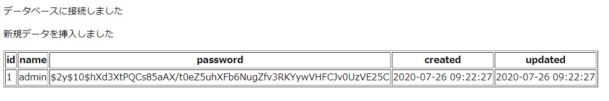

# CentOS Linux における LAMP 環境構築入門

## LAMPとは

OSである **Linux**、Webサーバである **Apache HTTP Server**、データベースである **MySQL**、スクリプト言語である **Perl, PHP, Python** を総称した頭文字から成る造語

本研修では、CentOS Linux がインストールされたコンピュータに LAMP 環境を構築し、WEBサーバとして稼働させる方法を学ぶ

なお、使用するOS, ソフトウェアはそれぞれ以下の通り

- Linux OS: `CentOS 7`
- Webサーバー: `Apache 2.4`
- スクリプト言語: `PHP 7.4`
- データベース: `MySQL 5.7`

***

## 環境準備

本来であれば、実際に CentOS 7 のインストールされたサーバ用コンピュータをレンタルして環境構築を行いたいが、お金がかかるため、今回は Docker で CentOS 7 のコンテナを作成して代用する


```bash
# WSL2 環境では docker サービスは自動起動しないため、初回起動時に service start する
$ sudo service docker start

# CentOS 7 イメージを取得
$ docker pull centos:7

# Dockerチュートリアル時に作成した webserver コンテナを削除
## 今回 webserver コンテナは centos:7 イメージから作成したいため
## ※ 同名のコンテナを複数作成することはできない
$ docker rm webserver

# webserver コンテナを centos:7 イメージから作成し、ローカルポート80番をコンテナの80番ポートに繋げる
# $ docker run [options] <image> [init_command]
## -d: daemonモード（バックグラウンドでコンテナを起動）
## -i: interactiveモード（コンテナ内でコマンド対話可能にする）
## -t: ttyモード（コンテナで仮想ターミナルを使えるようにする）
## -p <ローカルポート:コンテナポート>: ポート接続
## --privileged: コンテナ内でサービスの起動を許可（Apache 等のサービスを起動するため）
##    ※ 起動時コマンドに /sbin/init を指定してサービスを開始するように指定する
##       参考: https://qiita.com/mikene_koko/items/4c71c969f55e3fe24190
## --name <name>: コンテナ名指定
$ docker run -d -it -p 80:80 --privileged --name webserver centos:7 /sbin/init

# 起動中のコンテナを確認
## 起動時の COMMAND が "/sbin/init" になっていることを確認しておく
$ docker ps
CONTAINER ID    IMAGE        COMMAND        CREATED        STATUS            PORTS            NAMES
65aec24d3f63   centos:7   "/sbin/init"   4 seconds ago   Up 3 seconds   0.0.0.0:80->80/tcp   webserver
```

***

## CentOS 7 を日本語環境用に調整

```bash
# -- user@localhost

# webserver コンテナに接続（コンテナ内に入る）
## 正確には webserver コンテナ内の bash シェルを実行する
## -i: interactiveモード（コンテナ内でコマンド対話可能にする）
## -t: ttyモード（コンテナで仮想ターミナルを使えるようにする）
$ docker exec -it webserver bash

# -- root@docker://webserver

# yumパッケージのアップデート
## yum: CentOS のパッケージマネージャ
% yum -y update

# 日本語ロケールがあるか確認
% localectl list-locales | grep -i ja

# => 何も表示されない = 日本語ロケールが定義されていない

# 日本語ロケール定義
% localedef -f UTF-8 -i ja_JP ja_JP

# 確認
% localectl list-locales | grep -i ja
ja_JP
ja_JP.utf8

# 日本語ロケールに設定
% localectl set-locale LANG=ja_JP.UTF-8
% localectl set-keymap jp106

# ロケール確認
% localectl status
   System Locale: LANG=ja_JP.UTF-8
       VC Keymap: jp106
      X11 Layout: jp
       X11 Model: jp106
     X11 Options: terminate:ctrl_alt_bksp

# 環境変数 LANG を日本語環境に設定
% echo 'export LANG=ja_JP.UTF-8' >> ~/.bashrc
% source ~/.bashrc

# ロケール環境変数を確認
% locale
LANG=ja_JP.UTF-8
LC_CTYPE="ja_JP.UTF-8"
LC_NUMERIC="ja_JP.UTF-8"
LC_TIME="ja_JP.UTF-8"
LC_COLLATE="ja_JP.UTF-8"
LC_MONETARY="ja_JP.UTF-8"
LC_MESSAGES="ja_JP.UTF-8"
LC_PAPER="ja_JP.UTF-8"
LC_NAME="ja_JP.UTF-8"
LC_ADDRESS="ja_JP.UTF-8"
LC_TELEPHONE="ja_JP.UTF-8"
LC_MEASUREMENT="ja_JP.UTF-8"
LC_IDENTIFICATION="ja_JP.UTF-8"
LC_ALL=

# TimeZone を日本語環境に設定
% timedatectl set-timezone Asia/Tokyo

# TimeZone確認
% timedatectl status
      Local time: Sun 2020-07-26 14:22:02 JST
  Universal time: Sun 2020-07-26 05:22:02 UTC
        RTC time: Sun 2020-07-26 05:22:02
       Time zone: Asia/Tokyo (JST, +0900)
     NTP enabled: n/a
NTP synchronized: no
 RTC in local TZ: no
      DST active: n/a
```

***

## Apache（httpd）のインストール

### Apacheとは
- HTTPサーバーの一種
    - ブラウザなどから来るHTTPリクエストを受信し、サーバーからのレスポンスを返す中継ソフトウェア
    - 要するに、Webサイト等を表示するためのソフトウェアのこと
- 数年前までは、世界中で使用されているHTTPサーバーだったが、最近では nginx に首位の座を奪われようとしている
- 古くから使われていて情報が多いため、本研修では Apache をHTTPサーバーとして採用する

### インストール
```bash
# -- root@docker://webserver

# Apache (httpd) インストール
% yum install httpd

# => インストールされる httpd のバージョンを確認して「y」でインストール続行

# Apacheバージョン確認
% httpd -v
Server version: Apache/2.4.6 (CentOS)

# システム起動時 Apache サービスが自動起動するように設定
## これをしておかないとコンピュータ再起動時に Apache が起動せず、WEBサーバが停止してしまう
% systemctl enable httpd.service

# Apache サービスの起動
## これで WEBサーバとして稼働するようになる
% systemctl start httpd.service

# Apache サービスの状態確認
% systemctl status httpd.service

# => Active: active (running) になっていればOK
```

http://localhost にアクセスして Apache のウェルカムページが表示されればOK

※ http のデフォルトポートは80番であるため http://localhost:80 の `:80` は省略できる


***

## PHPのインストール

```bash
# -- root@docker://webserver

# リポジトリに登録されているPHPの情報を取得
% yum info php
Loaded plugins: fastestmirror, ovl
Loading mirror speeds from cached hostfile
 * base: ftp.iij.ad.jp
 * extras: ftp.iij.ad.jp
 * updates: ftp.iij.ad.jp
Available Packages
Name        : php
Arch        : x86_64
Version     : 5.4.16
Release     : 48.el7
Size        : 1.4 M
Repo        : base/7/x86_64
Summary     : PHP scripting language for creating dynamic web sites
URL         : http://www.php.net/
License     : PHP and Zend and BSD
Description : PHP is an HTML-embedded scripting language. PHP attempts to make it
            : easy for developers to write dynamically generated web pages. PHP also
            : offers built-in database integration for several commercial and
            : non-commercial database management systems, so writing a
            : database-enabled webpage with PHP is fairly simple. The most common
            : use of PHP coding is probably as a replacement for CGI scripts.
            : 
            : The php package contains the module (often referred to as mod_php)
            : which adds support for the PHP language to Apache HTTP Server.

# PHP 7.4 をインストールするため remi-release-7 リポジトリ登録
% yum install -y https://rpms.remirepo.net/enterprise/remi-release-7.rpm

# 登録済みのリポジトリ確認
% ls -l /etc/yum.repos.d/
total 96
-rw-r--r-- 1 root root 1664 Apr  7 22:01 CentOS-Base.repo
-rw-r--r-- 1 root root 1309 Apr  7 22:01 CentOS-CR.repo
-rw-r--r-- 1 root root  649 Apr  7 22:01 CentOS-Debuginfo.repo
-rw-r--r-- 1 root root  630 Apr  7 22:01 CentOS-Media.repo
-rw-r--r-- 1 root root 1331 Apr  7 22:01 CentOS-Sources.repo
-rw-r--r-- 1 root root 7577 Apr  7 22:01 CentOS-Vault.repo
-rw-r--r-- 1 root root  314 Apr  7 22:01 CentOS-fasttrack.repo
-rw-r--r-- 1 root root  616 Apr  7 22:01 CentOS-x86_64-kernel.repo
-rw-r--r-- 1 root root 1050 Oct  2  2017 epel-testing.repo
-rw-r--r-- 1 root root  951 Oct  2  2017 epel.repo
-rw-r--r-- 1 root root  446 Feb 17 16:07 remi-glpi91.repo
-rw-r--r-- 1 root root  446 Feb 17 16:07 remi-glpi92.repo
-rw-r--r-- 1 root root  446 Feb 17 16:07 remi-glpi93.repo
-rw-r--r-- 1 root root  446 Feb 17 16:07 remi-glpi94.repo
-rw-r--r-- 1 root root  855 Feb 17 16:07 remi-modular.repo
-rw-r--r-- 1 root root  456 Feb 17 16:07 remi-php54.repo
-rw-r--r-- 1 root root 1314 Feb 17 16:07 remi-php70.repo
-rw-r--r-- 1 root root 1314 Feb 17 16:07 remi-php71.repo
-rw-r--r-- 1 root root 1314 Feb 17 16:07 remi-php72.repo
-rw-r--r-- 1 root root 1314 Feb 17 16:07 remi-php73.repo
-rw-r--r-- 1 root root 1314 Feb 17 16:07 remi-php74.repo
-rw-r--r-- 1 root root  750 Feb 17 16:07 remi-safe.repo
-rw-r--r-- 1 root root 2605 Feb 17 16:07 remi.repo

# PHP 7.4 のインストール
## remi-php74 リポジトリに含まれている php をインストール
% yum install --enablerepo=remi,remi-php74 php

# => インストールされる php バージョンに問題ないことを確認したら「y」で続行

# PHPバージョン確認
% php -v
PHP 7.4.8 (cli) (built: Jul  9 2020 08:57:23) ( NTS )

# PHPモジュールのインストール
## mbstring: マルチバイト文字を扱えるようにするモジュール
## pdo: データベース接続を可能にするモジュール
## mysqlnd: MySQL関連モジュール
## intl: 国際化対応関連モジュール
% yum install --enablerepo=remi,remi-php74 php-mbstring php-pdo php-mysqlnd php-intl

# PHPオリジナル設定ファイルをバックアップ
% cd /etc/php.ini /etc/php.ini.bak

# PHPデフォルトTimeZoneを Asia/Tokyo に設定
## sed で「date.timezone =」から始まる行（もしくはそのコメント行）を「date.timezone = "Asia/Tokyo"」に置換
### -i: ファイルを直接置換する
### -r: 拡張正規表現を使う
% sed -i -r 's/^;?[ \t]*date\.timezone[ \t]*=/date.timezone = "Asia\/Tokyo"/' /etc/php.ini

# Apache再起動
## - PHP を Apache の拡張機能として利用することができるようになる
## - php.ini の設定が反映される
% systemctl restart httpd.service

# PHPの動作確認
## Apacheのルートディレクトリ /var/www/html/ に index.php を作成する
## ファイルの中身は <?php phpinfo() ?> と記述
% echo '<?php phpinfo() ?>' | tee /var/www/html/index.php
```

http://localhost にアクセスして、PHPバージョン情報等が表示されればOK


***

## MySQLのインストール

データベースサーバとしてMySQLをインストールする

```bash
# -- root@docker://webserver

# MySQL 5.7 をインストールするためのリポジトリ登録
% yum install -y http://dev.mysql.com/get/mysql57-community-release-el7-11.noarch.rpm

# MySQL 5.7 インストール
% yum install mysql-community-server

# => インストールされる mysql-community-server のバージョンに問題ないことを確認したら「y」で続行

# MySQLのバージョン確認
% mysqld --version
mysqld  Ver 5.7.31 for Linux on x86_64 (MySQL Community Server (GPL))

# MySQLサーバーをスタートアップ登録しサービス稼働開始
% systemctl enable mysqld.service && systemctl start mysqld.service

# MySQLサーバーの状態確認
% systemctl status mysqld.service

# => Active: active (running) になっていればOK

# MySQLの初期パスワード確認
% cat /var/log/mysqld.log | grep 'temporary password'
[Note] A temporary password is generated for root@localhost: <初期パスワード>

# MySQLのパスワードを変更
% mysql_secure_installation
Enter password for user root: # <= 先に確認した初期パスワード入力
New password: # <= 新規パスワード入力（アルファベット大文字小文字、数字、記号をすべて含むこと）
              ## ここでは PWD!iam@123 とする
Re-enter new password: # <= 新規パスワードを再入力: PWD!iam@123
Change the password for root ? # <= 「n」でOK
# => 以降は基本的に全て「y」

# MySQLオリジナル設定ファイルをバックアップ
% cp /etc/my.cnf /etc/my.cnf.bak

# MySQL基本設定
## MySQL通信ポート: 3306
## デフォルト文字エンコーディング: utf8mb4
% tee /etc/my.cnf << EOS
[mysqld]
port                 = 3306
server-id            = 1
character-set-server = utf8mb4
datadir              = /var/lib/mysql
socket               = /var/lib/mysql/mysql.sock
symbolic-links       = 0
log-error            = /var/log/mysqld.log
pid-file             = /var/run/mysqld/mysqld.pid

[client]
port                  = 3306
socket                = /var/lib/mysql/mysql.sock
default-character-set = utf8mb4
EOS

# 設定反映のためMySQLサーバ再起動
% systemctl restart mysqld.service
```

### MySQLデータベース作成
```bash
# MySQLにログイン
% mysql -u root -p
Enter password: # <= 設定したパスワード入力

# 動作確認用データベース: test_db 作成
## 文字コード: utf8mb4
## 照合順序: utf8mb4_general_ci
> CREATE DATABASE test_db CHARACTER SET utf8mb4 COLLATE utf8mb4_general_ci;

# データベースを一覧表示
> SHOW DATABASES;
+--------------------+
| Database           |
+--------------------+
| information_schema |
| mysql              |
| performance_schema |
| sys                |
| test_db            |  # 新規作成
+--------------------+

# 新規ユーザ: test_usr 作成
## 基本的に root ユーザでMySQLサーバにログインするのはセキュリティ的によろしくない
## データベースごとに専用のユーザを作成するのが運用上望ましい
## > CREATE USER 'ユーザ名'@'接続先DBホスト' IDENTIFIED BY '接続パスワード';
> CREATE USER 'test_usr'@'localhost' IDENTIFIED BY 'PWD!tE_sT@456';

# test_usr ユーザにデータベース操作権限を与える
## test_db のみに全権限を与える場合は GRANT ALL ON test_db.* だが
## PROCESS 権限がないと mysqldump --single-transaction が上手く実行できないため *.* に対する全権限を与える
> GRANT ALL ON *.* TO 'test_usr'@'localhost';

# MySQL操作終了
> exit;

# test_usr ユーザで MySQLデータベース: test_db に接続
% mysql -u test_usr -p test_db
Enter password: # <= test_usr に設定したパスワード入力

# test_db に新規テーブル: users 作成
## id: integer (auto_increment, not null, primary): ID
## name: varchar(255) (not null): ユーザ名
## password: varchar(255) (not null): パスワード（bcryptハッシュ値）
## created: datetime: 作成日時
## updated: datetime: 更新日時
> CREATE TABLE users (
    id INTEGER AUTO_INCREMENT NOT NULL PRIMARY KEY,
    name VARCHAR(255) NOT NULL,
    password VARCHAR(255) NOT NULL,
    created DATETIME,
    updated DATETIME
);

# テーブル一覧確認
> SHOW TABLES;
+-------------------+
| Tables_in_test_db |
+-------------------+
| users             |
+-------------------+
1 row in set (0.00 sec)

# users テーブルの構造確認
> DESC users;
+----------+--------------+------+-----+---------+----------------+
| Field    | Type         | Null | Key | Default | Extra          |
+----------+--------------+------+-----+---------+----------------+
| id       | int(11)      | NO   | PRI | NULL    | auto_increment |
| name     | varchar(255) | NO   |     | NULL    |                |
| password | varchar(255) | NO   |     | NULL    |                |
| created  | datetime     | YES  |     | NULL    |                |
| updated  | datetime     | YES  |     | NULL    |                |
+----------+--------------+------+-----+---------+----------------+
5 rows in set (0.00 sec)

# MySQL操作終了
> exit
```

### PHPからMySQLサーバへの接続
`/var/www/html/index.php` を編集して、PHPからMySQLサーバに接続・データ操作を行う

```bash
# -- root@docker://webserver

# bash ヒアドキュメントのマーク文字列を「\EOS」や「'EOS'」のようにすると
# 内部テキスト内で変数展開を行わないようにすることができる
## 通常のヒアドキュメントを使うとPHP変数（$変数名）が bash 変数として展開されてしまうため注意
% tee /var/www/html/index.php << \EOS
<?php
// MySQLサーバ接続設定
$db = [
    'host' => '127.0.0.1', // localhost IP = 127.0.0.1
    'database' => 'test_db', // 接続先データベース
    'user' => 'test_usr', // 接続ユーザ
    'password' => 'PWD!tE_sT@456', // 接続パスワード
];

// MySQLサーバ接続
try {
    $dbh = new PDO("mysql:dbname={$db['database']};host={$db['host']}", $db['user'], $db['password']);
    echo '<p>データベースに接続しました</p>';
} catch (PDOException $e) {
    echo '<p>接続失敗: ' . $e->getMessage() . '</p>';
    exit();
}

// usersテーブルからデータ取得
$rows = $dbh->query('SELECT * FROM users')->fetchAll(PDO::FETCH_ASSOC);

// usersテーブルに一つもデータがない場合は新規データ挿入
if (count($rows) === 0) {
    $sql = $dbh->prepare('INSERT INTO users (name, password, created, updated) VALUES (:name, :password, :created, :updated)');
    // 各カラムの値を指定して挿入実行
    // ※ password は BCRYPT ハッシュ化して保存する
    if ($sql->execute([
        ':name' => 'admin',
        ':password' => password_hash('pa$$word', PASSWORD_BCRYPT),
        ':created' => date('Y-m-d H:i:s'),
        ':updated' => date('Y-m-d H:i:s'),
    ])) {
        echo '<p>新規データを挿入しました</p>';
    } else {
        exit('<p>データの挿入に失敗しました</p>');
    }
    //  改めてusersテーブルからデータ取得
    $rows = $dbh->query('SELECT * FROM users')->fetchAll(PDO::FETCH_ASSOC);
}
?>

<table border="1">
    <thead>
        <tr>
            <th>id</th>
            <th>name</th>
            <th>password</th>
            <th>created</th>
            <th>updated</th>
        </tr>
    </thead>
    <tbody>
        <?php foreach ($rows as $row) : ?>
            <tr>
                <td><?= $row['id'] ?></td>
                <td><?= $row['name'] ?></td>
                <td><?= $row['password'] ?></td>
                <td><?= $row['created'] ?></td>
                <td><?= $row['updated'] ?></td>
            </tr>
        <?php endforeach ?>
    </tbody>
</table>
EOS
```

http://localhost にアクセスして以下のような画面になれば動作確認OKである



***

## ドメイン名前解決

ここまで、WEBサーバへのアクセスは `http://localhost` というURLで行ってきた

本研修の締めくくりとして、このURLを `http://webserver.local.com` というドメイン名に変更し、名前解決を行う

なお、ドメインの名前解決については [WEB基礎知識](../01-basic/WEB/README.md) を参照

### localhostについて
localhostとは、自分自身のIPアドレスを表す特殊な名前（ホスト名）で **ループバックアドレス** とも呼ばれる

IPv4では、単独のアドレスではなく、`127.0.0.0` という特殊なネットワーク全てがlocalhostで、慣例的に `127.0.0.1` を自分自身のIPアドレスの数値表現として使う（※ ただし `127.0.0.0` に属するIPアドレスは全て自分自身を表す）

基本的にどのようなシステムでも、localhostという名前は、DNSサーバなどの外部の名前解決プロトコルを使わずに `127.0.0.1` に解決できる

IPv6では `::1`（下位1ビットのみが「1」で後は「0」のアドレス）が単独でlocalhostとして指定されている

### localhostへのドメイン紐づけ
本研修ではドメイン紐づけを、昔ながらの hosts ファイルによって行う

※ 実際に CentOS コンピュータをレンタルしてWEBサーバとしてグローバルネットワークに公開する場合は、レンタルしたコンピュータのグローバルIPアドレスとドメイン名の紐づけ設定を、レジストラ等に申請して DNS データベースに登録することになる

WSL2 環境で本研修を行っている場合、hosts ファイルに記述するべき内容は、以下の2つである

- IPv4 `127.0.0.1` とドメイン名の紐づけ
- IPv6 `::1` とドメイン名の紐づけ

Vagrant等の環境で行っている場合は、VagrantのプライベートIPv4アドレスとドメイン名の紐づけを行う形になる

`Win + X` |> `A` => 管理者権限 PowerShell 起動

```powershell
# hosts ファイルをメモ帳で開いて編集
> notepad C:\Windows\System32\drivers\etc\hosts
### <hosts>
# 以下の2行を追加
127.0.0.1 webserver.local.com
::1       webserver.local.com
### </hosts>

# hosts ファイルの内容を反映（ローカルDNSのキャッシュクリア）
> ipconfig /flushdns
```

http://webserver.local.com にアクセスし、今まで http://localhost で表示されていた画面と同じものが表示されればOK

***

## 後片付け

研修が完了したら Docker コンテナは停止 => 削除してしまって良い

```bash
# -- user@localhost

# webserver コンテナを停止
$ docker stop webserver

# webserver コンテナを削除
$ docker rm webserver
```

ついでに `C:\Windows\System32\drivers\etc\hosts` に記述していた `localhost` <=> `webserver.local.com` の紐づけ設定も削除してしまって良い
