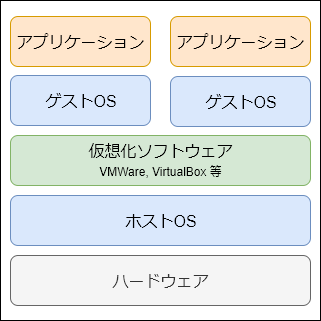
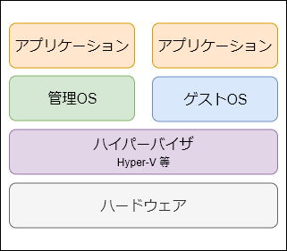
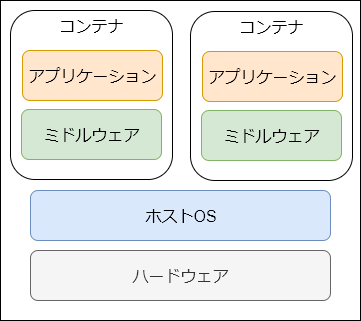
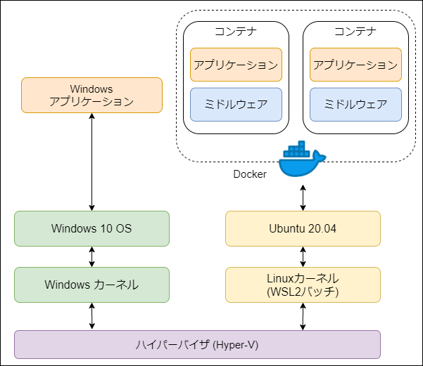
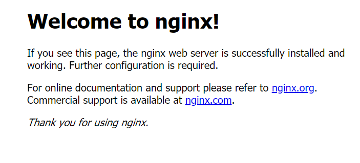

# Docker入門

## 仮想化技術

仮想環境には大きく以下の3種類があり、いずれも「隔離されたアプリケーション実行環境」を提供するものである

- ホスト型
    
    - ホストOSの上に別のOS（ゲストOS）をインストールする仮想化技術
    - ゲストOSをそのまま仮想環境にインストールするため、ある程度再現性が担保されている
    - ディスク容量やメモリ使用量が大きい、動作が重い・不安定などの欠点がある
- ハイパーバイザ型
    
    - ハイパーバイザとはホストOSそのものを仮想化する制御プログラム
    - ホスト型より性能劣化が低い
    - ゲストOSとして使用できるOSに制限がある
- コンテナ型
    
    - ホストOSのカーネルを流用して隔離されたアプリケーション実行環境（コンテナ）を実現する仮想化技術
    - 性能劣化がほぼなく、安定して動作する
    - カーネルの異なるゲストOSを利用することはできない（例えば、Linuxホスト上でコンテナとして利用できるのはLinux系OSのみであり、WindowsOS等を使うことはできない）

この仮想化技術の発展により、Web開発は大きく進展したと言われている

従来は、物理的なサーバマシンに様々なアプリケーションをまとめて放り込んでいるような状態であったため、以下のような問題があった

- 開発環境とサーバ環境を同一の状態にすることが難しく、開発時に動作していたものがサーバ公開時に動作しなくなるなどの問題が発生しやすい
- 一つのアプリケーションに問題が発生した場合、他の正常稼働しているアプリケーションにも影響が出る
- サーバ用途の転用が困難（ハードウェア構成の変更作業が発生する）
- アプリケーション・ミドルウェアの構成を自由に変更することが困難
- アプリケーション・ミドルウェアの構成を自動化することが困難

上記のような問題のほとんどが、仮想化技術により解決された

特にコンテナ型の仮想化技術は、ホストOSの上で直接動作するため、ほぼ性能劣化することなく隔離されたアプリケーション実行環境を提供することができる

そのため、現在のWeb開発においてはこのコンテナ型仮想環境を利用するのが主流になりつつあり、特に、Docker社の開発した **Docker** は、コンテナ型仮想化技術として広く普及している

実際、Google社のWebサービスなどはあらゆるものがコンテナ化されて運用されている

### WindowsにおけるWEB開発
前述の通り、WEB開発においてはコンテナ型仮想環境を用いてアプリケーション実行環境ごと隔離して開発するのがスタンダードとなってきている

しかしながら、コンテナ技術は基本的にLinux系OS上に動かすものであるため、Windows等の別のOS上で動かすのは難しい

そういった場合は、VirtualBox や VMware 等のホスト型仮想環境の上にLinux系OSをインストールして使うか、WSL2（ハイパーバイザ型仮想環境）上にLinux系OSをインストールして使うことになる

WSL2 が正式リリースされた 2020年5月 までは、VirtualBox + Vagrant (環境構築自動化ツール) というホスト型仮想環境を使うのが一般的だった

しかし以下のような問題があり、WindowsでWEB開発を行う場合は WSL2 を使うことが多くなってきている

- VirtualBox, Vagrant, Vagrant Plugin のバージョンごとに相性があり、バージョンが変わるだけで上手く動作しないことが多い
- ホスト型仮想環境であるため、メモリ使用量が比較的多い
- WindowsファイルシステムとLinuxファイルシステムの相互変換コストが大きく、動作が遅かったり、ハードリンク系のファイル操作が上手く働かなかったりする
- GPUリソースを扱うことができない

***

## Docker

- **Docker**
    - OS・ミドルウェア・ファイルシステム全体を **イメージ** という単位で取り扱い、まるごとやりとり出来るツール
    - オープンソースのコンテナエンジンとしては現状最も有名

### 特徴
- 仮想環境は**コンテナ型**と呼ばれるもので、ホストOSを直接アクセスするためオーバーヘッドが少ない
- 環境構築が容易（`Dockerfile`に環境設定を記述するだけで、必要な環境を自動で構築してくれる）
- コンテナは移植性(ポータビリティ)が高く、Dockerさえインストールされていれば、全く同じ環境でアプリを動かせる
- ホストOSからはコンテナは１プロセスとして認識される

### Dockerが解決するもの
Dockerはアプリケーションとその実行環境を統合的に管理する為のソリューションであるため、開発環境におけるOSレベルのライブラリ、ミドルウェアのバージョン、環境設定は、常に本番環境と同じものにすることが可能

すなわち、Dockerにより本番環境へのデプロイ時の最大の不安要素が解消される

### Dockerの原則
1. 1コンテナにつき1プロセス
    - 1つのコンテナ内に複数プロセス(例: Rails, Nginx, MySQL)を詰め込むと、コンテナの再起動などが気軽にできない
2. コンテナ内で完結させる
    - 使用するミドルウェアやツールなどはすべてホスト側ではなくコンテナ上で管理すること　
    - これにより、バージョンアップやメンテはDockerfile上で管理できる

### Docker専用Linuxディストリビューション
あらゆるプログラムをDocker上で動かすことを前提とした、Docker専用Linuxディストリビューションが存在する

- CoreOS
    - systemd, etcd, fleet, Docker等の基本ツールのみをそろえた軽量Linux
    - CoreOS社のコンテナエンジンrktも使える
    - 基本がLinuxなため学習コストは高めだが、柔軟性も高い
- RancherOS
    - カーネル上でシステムDockerが動作し、Docker以外のものが一切ない
    - CoreOS以上に軽量＆起動速度速い
    - Dockerの使い方さえわかれば学習コストは高くない

***

## Docker環境構築

本マニュアルのロードマップを最初から実施している場合、すでに WSL2 + Ubuntu 20.04 の上に Docker をインストールした状態になっているはずである

参考: [WSL2開発環境構築](../WSL2開発環境構築.md)



前述の通り、現Windows環境においては、WSL2 + Linux + Docker の構成を推奨しているが、参考までに別の環境構築手順も以下にまとめておく

- [Vagrant+CoreOS+Docker環境構築](./ref/Vagrant+CoreOS+Docker環境構築.md)
- [DockerDesktopインストール](./ref/DockerDesktopインストール.md)

なお、**docker-compose** というソフトウェアもインストールしているが、これは複数のDockerコンテナをまとめて管理するのに便利なツールである

***

## Dockerチュートリアル

まずは、Docker上に `webserver` コンテナを作り、その中に `nginx` イメージをインストール＆実行してみる

```bash
# WSL2 環境では docker サービスは自動起動しないため、初回起動時に service start する
$ sudo service docker start

# ローカルに保存されているイメージを確認
$ docker images
REPOSITORY          TAG                 IMAGE ID            CREATED             VIRTUAL SIZE

# => 一つもイメージを保存していないため、現在は何もリストされていない

# nginxイメージを取得する
$ docker pull nginx
Using default tag: latest
latest: Pulling from library/nginx
 : (略)

# => docker images コマンドで nginxイメージが保存されていることを確認

# webserver コンテナを nginx イメージから作成し、ローカルポート8080番をコンテナの80番ポートに繋げる
## $ docker run [options] <image>
## -d: daemonモード（バックグラウンドでコンテナを起動）
## -p <ローカルポート:コンテナポート>: ポート接続
## --name <name>: コンテナ名指定
$ docker run -d -p 8080:80 --name webserver nginx
```

ホストマシンのブラウザで、 http://localhost:8080 にアクセスし、nginxサーバーが稼働していることを確認出来たら成功

※ Vagrant環境なら http://Vagrant内仮想マシンのプライベートIP:8080



### Dockerコンテナの停止
このままだと Dockerコンテナ（`webserver`）が起動したままなので、停止する

```bash
# 起動中のコンテナを一覧表示
$ docker ps
CONTAINER ID    IMAGE            COMMAND            CREATED            STATUS            PORTS            NAMES
d0b48cd50872    nginx   "/docker-entrypoint..."   5 minutes ago    Up 5 minutes   0.0.0.0:8080->80/tcp   webserver

# コンテナIDを指定して停止
$ docker stop d0b48cd50872

# コンテナ名で停止することも可能
# $ docker stop webserver

# 確認
$ docker ps
CONTAINER ID    IMAGE            COMMAND            CREATED            STATUS            PORTS            NAMES
```

***

## Docker基本操作

### ローカルに保存されているイメージの一覧表示
```bash
$ docker images
```

### イメージをローカルから削除
```bash
$ docker rmi <イメージ名>
```

### コンテナ一覧の確認
```bash
$ docker ps
```

### コンテナ内コマンドの実行
```bash
$ docker exec -it <コンテナ名> <コマンド>

# コンテナ内に入ってコマンドを実行するには bashコマンドを実行すればよい
$ docker exec -it <コンテナ名> bash

# -- root@コンテナ

% # コンテナ内で任意のコマンド実行可能
% exit
```

### コンテナの停止
```bash
# コンテナを安全に停止する
## 待ち秒数を指定しない場合は SIGTERM 送信後、10秒後に強制停止
$ docker stop [-f <待ち秒数>] <CONTAINER ID もしくは NAMES>

# コンテナを強制停止する
## コンテナプロセスに対して即座に SIGKILL 送信
$ docker kill <CONTAINER ID もしくは NAMES>
```

### コンテナの起動
```bash
# 作成済みのコンテナ（一度 run したコンテナ）のみ start 可能
$ docker start <CONTAINER ID もしくは NAMES>
```

### コンテナの再起動
```bash
$ docker restart <CONTAINER ID もしくは NAMES>
```

### コンテナの削除
```bash
# コンテナを削除する場合は、先にそのコンテナを停止しておく必要がある
$ docker rm <CONTAINER ID もしくは NAMES>
```

### 不要なコンテナ・イメージを一括削除
削除は、`コンテナ => イメージ` の順で行う

```bash
# 以下のコマンドは全て Docker 1.13 以降のバージョンで使用可能
$ docker container prune  # 停止しているコンテナを全て削除
$ docker volume prune  # 使われていないボリュームを全て削除
$ docker image prune  # コンテナが使っていないイメージを全て削除
```

### コンテナ・イメージの全削除
```bash
$ docker rm -f `docker ps -a -q`  # 全コンテナ削除
$ docker volume rm `docker volume ls -q`  # 全ボリューム削除
$ docker rmi -f `docker images -q`  # 全イメージ削除
```
