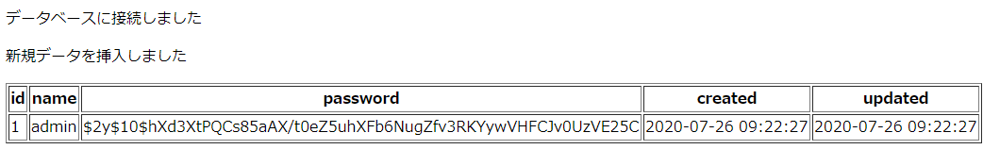
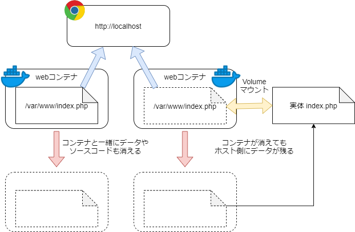

# Dockerfileで始めるIaC

## Dockerfileについて

これまでは、DockerHubに登録されているイメージをそのまま使っていた

しかし、デフォルトの設定を変更したい場合や、追加パッケージが必要な場合なども多いはずで、そういった場合は困ってしまう

（例えば `php:7.4-apache` はデフォルトのままだと php-pdo エクステンション等は入っていないため、データベース接続ができなかったりする）

起動中のコンテナの中に入って必要な設定や導入作業を行っても良いのだが、その場合、そのコンテナを別の環境に持ち込みたいときや誤ってコンテナを削除してしまったときに、同じ作業を繰り返さなくてはならなくなるため非常に効率が悪い

こうした問題を解決するために使うのが `Dockerfile` である

- **Dockerfile**
    - 公開されているDockerイメージをそのまま使うのではなく、必要なパッケージやアプリ、各種設定を含んだDockerイメージを自分で作成して使用する場合に記述するビルド手順書

### 基本的な書き方
```ruby
# FROM: どのイメージを基にするか
FROM centos

# MAINTAINER: 作成したユーザの情報（任意）
MAINTAINER Admin <admin@admin.com>

# RUN: docker buildするときに実行される
RUN echo "now building..." && \
    curl -SL http://example.com/postgres-$PG_VERSION.tar.xz | tar -xJC /usr/src/postgress

# COPY: ホスト側にあるファイル（Dockerfileのあるディレクトリ配下にあるファイルのみ）をコンテナ内にコピー
COPY ./php.ini /usr/local/etc/php/

# ADD: COPYとほぼ同じだが、tarファイルは自動で展開してくれる
ADD ./vhosts.tar /etc/nginx/conf.d/

# EXPOSE: コンテナが接続用にリッスンするポートを指定
## 要するにコンテナに開ける穴となるポートを指定
EXPOSE 80

# ENV: コンテナ内の環境変数を設定
## 基本的に Dockerfile: RUN コマンド内で参照可能な環境変数を設定
ENV PATH /usr/local/postgres-$PG_MAJOR/bin:$PATH

# USER: コンテナ内でコマンドを実行するユーザを指定
USER www-data

# WORKDIR: 作業ディレクトリを変更する
WORKDIR /var/www/

# CMD: docker run (docker-compose up | start) するときに実行される
## 以下の場合 $ /bin/bash -c "echo 'now running...'" が実行される
CMD ["/bin/bash", "-c", "echo 'now running...'"]
```

### Dockerfileを書く場合のポイントについて

#### RUNコマンドの挙動について
`Dockerfile` に書かれた `RUN` コマンドは、毎回中間的なDockerコンテナとして起動し、各コマンドを実行した段階でDockerイメージを作成する、という作業を繰り返す

この各段階のDockerイメージは**レイヤー**と呼ばれる

そのため、一つ前のコマンドの実行状態を継承するわけではないことに気をつける必要がある

例えば「`/tmp` ディレクトリに移動して `test.txt` を作成」したい場合、以下のように書いても上手く行かない

```ruby
RUN cd /tmp           # (1)
RUN touch test.txt    # (2)
```

(1) 実行時、起動した中間コンテナで `cd /tmp` コマンドが実行されて作業ディレクトリは `/tmp` に変更されるが、(2) 実行時はまた別の中間コンテナが起動するため、作業ディレクトリは `/` にリセットされてしまう

そのため、上記作業を実現したい場合は以下のように書く必要がある

```ruby
# シェルスクリプトの && でつなげる
RUN cd /tmp && touch test.txt

# もしくは、

# WORKDIR で作業ディレクトリ変更
WORKDIR /tmp
RUN touch test.txt
```

#### RUNコマンドはなるべく最小限で
前述の話と被るが、RUNコマンドは実行の度にレイヤーが積み重なっていくため、イメージが肥大化しやすい

そのため極力 RUNコマンドは一つにまとめるように書くことを推奨している

また、作成できるレイヤーには上限（128レイヤー）があるため、その意味でもなるべくまとめて実行したほうがよい

```ruby
# RUNコマンド書き方のコツ
## - コマンドは && でつなげていく
## - \ で改行できるため有効活用する
## - RUNコマンド途中でコメントを書きたい場合は :'コメント' コマンドを活用する
RUN : '必要なパッケージのインストール' && \
    apt-get update && apt-get install -y wget curl git libicu-dev mailutils unzip vim && \
    : 'PHPエクステンションの導入' && \
    docker-php-ext-install intl pdo pdo_mysql && \
    : 'cleanup apt-get caches' && \
    apt-get clean && rm -rf /var/lib/apt/lists/*
```

#### Dockerビルド時のキャッシュについて
Dockerコンテナをリビルドをする際、`Dockerfile` ですでに実行済みのコマンドは、キャッシュが使用される

そのため、あまり変わらない部分については、`Dockerfile` の最初のほうに書いておくことで、Dockerビルドの時間が短縮できる

ここで言う「あまり変わらない部分」というのは、例えば基本必要となるパッケージのインストールなどである

#### Linuxパッケージマネージャのキャッシュについて
Linuxパッケージマネージャ（Debian の `apt-get`, CentOS の `yum`, Alpine の `apk`）を利用して必要なパッケージをインストールした場合、パッケージマネージャのキャッシュファイルが残ったままだと、Dockerイメージ肥大化の原因になる

そのため、必要なパッケージをインストールした後はキャッシュ削除しておくと良い（`apk` だと `--no-cache` オプションが使えるので便利）

***

## Infrastructure as Code (IaC), CI/CD

`Dockerfile` を作成することで、自分で好きなようにDockerイメージを作成することができるようになるが、メリットはそれだけでなく、**OS設定などのインフラ構築部分も含めコード化できる**、というのが非常に大きい

これにより、同じ環境を簡単にミスなく作ることができ、またインフラ構築処理も構成管理することが可能になる

例えば Git で `Dockerfile` をバージョン管理し、CIツール（Jenkins などの自動デプロイツール）を使えば、アプリケーションのビルドからDockerビルド（Dockerイメージの作成）、コンテナのデプロイまでを自動化することができる

さらに、デプロイした環境に対して自動テスト（Seleniumなど）を連携させることで、より効率的に精度の高いシステム開発ができるようになる

このように開発すれば、ソースコードや環境構築部分で変更が入った際、簡単に本番に近い状態でデプロイ＆テストができる

本番に近い状態で常にテストが成功していれば、リリース直前で問題が発生することも減らすことができるようになる

このような考え方を **Infrastructure as Code (IaC)** と呼ぶ

こうして、ソースコードのバージョン管理が Git で可能になったように、OSレベルの設定管理が `Dockerfile` で可能になったとも言える

***

## Dockerfileを加えたLAMP構成

### 演習課題 01
ここまでの話を踏まえて、docker-compose を使ったLAMP構成を作り直す

コンテナ構成とビルド手順は以下の通り

- composeファイルバージョン: `3`
- `web`サービス（コンテナ名: `training2_web`）
    - ベースイメージ: `php:7.4-apache`
    - ログフォーマット: `json-file`
    - ポート: http://localhost でホスト側からアクセスできるように設定
    - リンク: `db`サービス
    - 必要パッケージ:
        - aptパッケージ:
            - `libonig-dev`
                - ※ PHP 7.4 からマルチバイト文字関連操作に `mbstring` エクステンションではなく、鬼車を使うように変更されたため導入する
            - `vim`: ファイル編集用にとりあえず入れておくと良い
        - PHPエクステンション: `pdo`, `pdo_mysql`
            - ※ `docker-php-ext-install` コマンドを使うのが簡単
    - 設定:
        - PHP設定ファイル: コンテナ内 `/usr/local/etc/php/php.ini` に配置
            - date.timezone: `Asia/Tokyo`
            - mbstring.internal_encoding: `UTF-8`
            - mbstring.language: `Japanese`
- `db`サービス（コンテナ名: `training2_db`）
    - ベースイメージ: `mysql:5.7`
    - ログフォーマット: `json-file`
    - rootユーザパスワード: `root` (環境変数: `MYSQL_ROOT_PASSWORD`)
    - 作成するデータベース: `training2` (環境変数: `MYSQL_DATEBASE`)
    - 設定ファイル: コンテナ内 `/etc/mysql/conf.d/my.cnf` に配置
        - mysqld.character-set-server: `utf8mb4`
        - client.default-character-set: `utf8mb4`
    - ※ my.cnf はパーミッション 644 に設定すること

#### 構成
構成は案の一つである（参照: [2-lamp/lamp/](./2-lamp/lamp/)）

```bash
lamp/
|_ docker/ # dockerコンテナ設定
|  |_ db/
|  |  |_ Dockerfile # dbサービスのビルド手順
|  |  |_ my.cnf # MySQL設定ファイル => service://db:/etc/mysql/conf.d/my.cnf
|  |
|  |_ web/
|     |_ Dockerfile # webサービスのビルド手順
|     |_ php.ini # PHP設定ファイル => service://web:/usr/local/etc/php/php.ini
|
|_ docker-compose.yml # dockerコンテナ構成
                      # - web: php:7.4-apache
                      #   - http://localhost => service://web:80
                      #   - link: service://db:3306
                      # - db: mysql:5.7
```

各ファイルの中身の解説については、参照ディレクトリ内のそれぞれのファイル内のコメントを見ること

#### 動作確認
```bash
# -- user@localhost

# docker-compose.yml のあるディレクトリに移動する
# $ cd /path/to/2-lamp/lamp/

# docker-compose.yml に記述してある全てのサービス（コンテナ）をビルドする
$ docker-compose build

# docker-compose.yml に記述してある全てのサービス（コンテナ）を起動する
## -d: daemonモード（バックグラウンド）でコンテナ起動
$ docker-compose up -d

# 起動確認
$ docker-compose ps
    Name                   Command               State          Ports       
----------------------------------------------------------------------------
training2_db    docker-entrypoint.sh mysqld      Up      3306/tcp, 33060/tcp
training2_web   docker-php-entrypoint apac ...   Up      0.0.0.0:80->80/tcp 

# webサービスコンテナに入る（コンテナ内 bash コマンド実行）
$ docker-compose exec web bash

# -- root@service://web

# --- php.ini の内容が反映されているか確認する ---

# date.timezone 確認 => Asia/Tokyo になっていればOK
% php -i | grep 'date.timezone'
date.timezone => Asia/Tokyo => Asia/Tokyo

# mbstring 設定確認
## internal_encoding => UTF-8, language => Japanese ならOK
% php -i | grep 'mbstring'
 :
mbstring.internal_encoding => UTF-8 => UTF-8
mbstring.language => Japanese => Japanese
 :

# コンテナ抜ける
% exit

# -- user@localhost

# dbサービスコンテナに入る（コンテナ内 bash コマンド実行）
$ docker-compose exec db bash

# -- root@service://db

# user: root, password: root でログインできるか確認
% mysql -u'root' -p'root'

# MySQLの文字コード設定が反映されているか確認
## character_set_client, character_set_server 等が utf8mb4 になっていればOK
> show variables like '%char%';
+--------------------------+----------------------------+
| Variable_name            | Value                      |
+--------------------------+----------------------------+
| character_set_client     | utf8mb4                    |
| character_set_connection | utf8mb4                    |
| character_set_database   | utf8mb4                    |
| character_set_filesystem | binary                     |
| character_set_results    | utf8mb4                    |
| character_set_server     | utf8mb4                    |
| character_set_system     | utf8                       |
| character_sets_dir       | /usr/share/mysql/charsets/ |
+--------------------------+----------------------------+

# データベース: training2 が作成されているか確認
# (training2 データベースを選択)
> use training2;
Database changed

# MySQLサーバから抜ける
> exit

# コンテナから抜ける
% exit
```

#### php-pdo を使って dbサービスコンテナに接続
`service://web:/var/www/html/index.php` (webサービスコンテナ内の `/var/www/html/index.php`) を作成し、php-pdo を使った MySQL データベース操作プログラムを作成する

```bash
# -- user@localhost

# webサービスコンテナに入る（コンテナ内 bash コマンド実行）
$ docker-compose exec web bash

# -- root@service://web

# デフォルトで /var/www/html/ がカレントディレクトリであるため
# そのまま index.php 作成
% tee index.php << \EOS
<?php
// MySQLサーバ接続設定
$db = [
    // dbサービスコンテナとリンクしているため、tcp://db:3306 で service://db:3306 に接続可能
    'host' => 'db',
    'database' => 'training2', // 接続先データベース
    'user' => 'root', // 接続ユーザ
    'password' => 'root', // 接続パスワード
];

// MySQLサーバ接続
try {
    $dbh = new PDO("mysql:dbname={$db['database']};host={$db['host']}", $db['user'], $db['password']);
    echo '<p>データベースに接続しました</p>';
} catch (PDOException $e) {
    echo '<p>接続失敗: ' . $e->getMessage() . '</p>';
    exit();
}

// usersテーブルがなければ新規作成する
$dbh->exec('CREATE TABLE IF NOT EXISTS users (
    id INTEGER AUTO_INCREMENT NOT NULL PRIMARY KEY,
    name VARCHAR(255) NOT NULL,
    password VARCHAR(255) NOT NULL,
    created DATETIME,
    updated DATETIME
)');

// usersテーブルからデータ取得
$rows = $dbh->query('SELECT * FROM users')->fetchAll(PDO::FETCH_ASSOC);

// usersテーブルに一つもデータがない場合は新規データ挿入
if (count($rows) === 0) {
    $sql = $dbh->prepare('INSERT INTO users (name, password, created, updated) VALUES (:name, :password, :created, :updated)');
    // 各カラムの値を指定して挿入実行
    // ※ password は BCRYPT ハッシュ化して保存する
    if ($sql->execute([
        ':name' => 'admin',
        ':password' => password_hash('pa$$word', PASSWORD_BCRYPT),
        ':created' => date('Y-m-d H:i:s'),
        ':updated' => date('Y-m-d H:i:s'),
    ])) {
        echo '<p>新規データを挿入しました</p>';
    } else {
        exit('<p>データの挿入に失敗しました</p>');
    }
    //  改めてusersテーブルからデータ取得
    $rows = $dbh->query('SELECT * FROM users')->fetchAll(PDO::FETCH_ASSOC);
}
?>

<table border="1">
    <thead>
        <tr>
            <th>id</th>
            <th>name</th>
            <th>password</th>
            <th>created</th>
            <th>updated</th>
        </tr>
    </thead>
    <tbody>
        <?php foreach ($rows as $row) : ?>
            <tr>
                <td><?= $row['id'] ?></td>
                <td><?= $row['name'] ?></td>
                <td><?= $row['password'] ?></td>
                <td><?= $row['created'] ?></td>
                <td><?= $row['updated'] ?></td>
            </tr>
        <?php endforeach ?>
    </tbody>
</table>
EOS

# コンテナから抜ける
% exit

# -- user@localhost

# webサービスコンテナのアクセスログ確認のためログフォロー
$ docker-compose logs -f web
```

http://localhost にアクセスして、webサービスコンテナ内のphpから、dbサービスコンテナ内のデータベース操作ができていることを確認する

また、webサービスコンテナのログにアクセスログが出ているのを確認できたら、`Ctrl + C` でログフォローを終了する



#### 後片付け
```bash
# -- user@localhost

# docker-compose 内の全コンテナを停止 => 削除
$ docker-compose down
```

***

## Dockerボリュームについて

ここまでのDockerの使い方にはいくつか問題がある

例えば以下のような問題である

- MySQLデータベースのデータが、コンテナを削除すると一緒に消えてしまう
    - Dockerfileを修正してリビルドした場合も同様に消えてしまう
- プログラムソースコードも同様に、コンテナ削除と同時に削除されてしまう
- プログラムソースコードの編集が行いづらい
    - いちいちコンテナの中に入って vim 等で編集しなければならない

こういった問題はDockerの**Volumeマウント機能**を利用することで解決できる

これはホスト側に存在する実体ファイルやディレクトリを、Dockerコンテナから読み書きできるように接続（共有）する機能である

言い換えると、ホスト側のファイル・ディレクトリのシンボリックリンクをDockerコンテナ内に作成する機能とも言える

これにより、データやソースコードをDockerコンテナ内に置かずに済むようになるため、コンテナが削除されてもホスト側に実体ファイル（データ、ソースコード）を残すことが可能となる（**データ永続化**）



### 設定方法
基本的には `docker-compose.yml` に以下のように記述することでVolumeマウントすることができる

```yaml
services:
  <service_name>:
    # Volumeマウントしたいファイル・ディレクトリを配列形式で設定
    volumes:
      # 基本書式: <ホスト側マウント元>:<コンテナ側マウント先>:<モード>

      # ホスト側カレントディレクトリ（./）は docker-compose.yml のあるディレクトリを示す
      ## 以下の場合 docker-compose.yml のあるディレクトリ直下の html/ ディレクトリを
      ## コンテナ内の /var/www/html/ ディレクトリとリンクし、コンテナ側から読み書き可能（rw）としている
      - ./html/:/var/www/html/:rw

      # コンテナ側からの書き込みを禁止（read-only）にしたい場合は、ro モードを指定する
      ## 以下の場合 php.ini 設定ファイルをコンテナ内の /usr/local/etc/php/php.ini に read-only でリンクしている
      - ./php.ini:/usr/local/etc/php/php.ini:ro

      # モードを省略した場合は基本的に rw モードとなる
      - ./logs/:/var/log/apache/

      # ホスト側のファイル・ディレクトリは絶対パスを指定することもできる
      - /etc/httpd/conf.d/:/etc/apache2/sites-available/
```

### 演習課題 02
演習課題 01 を改良し、以下のデータを永続化する

- `service://web:/var/www/html/` <= `host:./html/` (rw mode)
    - `./html/` をwebサービスコンテナ内の `/var/www/html/` に読み書きモードでマウント
- `service://web:/usr/local/etc/php/php.ini` <= `./docker/web/php.ini` (read-only)
    - Dockerfile内で `COPY` (`ADD`) する代わりにVolumeマウント機能を使うことができる
    - Dockerfileで設定ファイルをコンテナに転写する場合、設定内容を変更する度にコンテナをリビルドする必要があるが、Volumeマウントの場合はコンテナを再起動するだけで設定反映されるので便利（場合によっては再起動すら不要）
- `service://db:/var/lib/mysql/` <= `host:./web-data/` (rw mode)
    - `./web-data/` をdbサービスコンテナ内のMySQLデータ `/var/lib/mysql/` にマウント

#### 構成
[2-lamp/volume/](./2-lamp/volume/) を参照

```bash
volume/
|_ docker/ # dockerコンテナ設定
|  |_ db/
|  |  |_ my.cnf # MySQL設定ファイル => service://db:/etc/mysql/conf.d/my.cnf
|  |            ## 設定ファイルCOPY用だったDockerfileは不要になる
|  |
|  |_ web/
|     |_ Dockerfile # webサービスのビルド手順
|     |_ php.ini # PHP設定ファイル => service://web:/usr/local/etc/php/php.ini
|
|_ db-data/ # => service://db:/var/lib/mysql/
|_ html/ # => service://web:/var/www/html/
|  |_ index.php # http://localhost で表示されるファイル
|
|_ docker-compose.yml # dockerコンテナ構成
                      # - web: php:7.4-apache
                      #   - http://localhost => service://web:80
                      #   - link: service://db:3306
                      # - db: mysql:5.7
```

各ファイルの中身の解説については、参照ディレクトリ内のそれぞれのファイル内のコメントを見ること

***

## Dockerデータボリュームの作成

前節では、ホスト側にあらかじめ作成してあるファイル・ディレクトリをマウントした

しかし、Dockerコンテナビルド時にデータ永続化用ボリュームを新規作成することもできる

この場合、基本的に `/var/lib/docker/volumes/` 配下に新規ディレクトリが作成され、それがコンテナ内にマウントされることになる

MySQLデータの永続化などの場合は、このように新規データボリュームを作成して利用することが多い

### 設定方法
`docker-compose.yml` に以下のように記述する

```yaml
# 新規作成するボリューム
volumes:
  <volume_name>:
    # 色々設定できるが、基本省略で問題ない
    # 省略した場合 driver: local がデフォルトで使われる

# dockerサービスコンテナ
services:
  <service_name>:
    volumes:
      # 新規作成したデータボリュームをコンテナ内にマウント
      - <volume_name>:/path/to/data/
```

### 演習課題 03
演習課題 02 のMySQLデータを新規ボリューム `db-data` で永続化する

#### 構成
[2-lamp/volume2/](./2-lamp/volume2/) 参照

特に [docker-compose.yml](./2-lamp/volume2/docker-compose.yml) の内容をよく確認しておく

### Dockerデータボリュームの確認・削除
```bash
# 全てのDockerデータボリュームを確認
$ docker volume ls
DRIVER   VOLUME NAME
local    ...
 :

# 特定のボリューム削除
$ docker volume <volume_name>

# docker-compose でコンテナ削除と同時に、docker-compose 内で定義されているボリュームも削除
$ docker-compose down -v
```

***

## 後片付け

演習が完了したら Docker コンテナは停止 => 削除してしまって良い

```bash
# -- user@localhost

# docker-compose.yml に定義された全コンテナを停止 => 削除
# -v オプション: 作成したボリュームデータも削除
$ docker-compose down -v
```
