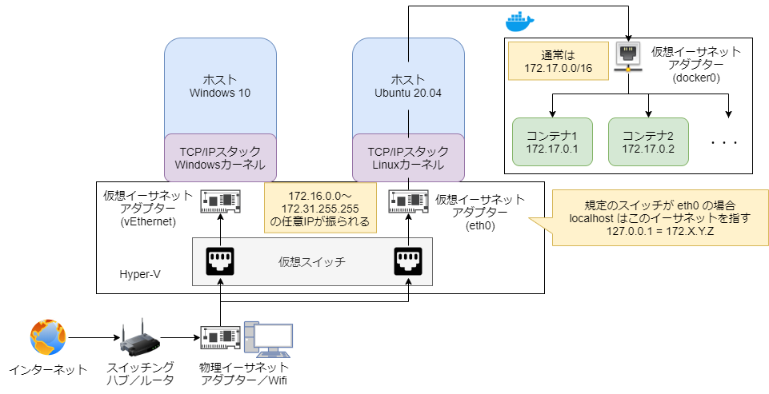
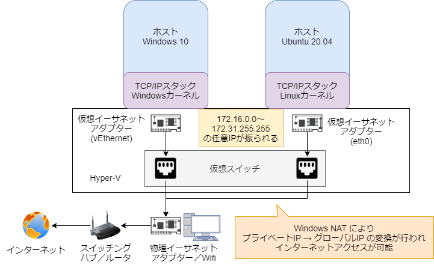
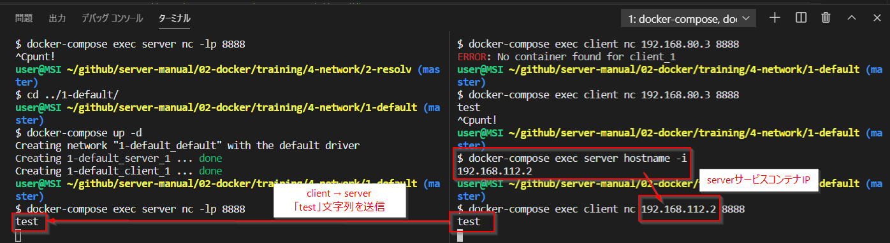

# Dockerネットワークについて

## WSL2 + Ubuntu 20.04 + Docker 環境における内部ネットワーク

WSL2 環境では、下図のようにHyper-Vの仮想ネットワーク上に、WindowsカーネルとLinuxカーネルが共存している

Hyper-Vでは、IPv4アドレスとして `172.16.0.0` ～ `172.31.255.255` までのプライベートアドレスが使われており、これを複数に分割して利用することで、独立した TCP/IP スタックとして各カーネル（OS）が動作する



Dockerは、Linuxカーネル上でまた別の仮想ネットワークを構成しており、通常は `172.17.0.0/16` のネットワーク範囲が `docker0` の仮想ブリッジとして動作する

### サブネットマスクについて
サブネットマスクはネットワーク範囲を定義するために使用される

ネットワークアドレスとサブネットマスクを組み合わせることで、ネットワークのIPv4範囲（サブネット）を指定することができる

サブネットマスクのIPv4表現は、以下のような対応となっている

サブネットマスク | IPv4表現
:--:            | :--:
`/1`            | `128.0.0.0`
`/2`            | `192.0.0.0`
`/3`            | `224.0.0.0`
`/4`            | `240.0.0.0`
`/5`            | `248.0.0.0`
`/6`            | `252.0.0.0`
`/7`            | `252.0.0.0`
`/8`            | `255.0.0.0`
 :              |  :
`/16`           | `255.255.0.0`
`/24`           | `255.255.255.0`
`/32`           | `255.255.255.255`

`docker0` のネットワーク範囲 `172.17.0.0/16` を計算すると以下のようになる

\                      | (1)       | (2)       | (3)       | (4)
:--:                   | :--:      | :--:      | :--:      | :--:
ネットワークアドレス    | `172`     | `17`      | `0`       | `0`
2進数表記              | 1010 1100 | 0001 0001 | 0000 0000 | 0000 0000
サブネットマスク(`/32`) | `255`     | `255`     | `0`       | `0`
2進数表記              | 1111 1111 | 1111 1111 | 0000 0000 | 0000 0000
IP                     | IP(1)     | IP(2)     | IP(3)     | IP(4)

ネットワークアドレスは、IPとサブネットマスクの論理積から算出されるから、逆算すると IP(1)～(4) は以下のようになる

- IP(1):
    - `1010 1100` 以外の答えはない
    - => 10進数表記: `172`
- IP(2):
    - `0001 0001` 以外の答えはない
    - => 10進数表記: `17`
- IP(3):
    - `0000 0000` ～ `1111 1111` の範囲が答えとなる
    - => 10進数表記: `0` ～ `255`
- IP(4):
    - `0000 0000` ～ `1111 1111` の範囲が答えとなる
    - => 10進数表記: `0` ～ `255`
    - ただし、最下位ビットに `0`, `255` は使えないため `1` ～ `254` が答えとなる

以上より、`docker0` ネットワークでは、各コンテナに `172.17.0.1` ～ `172.17.255.254` のIPv4アドレスが割り当てられることになる

- 参考: [サブネットマスク電卓](https://note.cman.jp/network/subnetmask.cgi)

### localhost について
localhost は、自分自身を表現する特別なIPアドレスで `127.0.0.1` (IPv6: `::0`) と表記される

Hyper-V（WSL）環境では、Windows 10 や Linux へのアクセス振り分け用の仮想スイッチが構築されており、この規定スイッチにより localhost の指し示す先が変わる

通常は、WSL2 環境で最初に作成した Linux カーネル（本稿の環境では Ubuntu 20.04）が規定スイッチに設定されるため、localhost (`127.0.0.1`) = `eth0` (Ubuntu 20.04 の IPv4: `172.X.Y.Z`) となる

### WSL2上のLinuxカーネルから外部ネットワークアクセスできる理由
前述の通り、WSL2上のLinuxカーネルは物理イーサネットとは異なる TCP/IP スタック上で動作しているため、通常そのままでは外部ネットワークにアクセスできない

この問題を解決するために、WSL2は仮想的なNATを構築し、各仮想イーサネットのプライベートIP (`172.16.0.0` ～ `172.31.255.255`) をグローバルIP (物理イーサネットIP: `192.168.0.1` など。環境により異なる) に変換している



***

## docker-compose デフォルトネットワーク

docker-compose においては、ネットワークを指定しない場合、新規仮想ネットワークが構築され、任意IPのネットワークアドレスが割り当てられる

作成された仮想ネットワークは `docker network ls` コマンドで確認できる

さらに `docker network inspect <network_name>` コマンドを使うことで、その仮想ネットワークのIPアドレスや、ネットワークに所属する各コンテナを確認することができる

### 演習課題 01
1. 以下のような `docker-compose.yml` ファイルを作成する
    - `busybox` イメージを使い、`server` サービスコンテナと `client` サービスコンテナを定義
    - どちらのサービスコンテナも `tty: true` を指定し、ターミナル利用可能に設定する
2. 上記で作成した `docker-compose.yml` をビルド＆起動した上で、自動作成された仮想ネットワークおよび各コンテナのIPアドレスを確認する
    - `docker network ls` コマンドで自動作成された（と思われる）仮想ネットワークを特定
    - `docker network inspect <network_name>` コマンドで仮想ネットワークおよび各コンテナのIPアドレスを確認
3. `server` サービスコンテナ内で `hostname -i` コマンドを使ってコンテナIPを確認
    - `docker network inspect <network_name>` コマンドで確認したIPと一致することを確認
4. `server` サービスコンテナ内で `nc` コマンドを使って、ポート8888番で簡易サーバを起動する
    - busybox の `nc` コマンドは `-l` オプションでリスンモード（サーバモード）
    - busybox の `nc` コマンドは `-p <port>` オプションで指定ポートを開く
5. 上記とは別のターミナルを開き、`client` サービスコンテナ内で `nc` コマンドを使って `server` コンテナに接続する
    - `nc <server_ip> <server_port>` コマンドで接続可能
        - server_ip: 2, 3 の手順で確認した `server` サービスコンテナのIP
        - server_port: 4 の手順で開いた 8888 番ポート
    - 接続したら `test` と入力し、4 のターミナル（`server` サービスコンテナの簡易サーバ）で `test` という文字列を受信できるか確認

#### 実装
[4-network/1-default/docker-compose.yml](./4-network/1-default/docker-compose.yml) 参照

#### 動作確認
```bash
# -- user@localhost

# 4-network/1-default/ ディレクトリに移動
# cd /path/to/4-network/1-default/

# 他のDockerコンテナは停止しておく
$ docker stop $(docker ps -q)

# 1. コンテナビルド＆起動
$ docker-compose up -d

# 2-1. docker仮想ネットワークを全て確認
$ docker network ls
NETWORK ID    NAME               DRIVER  SCOPE
95acdcfc0b73  1-default_default  bridge  local # <= 今回自動作成された仮想ネットワーク
1bc6154bf7aa  bridge             bridge  local # <= dockerデフォルトネットワーク（docker0）
995f007b4724  host               host    local # <= Linuxホストネットワーク（localhost）
3390eef98586  none               null

# 2-2. 1-default_default ネットワークと所属するコンテナを一覧表示
$ docker network inspect 1-default_default
[
    {
        "Name": "1-default_default",
        # ...
        "IPAM": {
            # ...
            "Config": [
                {
                    "Subnet": "192.168.80.0/20", # ネットワーク範囲
                    "Gateway": "192.168.80.1"
                }
            ]
        },
        # ...
        "Containers": {
            "3910e5b9cc840bdfba2e91558ca08f5ecbcad8abb63d3a31d6ddcb24b5c29ad1": {
                "Name": "1-default_server_1",
                "EndpointID": "8d6287166a33c89404112e6cdc34e839814ba12a391c4a17bb0fa0cf946951eb",
                "MacAddress": "02:42:c0:a8:50:03",
                "IPv4Address": "192.168.80.3/20", # serverサービスコンテナIP
                "IPv6Address": ""
            },
            "e58bfe80e657a851e645bae6ca40ced9fc19be13e1fd1496d6e9ebcac1862bfc": {
                "Name": "1-default_client_1",
                "EndpointID": "09fcd628ed01e6892b6cc0f65944f64e4d0b8a6aa6de95192306dd6d14bf63e6",
                "MacAddress": "02:42:c0:a8:50:02",
                "IPv4Address": "192.168.80.2/20", # clientサービスコンテナIP
                "IPv6Address": ""
            }
        },
        # ...
    }
]

# 3. serverサービスコンテナ内で hostname -i コマンドを使ってIP確認
$ docker-compose exec server hostname -i
192.168.80.3 # <= docker network inspect 1-default_default で確認したIPと同じはず

# 4. serverサービスコンテナで nc 簡易サーバ（ポート: 8888）起動
$ docker-compose exec server nc -lp 8888

# => アイドル状態になるため、一旦このままにして別のターミナル起動
```

```bash
# -- user@localhost

# 4-network/1-default/ ディレクトリに移動
# cd /path/to/4-network/1-default/

# 5. clientサービスコンテナで serverサービスコンテナの nc 簡易サーバ（ポート: 8888）に接続
## 接続先（serverサービスコンテナ）のIPは、上記で確認したIPを指定
$ docker-compose exec client nc 192.168.80.3 8888

# => 接続されると、入力待ち状態になる

### <stdin>
# test と入力してエンター
test
# => serverコンテナ側のターミナルで「test」という文字列が受信されればOK

# => Ctrl + C で終了（serverサービスコンテナ側も同様）
### </stdin>
```



#### 後片付け
```bash
# docker-compose down するとコンテナと一緒に仮想ネットワークも削除される
$ docker-compose down

# 1-default_default ネットワークが削除されているか確認
$ docker network ls
NETWORK ID    NAME               DRIVER  SCOPE
1bc6154bf7aa  bridge             bridge  local # <= dockerデフォルトネットワーク（docker0）
995f007b4724  host               host    local # <= Linuxホストネットワーク（localhost）
3390eef98586  none               null
```

***

## 同一ネットワーク内における名前解決

docker環境では、同一ネットワークに所属しているコンテナ同士は、IPではなくサービス名で通信することができる

ただしそのためには、各コンテナの所属ネットワーク名を明示する必要がある

```yaml
services:
  <service_name>:
    # ↓ 自動作成されるデフォルトの仮想ネットワークに所属していることを明示する場合
    networks:
      - default
```

### 演習課題 02
1. 演習課題 01 で作成した `docker-compose.yml` を修正し、各コンテナがデフォルトの仮想ネットワークに所属することを明示
2. コンテナをビルド＆起動した上で、`server` サービスコンテナで `nc` 簡易サーバ（ポート: 8888）を起動
3. `client` サービスコンテナから、`server` というサービス名で `server` サービスコンテナに `nc` 接続できるか確認

#### 実装
[4-network/2-resolv/docker-compose.yml](./4-network/2-resolv/docker-compose.yml) 参照

#### 動作確認
```bash
# -- user@localhost

# 4-network/2-resolv/ ディレクトリに移動
# cd /path/to/4-network/2-resolv/

# コンテナビルド＆起動
$ docker-compose up -d

# serverサービスコンテナで nc 簡易サーバ（ポート: 8888）起動
$ docker-compose exec server nc -lp 8888

# => アイドル状態になるため、一旦このままにして別のターミナル起動
```

```bash
# -- user@localhost

# 4-network/2-resolv/ ディレクトリに移動
# cd /path/to/4-network/2-resolv/

# clientサービスコンテナから serverサービスコンテナに nc 接続できるか確認
## IPの代わりにサービス名（server）で接続する
$ docker-compose exec client nc server 8888

### <stdin>
# test と入力してエンター
test
# => serverコンテナ側のターミナルで「test」という文字列が受信されればOK

# => Ctrl + C で終了（serverサービスコンテナ側も同様）
### </stdin>

# 後片付け
$ docker-compose down
```

***

## ネットワークアドレスを指定して仮想ネットワークを作成

これまでは任意のIPアドレスに自動で仮想ネットワークを作成させていたが、ネットワークアドレスを指定して、各コンテナのIPアドレスの割り当てを手動で行うことも可能

手動でIPの割り当てを行うことで、常に同一のIPでコンテナにアクセスできるようになる

なお、この場合 **サービス名による名前解決はできない**

```yaml
# 作成する仮想ネットワークを定義
networks:
  # 仮想ネットワーク名指定
  <network_name>:
    driver: bridge # ドライバは基本的に bridge を指定
    ipam:
     driver: default
     config:
       # 仮想ネットワークのネットワーク範囲を指定
       ## 172.68.0.0/16 の場合、172.68.0.1 ～ 172.68.255.254 のIPアドレスを割り振れる
       - subnet: 172.68.0.0/16

# 作成するサービスコンテナ
services:
  <service_name>:
    # 所属ネットワークを指定
    networks:
      - <network_name>:
        # 172.68.0.0/16 のネットワーク範囲で任意のIPアドレスを設定できる
        ipv4_address: 172.68.0.1
```

### 演習課題 03
1. 以下のような `docker-compose.yml` ファイルを作成する
    - ネットワーク範囲 `178.27.0.0/16` の仮想ネットワーク `app_net` を作成
    - `busybox` イメージを使い、`server` サービスコンテナと `client` サービスコンテナを定義
        - `server` サービスコンテナ:
            - `tty: true` を指定してターミナル利用可能に
            - ネットワーク: `app_net` に所属
            - IPv4: `178.27.0.10` を指定
        - `client` サービスコンテナ:
            - `tty: true` を指定してターミナル利用可能に
            - ネットワーク: `app_net` に所属
            - IPv4: `178.27.0.20` を指定
2. 上記で作成した `docker-compose.yml` をビルド＆起動した上で、作成された仮想ネットワークおよび各コンテナのIPアドレスを確認する
3. コンテナをビルド＆起動した上で、`server` サービスコンテナで `nc` 簡易サーバ（ポート: 8888）を起動
4. `client` サービスコンテナから `server` サービスコンテナに `nc` 接続できるか確認
    - IP: `178.27.0.10` で接続

#### 実装
[4-network/3-ip/docker-compose.yml](./4-network/3-ip/docker-compose.yml) 参照

#### 動作確認
```bash
# -- user@localhost

# 4-network/3-ip/ ディレクトリに移動
# cd /path/to/4-network/3-ip/

# コンテナビルド＆起動
$ docker-compose up -d

# docker仮想ネットワークを全て確認
$ docker network ls
NETWORK ID    NAME          DRIVER  SCOPE
7e3e3715318c  3-ip_app_net  bridge  local # <= 今回作成した app_net 仮想ネットワーク
1bc6154bf7aa  bridge        bridge  local # <= dockerデフォルトネットワーク（docker0）
995f007b4724  host          host    local # <= Linuxホストネットワーク（localhost）
3390eef98586  none          null

# 3-ip_app_net ネットワークと所属するコンテナを一覧表示
$ docker network inspect 3-ip_app_net
[
    {
        "Name": "3-ip_app_net",
        # ...
        "IPAM": {
            # ...
            "Config": [
                {
                    "Subnet": "178.27.0.0/16" # ネットワーク範囲
                }
            ]
        },
        # ...
        "Containers": {
            "72499eace4d3eaeed6d96ceb2f2c58b06acc5e53a944d25db986529ae01f6bef": {
                "Name": "3-ip_client_1",
                "EndpointID": "f5eb8742388aee8b7072793e1e3039145f6fc8e105914f0718f9fb019cad7c8a",
                "MacAddress": "02:42:b2:1b:00:14",
                "IPv4Address": "178.27.0.20/16", # clientサービスコンテナのIP
                "IPv6Address": ""
            },
            "97bc9ce7083b1331243e165f657bdf71e9d958fa0288a0389ef0c49630fcd4a3": {
                "Name": "3-ip_server_1",
                "EndpointID": "6ff48e41e165641e5c43f25b2a7dd7a115d89edee61907c67b9718c778be5d97",
                "MacAddress": "02:42:b2:1b:00:0a",
                "IPv4Address": "178.27.0.10/16", # serverサービスコンテナのIP
                "IPv6Address": ""
            }
        },
        # ...
    }
]

# serverサービスコンテナで nc 簡易サーバ（ポート: 8888）起動
$ docker-compose exec server nc -lp 8888

# => アイドル状態になるため、一旦このままにして別のターミナル起動
```

```bash
# -- user@localhost

# 4-network/3-ip/ ディレクトリに移動
# cd /path/to/4-network/3-ip/

# clientサービスコンテナで serverサービスコンテナの nc 簡易サーバ（ポート: 8888）に接続
## 接続先: 178.27.0.10 => serverサービスコンテナ
$ docker-compose exec client nc 178.27.0.10 8888

### <stdin>
# test と入力してエンター
test
# => serverコンテナ側のターミナルで「test」という文字列が受信されればOK

# => Ctrl + C で終了
### </stdin>

# 後片付け
$ docker-compose down
```