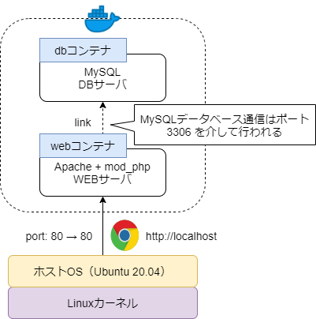

# Docker基礎研修

## 序論

[LAMP構築入門](../LAMP構築入門.md) では、一つの Docker コンテナを一つの CentOS サーバコンピュータと見立て、その中に各種ミドルウェア（Apache, MySQL, PHP 等）を全てまとめて導入するという手順を踏んだ

これは従来型のサーバ構築手法であるが、以下のような問題点がある

- LinuxディストリビューションやOSのバージョン、使用するミドルウェアのバージョン等により導入手順や設定手順が異なる
- サーバ構成や設定、導入手順などをコード化（ドキュメント化）しづらく、属人化しやすい
- OSの環境変数やインストールされているソフトウェアの影響で環境が汚染されやすく、全く同一の環境を再現しづらい
- 一つのシステムに複数のサービスを導入する都合上、構成を柔軟に変更したり拡張したりすることが難しい

こうした問題点を解決するために発展してきたのが仮想化技術である

特に、コンテナ型仮想化技術は、カーネルごと仮想化するわけではなく、ホストOSのカーネル（通常は Linux カーネル）は共有して、その上の OS やミドルウェア、アプリケーションを仮想化する技術であるため、軽量で高速に動作すると言われている（**OSレベルの仮想化**）

コンテナ型仮想化技術の代表的存在である Docker もまた、従来型サーバ構築手法の問題点を解決するために発展してきた技術であるため、「1コンテナ1サービス」のように構成分離を行うのが本来の使い方である

そのため本研修では、どのようにサーバ構成を分離し、コンテナを構築・運用していくかに焦点を当てていく

***

## LAMP環境の構成分離とコンテナ構築

### 構成分離
LAMPの構成要素である Linux, Apache, MySQL, PHP (ここではスクリプト言語を PHP に限定) について考える

OSである Linux は置いておくとして、まず間違いなく分離した方が良いのは Apache WEBサーバと MySQL DBサーバである

一方 PHP の扱いについては、基本的に以下のいずれかを選択する形になる

1. Apache 拡張機能としての PHP (**mod_php**) を使う
    - この場合の PHP はあくまで Apache の拡張機能扱いとなるため、Apache コンテナに一緒に入れる形となる
    - 昔ながらの PHP の使い方であり、情報ソースが多く、構成も分かりやすい
2. FastCGI としての PHP (**php-fpm**) を使う
    - PHP を Apache から切り離し、アプリケーションサーバとして扱う方法
    - この場合は、Apache コンテナとは別のコンテナに分離した方が扱いやすい
    - 大規模なWEBサイトであれば、php-fpm の方が高速に動作すると言われているが、中小規模なサイトでは有意なパフォーマンス差は見られない
        - ※ そもそも大規模サイトの場合は **C10K問題** もあるため、Nginx をWEBサーバとして採用するケースが増えている

※ 可能であればこの辺りで [WEBサーバとAPサーバ](../../01-basic/WEB/WEBサーバとAPサーバ.md) について復習しておくと良い

本研修では構成の分かりやすさから mod_php を採用し、以下の2つのコンテナに分離することにする

1. Apache WEBサーバコンテナ（+ mod_php）
    - ベースイメージ: [php:7.4-apache](https://hub.docker.com/_/php)
        - Docker 公式イメージに Apache + mod_php 構成済みのものがあるため素直にこれを使わせてもらう
        - このイメージは Debian Linux ベースであるため、CentOS の Apache とはサービス名や設定ファイルの場所などが違うことに注意する
2. MySQL DBサーバコンテナ
    - ベースイメージ: [mysql:5.7](https://hub.docker.com/_/mysql)
        - こちらも Docker 公式イメージにそのものずばりなものが用意されている
        - このイメージも Debian Linux ベースであるため、CentOS の MySQL とはサービス名や設定ファイルの場所などが違うことに注意する

### Docker コンテナ構築
上記のように構成分離したため、コンテナの構成としては下図のようになる



設計通りにまずは Docker コンテナを構築してみる

```bash
# -- user@localhost

# WSL2 環境の場合は、docker サービスがスタートアップ登録されないため、手動起動しておく
$ sudo service docker start

# 余計な docker コンテナが起動していると研修が上手く行かない場合があるので、起動中のコンテナは全て停止しておく
$ docker stop $(docker ps -q)

# dbコンテナ作成
## ベースイメージ: mysql:5.7 (初めて使う場合は自動でダウンロードされる)
## コンテナ内ターミナル: 利用 (-i -t オプション)
## 環境変数 (-e オプション):
##   - MYSQL_ROOT_PASSWORD: "root"
##     => MySQL rootユーザパスワード ※何かしらパスワードを指定しないと起動しないため注意
$ docker run -d -it -p 3306:3306 -e MYSQL_ROOT_PASSWORD=root --name db mysql:5.7

# webコンテナ作成
## ベースイメージ: php:7.4-apache (初めて使う場合は自動でダウンロードされる)
## ポート接続: ホスト:80 => コンテナ:80 (http通信用ポート)
## コンテナ内ターミナル: 利用 (-i -t オプション)
## 先に作成していたdbコンテナとリンク（webコンテナから dbコンテナに MySQL 接続するため）
$ docker run -d -it -p 80:80 --link db --name web php:7.4-apache

# 起動中のコンテナ確認
$ docker ps
CONTAINER ID  IMAGE           COMMAND      CREATED  STATUS  PORTS           NAMES
7ef644712c71  mysql:5.7       "docker..."  ... ago  Up      3306->3306/tcp  db
23cc0f0c9722  php:7.4-apache  "docker..."  ... ago  Up      80->80/tcp      web
```

### 動作確認
DocumentRoot `/var/www/html/` に `index.php` を作成し、Apache WEBサーバコンテナの動作確認を行う

```bash
# -- user@localhost

# webコンテナの中に入る（webコンテナ内 bash ターミナルを実行する）
$ docker exec -it web bash

# -- root@docker://web

# デフォルトで /var/www/html/ がカレントディレクトリであるため
# そのまま index.php 作成
% echo '<?php phpinfo(); ?>' > index.php

# webコンテナを抜ける
% exit
```

http://localhost (http://localhost:80) にアクセスして phpinfo が表示されれば OK

### mysqlコンテナへの接続
web コンテナに mysql-client (MySQLデータベースサーバに接続するためのプログラム) を導入し、web コンテナから db コンテナに接続してみる

```bash
# -- user@localhost

# webコンテナの中に入る（webコンテナ内 bash ターミナルを実行する）
$ docker exec -it web bash

# -- root@docker://web

# mysql-client インストール
## php:7.4-apache イメージは Debian ベースのため
## パッケージマネージャは yum ではなく apt-get
% apt-get update && apt-get install -y default-mysql-client

# dbコンテナに接続
## webコンテナ作成時に --link db を指定したため tcp://db:3306 で docker://db にMySQL接続可能
## mysql 通信のデフォルトポートは 3306 であるため -P 3306 は省略可能
### - mysql 接続ユーザ: root
### - mysql 接続パスワード: root (dbコンテナ作成時に指定したパスワード)
% mysql -u'root' -p'root' -h db -P 3306

# -- root@tcp://db:3306

# 無事dbコンテナに接続できたらOK
# => 一旦終了
> exit

# -- root@docker://web

# webコンテナを抜ける
% exit
```

### 後片付け
```bash
# -- user@localhost

# dbコンテナとwebコンテナを停止 => 削除する
$ docker stop db && docker rm db
$ docker stop web && docker rm web
```

***

## docker-compose を使った複数コンテナの一括管理

これまでは `docker` コマンドを使って、コンテナを一つずつ構築してきた

しかし、利用するコンテナが増えてくると一つずつ構築・管理するのは困難になってくる

そういった場合に利用するのが `docker-compose` である

- **docker-compose**
    - 複数のコンテナで構成されるアプリケーションについて、Dockerイメージのビルドや各コンテナの起動・停止などをより簡単に行えるようにするツール
    - `docker-compose.yml` という設定ファイルに複数のDockerコンテナの設定をまとめて記述し、一括管理することが可能

### docker-compose によるLAMP環境構築
前述のDockerコンテナ構成を `docker-compose.yml` という設定ファイルに記述する

※ [1-min-lamp](./1-min-lamp) ディレクトリ参照

```yaml
version: "3" # composeファイルバージョン指定

# 各種コンテナの定義
services:
  # webサービス: php:7.4-apache イメージから構築
  ## コンテナ名: training1_web
  web:
    image: php:7.4-apache
    container_name: training1_web
    # ログ出力フォーマット: 基本的に json-file で良い
    logging:
      driver: json-file
    tty: true # コンテナ内でターミナル利用可能に（docker -it オプションと同等）
    ports:
      - "80:80" # http://localhost:80 => service://web:80
    links:
      - db # dbサービス（training1_dbコンテナ）とリンク
           ## これにより tcp://db:3306 => service://db:3306 の接続が可能になる
  
  # dbサービス: mysql:5.7 イメージから構築
  ## コンテナ名: training1_db
  db:
    image: mysql:5.7
    container_name: training1_db
    # ログ出力フォーマット: 基本的に json-file で良い
    logging:
      driver: json-file
    tty: true # コンテナ内でターミナル利用可能に（docker -it オプションと同等）
    # 環境変数定義
    environment:
      # MySQL rootユーザパスワードを指定しないとMySQLのDockerコンテナは起動しない
      MYSQL_ROOT_PASSWORD: root
```

- **docker-compose.yml**
    - 使うコンテナやパラメータなどを記述した設定ファイル
    - YAML形式のためインデントに注意！

docker-compose では、サービス名とコンテナ名という似たような概念が出てくるが以下のような違いがある

- サービス名:
    - `docker-compose.yml` で必ず指定しなければならない項目
    - docker-compose においては 1サービス = 1コンテナ に対応する
    - docker-compose でコンテナを識別するための名前であり、`docker-compose` コマンドでコンテナ内のコマンドを実行したりする場合に使われる
- コンテナ名:
    - Dockerコンテナ名であり、`docker` コマンドでコンテナを識別するための名前となる
    - `docker-compose.yml` で設定を省略可能であり、省略した場合は任意のコンテナ名が振られる
        - ※ 大抵は `ディレクトリ名_サービス名_連番` という形式のコンテナ名が振られる

### docker-compose によるコンテナ起動
```bash
# -- user@localhost

# docker-compose.yml のあるディレクトリに移動する
# $ cd /path/to/1-min-lamp/

# docker-compose.yml に記述してある全てのサービス（コンテナ）をビルドする
$ docker-compose build

# => 記述ミスがあったり、コンテナ構築中にエラーが発生するとエラー文が流れるため見ておく

# docker-compose.yml に記述してある全てのサービス（コンテナ）を起動する
## -d: daemonモード（バックグラウンド）でコンテナ起動
$ docker-compose up -d

# docker-compose.yml に記述してある各サービスの状態を確認
## 起動中の全てのDockerコンテナを一覧表示するわけではないため注意
$ docker-compose ps
    Name                   Command               State          Ports       
----------------------------------------------------------------------------
training1_db    docker-entrypoint.sh mysqld      Up      3306/tcp, 33060/tcp
training1_web   docker-php-entrypoint apac ...   Up       0.0.0.0:80->80/tcp

# 起動中の全てのDockerコンテナ確認
## おそらく現段階では今起動したコンテナしかリストアップされないはず
$ docker ps
CONTAINER ID  IMAGE           COMMAND       CREATED  STATUS  PORTS                 NAMES
3aec97dd7bc6  php:7.4-apache  "docker-..."  ... ago  Up      0.0.0.0:80->80/tcp    training1_web
6de05759cca4  mysql:5.7       "docker-..."  ... ago  Up      3306/tcp, 33060/tcp   training1_db
```

### 動作確認
`web` サービス (`training1_web` コンテナ) 内に入り、`index.php` を作成してみる

```bash
# -- user@localhost

# webサービス内に入る（webサービス内 bash ターミナルを実行）
$ docker-compose exec web bash

# ↑ は以下のコマンドと同等
# $ docker exec -it training1_web bash

# -- root@service://web

# デフォルトで /var/www/html/ がカレントディレクトリであるため
# そのまま index.php 作成
% echo '<?php phpinfo(); ?>' > index.php

# 一旦コンテナを抜ける
% exit

# -- user@localhost

# アクセスログを確認するために webサービスのログを出力
## -f: フォローモード（最新のログを出力し続ける）
$ docker-compose logs -f web

# http://localhost にアクセスして phpinfo が表示されればOK
# => 以下のようなログが出力されるはず
## training1_web1 | 172.25.0.1 - - [アクセス日時] "GET / HTTP/1.1" 200 22689 "-" "ブラウザ名"

# => Ctrl + C キーでログ出力を停止
```

### 後片付け
```bash
# -- user@localhost

# docker-compose.yml に記述されている全てのサービス（コンテナ）を停止 => 削除
## コンテナを停止するだけなら $ docker-compose stop
$ docker-compose down
```

***

## docker-compose 基本コマンド

- `docker-compose build`
    - 設定されたコンテナを全てビルド
    - `docker-compose up [--build]` コマンドで代用可能
- `docker-compose up`
    - 設定されたコンテナを全てビルドして起動
    - `-d` オプションを使うとバックグラウンド実行可能
    - `--build` オプションを使うとビルドし直してから起動
- `docker-compose down`
    - 設定されたコンテナを全て停止 => 削除する
    - `-v` オプションを使うと volume も削除（※ volume については後ほど）
    - `--rmi all` オプションを使うとイメージもまとめて削除する
- `docker-compose start`
    - 設定されたコンテナを起動（ビルド済みのコンテナのみ）
- `docker-compose stop`
	- 設定されたコンテナをすべて停止
- `docker-compose restart`
    - 設定されたコンテナを全て再起動
- `docker-compose ps`
    - 設定されたコンテナの状態を一覧表示
    - 設定されているコンテナであれば起動していなくても `Status: Exit` で表示される
    - `docker ps` と違い、起動中の全てのコンテナを表示するわけではない
- `docker-compose exec <サービス名> <コマンド>`
    - 指定したDockerサービス内のコマンドを実行する
    - `docker exec -it <コンテナ名> <コマンド>` と同じ動作をするが、コンテナ名ではなく、サービス名を指定することに注意

***

## 研修

- [Dockerfileで始めるIaC](./1-dockerfile.md)
    - DockerHubに登録されているイメージをカスタマイズして使う方法
    - Infrastructure as Code (IaC) の考え方を学ぶ
    - データベースやソースコードなど、永続化したいデータの扱い方
- [Apacheサーバ入門](./2-apache.md)
    - `.htaccess` ファイルを使ったアクセス制御
    - VirtualHostを用いた複数サイト運営方法
    - SSI を使った動的サイト構築
- [Dockerネットワーク](./3-network.md)
    - WSL2 + Docker 環境の内部ネットワーク構成について学ぶ
    - Docker ネットワークの基礎およびコンテナ間通信について学ぶ
