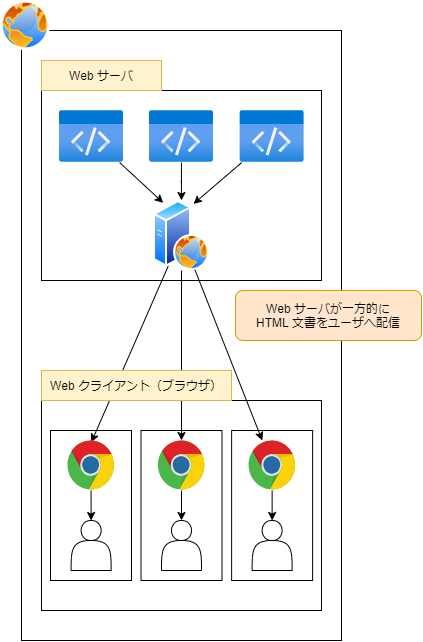
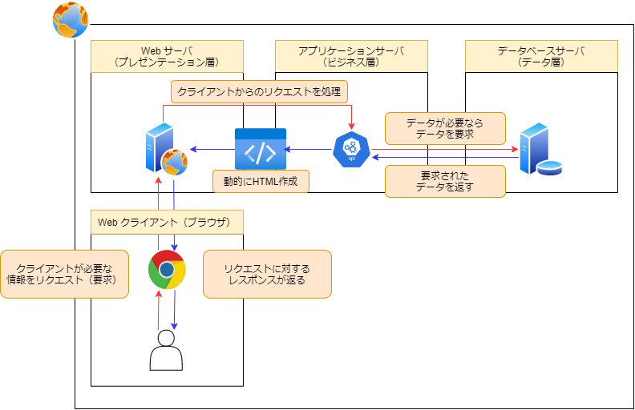
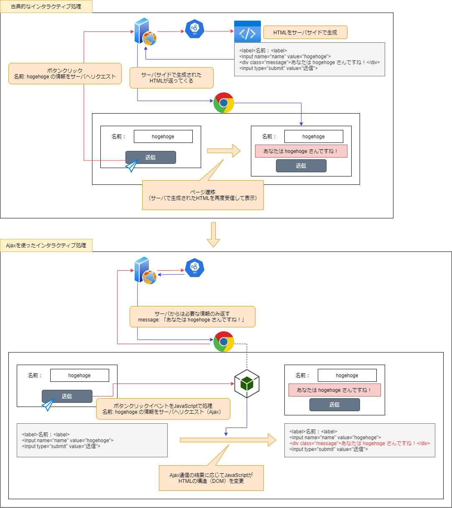
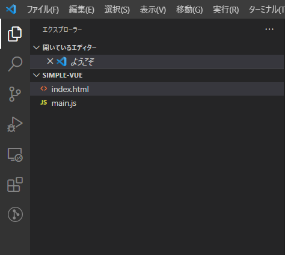
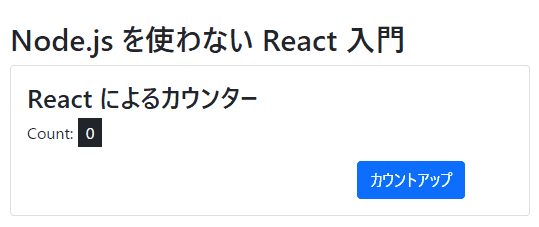

# React とか Vue とか Webpack とかで混乱している人のための現代フロントエンド開発入門

## Webフロントエンド開発の歴史

1991年に Web (World Wide Web) がインターネット上に誕生した当初、Web は文書閲覧のためのものだった

そのため、現在我々が利用するような SNS や Google Maps のようなインタラクティブコンテンツ（ユーザと Web が対話的にやりとりするようなコンテンツ）は存在せず、ユーザは Web が配信する文書を一方的に受信するだけだった



1990年代半ば以降、CSS や JavaScript がWebブラウザに搭載されるようになり、よりリッチなコンテンツの配信が可能となってきた

しかしながら、当時の JavaScript はまだ貧弱で、CSS ともに文書の装飾に用いられることが一般的だった

同時期、CGI を始めとする Web 向けのサーバサイドプログラム技術が登場した

これにより、データベースサーバによるデータ管理／サーバサイドプログラムによる動的なHTML文書の生成／Webクライアント（ブラウザ）という古典的なWebシステムが生まれた

この、サーバ側がデータベースやアプリケーション本体を担い、クライアントは見た目を担うという形式は形を変えつつ現在でもある程度支持されている



その後もサーバサイド側は CGI から進化を続け、Ruby on Rails のような MVC (Model View Controller) ベースのフレームワークが登場することで、ECサイトやブログのような複雑なWebシステムが作られるようになってきた

一方、フロントエンド側はそれほど大きく進化することなく、CSS による装飾、JavaScript によるアラートや入力受付程度の簡単な処理のみを求められていた

### Ajax の登場
前述の通り、しばらくの間フロントエンドは見た目の補助以上の処理を求められなかったが、2005年にGoogle社がリリースした Google Maps によりこの常識は覆された

Google Maps は地図サービスであるが、当時としては革新的な、ページを遷移することなくWebブラウザ側で地図を拡大・縮小する機能を提供した

これによりユーザは、地図を拡大・縮小する際に毎回サーバからの応答を待つことなくシームレスに操作を行うことが可能になったのである

これは **Ajax** と呼ばれる、JavaScript によってサーバと非同期に通信する技術によって実現されている

Ajax の登場により、Webブラウザでもデスクトップアプリケーションのようなインタラクティブなアプリケーション開発が可能となり、フロントエンドはより高度な処理を求められるようになってきた

例えば、Ajax 通信の結果により DOM (HTMLタグによって構築されている木構造) の構造を変化させるような処理である



なお上図の【Ajax通信を使ったインタラクティブ処理】において、「サーバからは必要な情報のみ返す」とあるが、このような仕様を **Web API** と呼ぶ

この頃、高度な DOM 操作を簡単に実現できるライブラリとして **jQuery** が人気を集めた

最近では React.js や Vue.js といった仮想DOM操作ライブラリによって取って代わられつつあるが、それでも jQuery を使ったフロントエンド開発は未だに根強く残っている

ともあれ、こうして Ajax と Web API により、よりリッチなWeb業務システムなWebサービスを構築することが一般的となり、Webクライアント（ブラウザ）側でも JavaScript を駆使して本格的なプログラムが書かれるようになった

この頃から、開発体制としてサーバサイドとクライアントサイドの分業化が見られるようになり、バックエンドエンジニアとフロントエンドエンジニアという職種が現れた

### HTML5の登場とフロントエンド開発の高度化
2000～2010年代にかけて Web はさらに複雑化・高度化していった

そして2014年に HTML の新規格として **HTML5** が登場し、Web 全体の仕様をアップデートする大きなムーブメントが発生した

現在の HTML は **HTML Living Standard** という規格に統一され、頻繁に仕様追加・変更が行われており、フロントエンド技術は加速度的に進化している

こうして、HTML5 の登場とそれに伴う CSS 仕様、JavaScript ライブラリの進化などで、クライアントサイドにおいてもより強⼒な表現が可能となった

これを受けて、プレゼンテーション層のプログラムがサーバーサイドからクライアントサイドにシフトしていき、従来サーバーサイドで⾏なっていた HTML の描画がクラ
イアントサイドで行われるようになってきた

これは、クライアントサイドで HTML 描画を行うことで画⾯遷移を減らし、ユーザにより優れたWeb体験を与えられるためである

### Node.js による JavaScript エコシステムの進化
2009年、サーバサイド JavaScript 環境である **Node.js** が登場した

これは元々はサーバサイド側で JavaScript 言語を扱うことができるというだけのものだが、フロントエンド開発にも以下の2つの大きな変化を与えた

- フロントエンド開発・検証の効率化:
    - 本来 JavaScript はブラウザ内で動くため、PC内のファイルを読み込んだり書き込んだりすることはできない
    - しかし、Node.js によりブラウザ外で JavaScript を実行可能となり、コーディング中のファイル監視をして、ファイル変更に合わせて自動的にブラウザをリロードしたりするようなことが可能となった
    - また、記述した JavaScript コードのテスト等も簡単に行えるようになり、フロントエンド開発・検証が効率的にできるようになった
- パッケージマネージャ npm の普及:
    - JavaScript で実装されたライブラリを npm 経由で利用できるようになったことで、開発したものをモジュール化して配布する文化が育った
    - これによりコード資産が共有できるようになり、開発効率が格段に向上した
    - このように、複数の開発者が互いの技術や資本を生かしながら広く共存共栄していく仕組みを **エコシステム** と呼ぶ

### ES2015 によるプログラミング言語としての JavaScript の進化
Webフロントエンド開発が⾼度化するなかで問題になったのが JavaScript の⾔語機能の貧弱さだった

元々ブラウザでちょっとした飾り付け等を行うことを目的として開発された JavaScript は、本格的なアプリケーションを作成する上では物⾜りないところが多かったのである

そこで⼤々的な仕様のアップデートが求められ、登場したのが **ES2015** (ECMAScript 2015) という規格である

ES2015 は JavaScript の歴史上でも最⼤のアップデートであり、構⽂が増え、`const` や `let` 宣言の普及など、書き⽅も⼤々的に変わることになった

しかしながら、サーバサイドで動く Node.js などは仕様のアップデートに合わせてバージョンアップすれば済むが、クライアントサイド（ブラウザ）で動く JavaScript は、仕様が提案されてすぐに全てのブラウザに実装されるわけではなく、統一的に書くことが難しい

しかし、多くの仕様変更は古い JavaScript への不満を解消する魅⼒的なものである

そこで、こういった仕様をブラウザ実装に先駆けて利⽤しようとする動きが広がってきた

**Babel** はこういったニーズに応える **JavaScript to JavaScript Compiler** である

すなわち、次世代の JavaScript を、まだその仕様を実装していないブラウザで動作する JavaScript に変換するという訳である

なお、Babel は基本的に Node.js で動くコンパイラであるため、Babel を使いたい場合は Node.js の導入も必須となる

こうして ES2015 以降の仕様の⼈気で、本来はコンパイルという過程を必要としない JavaScript 開発において、JavaScript to JavaScript Compile というビルド手順が増えてしまった

このような状況が、最近のフロントエンド開発への入門の敷居を上げているのではないかと感じられる

### Webpack について
**Webpack** はモジュールバンドラの一つで、複数の JavaScript ファイルを1ファイルにパッキングするものである

元々 JavaScript には、別のファイルに記述された JavaScript モジュールを読み込むという機能がないため、それを実現するモジュールバンドラの登場で大規模な JavaScript 開発が可能となった

特に npm パッケージマネージャを中心としたエコシステムを十分活用するためには、それぞれ分かれて開発されている各モジュールを上手く一つにまとめる機能は必須となる

そのため、フロントエンド開発において Node.js 環境を導入する場合、Webpack の使用もほぼ必須となってくる

Webpack と Babel は一緒に使われることが多いため、ごっちゃになってしまっている人も多そうだが、あくまで用途は別のものである

なお、最近のブラウザ内 JavaScript では、[ES Module](https://developer.mozilla.org/ja/docs/Web/JavaScript/Reference/Statements/import) という仕様が採用されており、モジュール読み込み機能が使えるようになりつつある

そのため、これから先のフロントエンド開発では Webpack は必ずしも必要なくなり、ES Module 機能を効率的に扱うための [Snowpack](https://www.snowpack.dev/) のような開発環境が主流になっていく可能性が高い

### React, Vue 等のフロントエンドライブラリの出現
ここまで紹介してきたようにフロントエンドを取り巻く仕様、技術は⾼度化している

これらが可能になったことで、アプリケーション、サービスにおいても複雑な要件が求められるようになった

すなわち、アプリケーションデータフローをフロントエンド側で受け持つなど、設計段階から難易度が上がってきたのである

DOM を Web API と連携させて適切に書き換えるのも考えなしにはできない

こうなってくるとアプリケーションの構造化を持たない jQuery のようなライブラリでは⼒不⾜である

そのため、MVC のようなアプリケーションの構造を持ったフレームワークが必要とされるようになり、Backbone.js, AngularJS などの新たなWebアプリケーションフレームワーク、ライブラリが次々と出現した

この流れの中で現れたのが、Facebook社が開発した **React** と **Flux** である（React はビューライブラリ、Flux はアプリケーションアーキテクチャ）

React を中⼼とした開発スタイルは仮想DOMによってDOM操作を⾼速で快適なものにし、また、Flux によって混乱しがちなフロントエンドのアーキテクチャに⽅向性が⽰され、React／Flux は大人気のライブラリとなった

React などの登場によって、⾼度なフロントエンドアプリケーションの開発はjQueryで無理やりにつくるよりも構造化しやすくなった

ここで新しく登場するのが、学習コストの問題である

React 自身もAPIを⼩さく保つなど学習コストをむやみに増やさない設計をしているが、JSX、データフローに関する知識など、React 導⼊に当たって少なくない知識が必要とされるのもまた事実である

このような学習コストの高さを低減するべく開発されたのが **Vue** というライブラリである

Vue はシンプルなAPIを提供し、UIの構築にはHTMLベースの平易なテンプレートを利⽤できる

そのため、HTML や JavaScript を多少触っていれば、Vue.js 固有の知識がほとんどなくてもすぐに利⽤可能となっている

一方、React のように固い設計はしづらいというデメリットもあり、大規模なプロジェクトでは React が採用されることが多い印象である

ともあれ、最近のフロントエンド開発では React や Vue といった構造的なアプリケーション開発可能なライブラリを採用することが多くなっているということである

***

## Node.js を使わない Vue, React 入門

前述の通り、Node.js を使うことでフロントエンド開発・検証を効率的に行うことができる

また、Node.js で動く Babel という JavaScript to JavaScript Compiler を使えば、ブラウザごとの JavaScript 仕様の違いを気にせず、最新の JavaScript 仕様（ES2015 以降の仕様）を使ってプログラムを書くこともできる

しかしながら、これらはあくまで開発効率を向上させるための手段であり、Vue や React のような最新ライブラリを使うのに必須なわけではない

最終的に各ブラウザに搭載された JavaScript エンジンが、JavaScript ファイルを解釈して実行するという基本原理は今も昔も変わらないためである

そのためここでは、まず Node.js を開発に使わない古典的な手法で Vue, React ライブラリを使ったフロントエンド開発を体験してみる

### Environment
- Terminal:
    - Bash (Ubuntu 20.04)
    - Zsh (macOS)
    - PowerShell (Windows 10)
- Editor: VSCode
    - Live Server Extension
- Browser: Google Chome

ここでは、VSCode をエディタとして採用し、[Live Server](https://marketplace.visualstudio.com/items?itemName=ritwickdey.LiveServer) 拡張機能を使うことにする

無論これは必須ではないが、ファイルの変更を検知して自動的にブラウザのページをリロードしてくれたりして便利なため採用している

詳細は [VSCodeエディタを使ったフロントエンド開発](../README.md#VSCodeエディタを使ったフロントエンド開発) を参照

また、ブラウザは極力 Google Chrome を使うことを推奨する

前述の通り、ブラウザごとに JavaScript で使用可能な文法等の仕様が異なり、以降のコードが必ずしもすべてのブラウザで問題なく実行されるか未検証のためである

### Node.js を使わない Vue 入門
ターミナル（Bash, Zsh, PowerShell 等）から以下の通りプロジェクトディレクトリの作成とVSCodeの起動を行う

```bash
# プロジェクトディレクトリ `simple-vue` 作成
$ mkdir simple-vue

# simple-vue ディレクトリで VSCode 起動
$ cd simple-vue/
$ code .
```

VSCode を開いたら、以下のようにファイルを作成する

```bash
simple-vue/
|_ index.html # トップページ
|_ main.js    # index.html から読み込まれる JS ファイル
```



#### index.html
```html
<!DOCTYPE html>
<html lang="ja">
<head>
  <meta charset="UTF-8">
  <meta http-equiv="X-UA-Compatible" content="IE=edge">
  <meta name="viewport" content="width=device-width, initial-scale=1.0">
  <title>Node.js を使わない Vue 入門</title>

  <!-- 簡単に見栄えを良くするため Bootstrap 5 CSS を CDN 経由でロード -->
  <link rel="stylesheet" href="https://cdn.jsdelivr.net/npm/bootstrap@5.0.0-beta1/dist/css/bootstrap.min.css">

  <!-- Vue 3.1.5 を CDN 経由でロード -->
  <script src="https://unpkg.com/vue@3.1.5"></script>
</head>
<body>
  <div id="app" class="container my-4">
    <h1 class="title">Node.js を使わない Vue 入門</h1>
    <div class="card">
      <div class="card-body">
        <h2 class="card-title">Vue によるカウンター</h2>
        <p class="card-text">
          <!-- {{ 変数 }}: Vue により DOM 操作され、変数が埋め込まれる -->
          Count: <span class="text-light bg-dark px-2 py-1">{{ count }}</span>
        </p>
        <div class="d-flex justify-content-end">
          <!-- @click.prevent: ボタンのデフォルトクリックイベントを消し、Vue 側で定義した countUp メソッドを実行する -->
          <button class="btn btn-primary me-5" @click.prevent="countUp">カウントアップ</button>
        </div>
      </div>
    </div>
  </div>

  <!--
    このページ用のメイン JS スクリプトをロード
    ※ Vue を使う場合は、必ず body タグの最後でスクリプトを実行すること
  -->
  <script src="./main.js"></script>
</body>
</html>
```

上記のように、Vue では HTML に特殊な記法を用いることができ、`{{ 変数名 }}` という書き方で Vue 側の変数を埋め込むことができる

また、`@イベント名` (正式には `v-on:イベント名`) という属性を指定することも可能で、これにより Vue 側で定義したイベントメソッドを実行させることができる

他にも様々な HTML 拡張記法があるため [公式ガイド](https://v3.ja.vuejs.org/guide/introduction.html) を確認すると良い

#### main.js
```javascript
/**
 * 本スクリプトには ES2015 以降の文法が含まれる（オブジェクトイニシャライザの短縮メソッド定義等）
 * モダンなブラウザでは基本的にサポートされているはずだが、動かない場合は最新の Google Chrome で確認すること
 */

// Vue Application 定義
const VueApp = {
  // Vue 変数宣言: ここで返したオブジェクトマップが変数として利用可能
  data() {
    return {
      // {{ count }} は初期状態で 0 として表示される
      count: 0,
    }
  },

  // メソッド宣言: ここで定義したメソッドを v-on:*** (もしくは @***) イベントで呼び出すことができる
  methods: {
    // countUp メソッド: Vue 変数 `count` をインクリメントする
    countUp() {
      this.count++;
    }
  }
};

// id="app" のエレメントをマウントし、Vue 側で HTML を構築できるようにする
Vue.createApp(VueApp).mount('#app');
```

上記のように、変数やメソッドを定義したオブジェクトを `Vue.createApp` に渡し、それを HTML エレメントにマウントすることで Vue で仮想DOMを操作できるようになる

なお、ここでは HTML と JavaScript を別ファイルに分けているが、コンポーネント単位で HTML／CSS／JavaScript を一つのファイルにまとめて記述する機能もある（**Single File Component (SFC)**）

しかし、SFC機能は基本的に Node.js 環境を構築して、SFC（`.vue` ファイル）をブラウザで実行可能な JavaScript ファイルに変換して使う形になる

#### 動作確認
VSCode 右下の「Go Live」アイコンをクリックするか、`F1` キー > `Live Server: Open with Live Server` コマンドを実行すると、ブラウザが起動してページを確認できるはずである（なお `Alt` + `L` |> `Alt` + `O` キーでも Live Server を起動できる）

以下のようにカウンターアプリケーションが実行されればOK


### Node.js を使わない React 入門
ターミナル（Bash, Zsh, PowerShell 等）から以下の通りプロジェクトディレクトリの作成とVSCodeの起動を行う

```bash
# プロジェクトディレクトリ `simple-react` 作成
$ mkdir simple-react

# simple-react ディレクトリで VSCode 起動
$ cd simple-react/
$ code .
```

VSCode を開いたら、以下のようにファイルを作成する

```bash
simple-react/
|_ index.html # トップページ
|_ main.jsx   # index.html から読み込まれる JSX ファイル
```

JSX という見慣れないファイルがあるが、これは **HTMLタグ（風のタグ）を直接 JavaSCript コードの中で書けるように拡張された JavaScript 拡張言語** である

これについて、詳しくは後述する

#### index.html
```html
<!DOCTYPE html>
<html lang="ja">
<head>
  <meta charset="UTF-8">
  <meta http-equiv="X-UA-Compatible" content="IE=edge">
  <meta name="viewport" content="width=device-width, initial-scale=1.0">
  <title>Node.js を使わない React 入門</title>

  <!-- 簡単に見栄えを良くするため Bootstrap 5 CSS を CDN 経由でロード -->
  <link rel="stylesheet" href="https://cdn.jsdelivr.net/npm/bootstrap@5.0.0-beta1/dist/css/bootstrap.min.css">

  <!-- React 16 を CDN 経由でロード -->
  <script src="https://unpkg.com/react@16/umd/react.development.js"></script>
  <script src="https://unpkg.com/react-dom@16/umd/react-dom.development.js"></script>

  <!-- React JSX スクリプトを解釈できるようにするための Babel ライブラリをロード -->
  <script src="https://unpkg.com/babel-standalone@6/babel.min.js"></script>
</head>
<body>
  <div id="app" class="container my-4"><!-- この中の HTML は React 側で構築 --></div>

  <!--
    このページ用のメイン JSX スクリプトをロード
    ※ React を使うには JSX という JavaScript 拡張言語を使う必要がある
    ※ JSX を使うには Bebel ライブラリをロードして script type="text/babel" でスクリプトを記述する
  -->
  <script type="text/babel" src="./main.jsx"></script>
</body>
</html>
```

JSX は JavaScript の拡張言語であるため、そのままではブラウザで実行することはできない

こういった場合、通常は Node.js + Babel を使って JSX to JavaScript Compile を行い、JSX をブラウザで実行可能な JavaScript ファイルに変換する必要がある（実は Bebel は ES2015 以降の文法だけでなく JSX 構文も JavaScript に変換できるということである）

そのため React でのフロントエンド開発には、基本的に Node.js の導入が不可欠なのだが、実はピュアJS（ブラウザで実行可能な JavaScript）で書かれた Bebel Compiler も配布されており、これを利用することで Node.js なしに JSX ファイルを直接ブラウザで実行することが可能である

動作原理自体はシンプルで、ピュアJS製の Babel は、HTML 内にある `<script type="text/babel">` というタグを検索し、その中に記述された JSX コードを JavaScript にコンパイルした上で実行している

すなわち、本来は事前に JSX to JavaScript Compile された JavaScript ファイルを読み込んで実行するところを、ブラウザ上で JSX to JavaScript Compile して、そのコンパイル結果の JavaScript を実行しているということである

ブラウザにコンパイルを任せてしまう分だけ、動作速度は遅くなってしまうため注意が必要である

#### main.jsx
```jsx
/**
 * App component
 * @description React では JSX という独自言語で HTML タグをそのまま使うことができる
 * @returns {JSX}
 */
function App() {
  // カウンタ変数: 初期値 0
  let [count, setCount] = React.useState(0);

  // カウンタ変数をインクリメントする関数: カウントアップ button の onClick イベントとして埋め込まれる
  function countUp(e) {
    e.preventDefault(); // ボタンクリックのデフォルトイベントを削除
    
    // React で変数の値を更新するためには React.useState の第2戻り値の関数を使う必要がある
    setCount(count + 1);
  }

  /**
   * JSX の書き方:
   * - JSX では複数の HTML タグを同じ階層に配置して扱うことはできない
   *   - そのため複数のタグを扱いたい場合は、適当なタグの中に入れて一つのタグにまとめる必要がある
   * - class の代わりに className という属性を使う必要がある
   * - 変数や関数は { 変数（関数）名 } という形で埋め込む
   */
  return (
    <div>
      <h1 className="title">Node.js を使わない React 入門</h1>
      <div className="card">
        <div className="card-body">
          <h2 className="card-title">React によるカウンター</h2>
          <p className="card-text"> 
            Count: <span className="text-light bg-dark px-2 py-1">{ count }</span>
          </p>
          <div className="d-flex justify-content-end">
            <button className="btn btn-primary me-5" onClick={ countUp }>カウントアップ</button>
          </div>
        </div>
      </div>
    </div>
  );
}

/**
 * React JSX で構築した HTML を id="app" のエレメントの中に描画
 * @description React JSX を返す関数は <関数名 /> という独自タグとして呼び出すことができる
 */
ReactDOM.render(<App />, document.getElementById('app'));
```

上記のように JSX では、普通の JavaScript 関数の戻り値として HTML タグ風のタグをそのまま記述するようなことが可能である

このような記述が Babel によりピュアJSに変換されるわけだが、実際どのように変換されるのかは理解しておいたほうが良い

例えば以下のような JSX コードがあるとして、

```jsx
function Hello() {
  return <p>Hello</p>;
}
```

これは以下のような JavaScript に変換される

```javascript
function Hello() {
    return React.createElement('p', null, 'Hello');
}
```

つまり、JSX タグは最終的に `React.createElement` により仮想DOM要素として生成されることになる

この辺りの話はやや難しいため、実際 React をプロジェクトで採用する際に改めて勉強すると良い

#### 動作確認
Live Server を起動して、以下のようにカウンターアプリケーションが実行されればOKである



***

## Vue + Node.js (Webpack + Babel) 環境での本格的フロントエンド開発入門

前述の通り、Vue も React もただ使うだけであれば、Node.js を開発環境に導入する必要はない

しかしながら、Vue SFC や React JSX 等、事前にピュアJSにコンパイルしておいた方が、ブラウザ上でいちいちコンパイルしなくて良くなるためパフォーマンス的に有利である

そこでここでは、Node.js 環境を構築し、Vue + Webpack + Babel というフロントエンド開発環境でのモダンな開発手法を体験してみる

### Setup
[WSL開発環境構築](../../WSL開発環境構築.md) で環境構築してある場合は、anyenv + nodenv を使って Node.js 環境済みのはずである

```bash
# Linuxbrew で Node.js インストール
$ brew install node

# Node.js バージョン確認
$ node -v
v13.5.0

# ついでに yarn パッケージマネージャをインストールしておく
$ npm i -g yarn

# yarn バージョン確認
$ yarn -v
1.21.1
```
