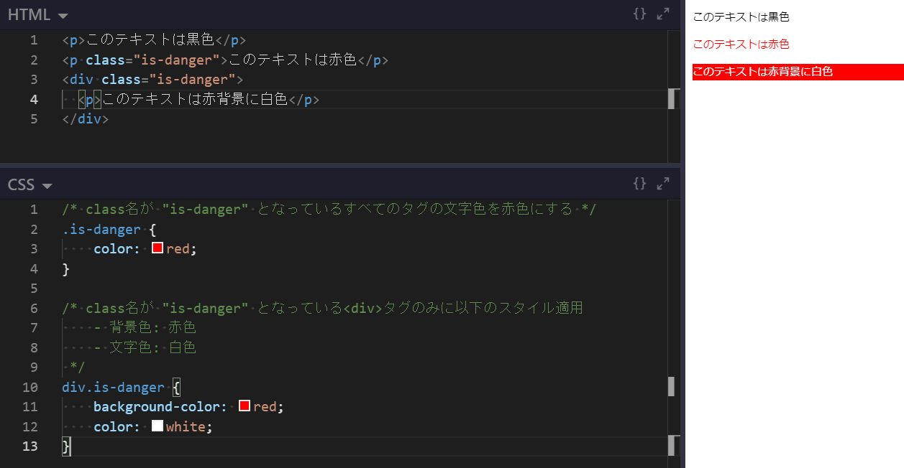

# HTML/CSS から始めるフロントエンド開発

Webエンジニアの職種を大別すると **フロントエンドエンジニア** と **バックエンドエンジニア** に分けられる

通常はいずれかの職種を専門にすることが多いが、いずれにしてもWebサイトやWebアプリケーションサービスの開発を行うことになる

そのため、Webを構成する基礎技術として HTML/CSS の習得は必修項目である

## Webの仕組み

- **インターネット**:
    - 世界中のコンピュータ同士で様々な情報（データ）を交換するための仕組み
    - この技術によりパソコンでメールを送受信したり、スマートフォンでWebサイトを閲覧したりすることが可能となっている
- **Web**:
    - インターネット上で標準的に用いられている文書の公開・閲覧システム
    - 文字や図表、画像、動画などを組み合わせた文書を配布することができる
    - 文書内の要素に別の文書を指し示す参照情報（ハイパーリンク）を埋め込むことができる **ハイパーテキスト** と呼ばれるシステムの一種
    - WebサイトURLの先頭につけられていることがある `www` は World Wide Web の略

### Webページの仕組み
Webシステムは **Webサーバ** と **Webクライアント** の2つから成る

- Webサーバ:
    - パソコンやスマートフォン等と同じくコンピュータの一種で、Web上で情報を公開しているコンピュータ端末
    - ファイルを保存したりデータを管理する等の機能があるが、画面やキーボードなど直接触って操作するためのインターフェイスはついていないことが多い
    - バックエンドエンジニアは基本的に、このコンピュータ内部のシステム構築を行うエンジニアである
- Webクライアント:
    - Webサーバから情報（データ）を受け取るコンピュータ端末
        - つまり我々が普段利用しているパソコンやスマートフォン等のこと
    - Webクライアントが欲しいWeb情報の「要求（リクエスト）」をして、Webサーバがそれに「応答（レスポンス）」することでユーザはWebページを閲覧できる
    - フロントエンドエンジニアは基本的に、Webクライアントに返すデータ構築を行うエンジニアである


### URLとは
URL（ユーアールエル）は `https://www.example.com/sample/index.html` のように記述され、閲覧したいWebサイトにたどり着くための住所のようなものである

Webサイトは各々固有のURLを持っている


しかし、このURLを毎回入力してWebサイトを表示させるのは大変であるため、Webページ内のテキストや画像などにURLの情報を設置し、それらをクリックすることで別のWebページを表示出来るような仕組みがある

これを **ハイパーリンク** と呼び、URLを直接指定することなく手軽にWebページ間を移動出来るようになっている

詳しくは [Webを支える技術](../../01-basic/WEB/README.md) を参照

### HTMLとは
- **HTML**: HyperText Markup Language
    - ハイパーテキストを記述するためのマークアップ言語の1つ
        - **ハイパーテキスト**:
            - 複数の文書を相互に関連付け、結び付ける仕組み（先述のハイパーリンクを実現する仕組み）
            - 画像等のマルチメディアを埋め込むリッチテキストのことを指す場合もある
    - World Wide Web において、Webページを表現するために用いられる
    - Webページに表示したい文章などを `<` と `>` で囲まれたタグと呼ばれる文字列でマークアップを行う
        - **タグ**:
            - Webページをどのように表示させるかWebクライアントに伝える命令文
            - コンピュータがページ構造を理解出来るようにすることがHTMLタグの役割


### CSSとは
- **CSS**: Cascading Style Sheet
    - HTML や XML などの文書の見た目をどのように装飾するかを指示する仕様の1つ
    - 文書の構造と体裁を分離させるという理念を実現するために提唱されたスタイルシートの具体的な仕様の1つ
    - CSSは、HTMLで表現可能と考えられるデザインの大部分を実現できる要素を取り入れつつ、以下のようなデザイン機能をもつ
        - ページを表示するメディアに合わせてスタイルシートを切り替えることで、メディアごとに表示を変化させることが出来る
        - Web制作者やユーザなどがそれぞれ定義したCSSのもたらす効果を重ね合わせる（カスケードする）ことが出来る
    - CSSは、HTML内の `style` タグ（もしくは属性）の中に直接記述したり、別ファイルに分離して `<link>` タグで読み込むことで適用することが出来る


***

## Webクライアントデバイスとブラウザ

- **デバイス**:
    - Webにおけるデバイスとは、スマートフォンやタブレット、パソコンなど、それ単体でインターネットに接続してWebページを閲覧できる端末のことを指す
    - 端末という意味だけでも多くの種類のデバイスがあり、Webページを作成する際は、主要なデバイスで適切に表示出来るようにマークアップを行う必要がある
    - デバイスの意味としては、マウスやキーボードなどのパソコン周辺機器という意味もある

### 端末デバイスの種類
- iOSデバイス:
    - Apple社が開発している iOS システムを搭載したデバイス
    - 具体的には iPhone や iPad などのApple製品を指す
- Androidデバイス:
    - Google社が開発している Android OS を搭載したデバイス
    - iOSデバイスと異なり、Google製以外にも様々な企業が開発・販売しているAndroidデバイスが存在する
    - 日本では Xperia や Galaxy といったスマートフォンが有名
- Windowsデバイス:
    - Microsoft社が開発している Windows OS を搭載したデバイス
    - 多くはパソコンとして提供されているが、Windows Phone のようなスマートフォンデバイスもある
- モバイルデバイス:
    - 携帯して持ち運び出来る電子機器を指す
    - スマートフォンやタブレット、ノートパソコン、デジタルカメラもモバイルデバイスである
    - ポータブルデバイスとも呼ばれる
- スマートデバイス:
    - 明確な定義はないが、一般的にはインターネットに接続して様々なアプリケーションを利用できる端末のことを指す
    - 多くの場合、スマートフォンやタブレット端末のことを示す
- ウェアラブルデバイス:
    - メガネや腕時計、指輪などの身につけて利用できる端末のことを指す
    - Apple Watch や Google Glass などが有名
- IoTデバイス:
    - モノのインターネット（Internet of Things）と呼ばれるデバイス
    - 身の回りの様々なものにインターネット通信機能を搭載した端末のこと
    - スマートデバイスやウェアラブルデバイスなどを総称してIoTデバイスと呼ぶ場合もある

上記以外にも多くのデバイスが存在している

### ブラウザ
Webサイトを閲覧するには **ブラウザ** と呼ばれるソフトウェアが必要であるため、すべてのWebクライアントデバイスにはブラウザが搭載されている

Webサーバから送られてくるデータは、アルファベットや記号から成る暗号のような **コード** で記述されている

コードそのままの状態では人には快適に閲覧できないため、Webブラウザはコードを解析し、人の目に快適に見えるように文字の大きさや色、画像の配置、レイアウト等を整える役割を果たす


ブラウザには様々な種類があり、主に以下のようなものが使われている

- Google Chrome
- Apple Safari
- Microsoft Edge
- Mozilla Firefox

ブラウザの役割は「Webページのデータを見やすく表示する」ことであるため、ブラウザの種類によって動作が大きく変わることはあまりない

しかし、ブラウザごと解釈方法や表現方法が異なる場合があるため、「Chrome ではきれいに表示されているが、Edge ではレイアウトが崩れている」「Safari と Firefox で挙動が微妙に異なる」といったことがよく発生する

そのため、Webサイトを作り始める前に、ページの表示確認をするための標準ブラウザを決めておくことが一般的である

***

## Web制作の流れ

Webサイトを作成する場合、様々な工程が必要であり、制作の流れも時と場合によりけりである

そのためここでは、最も一般的と思われるWeb制作の流れを把握する

### 制作チームの職種
フリーランスエンジニアなどはすべての工程を一人で行うことが多いが、企業でのWeb制作においては概ね以下のような職種の人間が集まってチーム開発を行うことが一般的である

- Webディレクター:
    - Webサイトの目的やメインターゲットとなるユーザの精査など、企画立案を行う
    - サイトマップの作成を行い、制作全体の工程管理を行う
        - サイトマップとはWebサイトの構成を表したもの
        - どのページがどこにリンクしているかなどをまとめ、制作陣営に要件を伝える
- Webデザイナー:
    - Webサイトの骨組みとなるワイヤーフレームの作成を行う
        - ワイヤーフレームとは、完成イメージを見える化するための大まかなレイアウトを定めたもの
        - テキストや画像、仕切り線などを簡単なラインとボックス等で作成し、必要な項目や優先順位、配置等を確認する
    - デザインツール等を使ってサイトデザインを行う
        - 制作する見本は **デザインカンプ** と呼ばれ、Webサイトとして表示されたときと同じ状態になるよう、細かいところまで作り込む
- フロントエンドエンジニア:
    - HTML/CSS を用いて、デザインをWebサイトとして動作する形に実装していく
        - この作業を **コーディング** と呼ぶ
    - 最近の複雑な動作をするWebサイトでは、更に JavaScript を使って作り込むことも多い
- バックエンドエンジニア:
    - Webサイト制作においてはあまり必要とされない職種だが、会員制サイトやより複雑なシステムを内包するWebアプリケーションなどでは、バックエンドエンジニアが裏側のシステム構築を行う
    - JavaScript を使ったコーディング作業を兼任する場合も多く、フロントエンド・バックエンドと分けずに開発を行う企業もある

制作は通常、Webディレクター → Webデザイナ → フロントエンド・バックエンドエンジニア の作業順で流れていき、具体的には以下のようなフローになることが多い

1. 企画立案
2. サイトマップ制作
3. ワイヤーフレーム作成
4. デザイン
5. コーディング／システム開発
6. Web公開

### 企画立案
Webサイトは目的により様々なタイプに分類されるが、概ね以下の6種類に大別される

- コーポレートサイト:
    - 企業の情報を掲載している公式サイト
    - 会社概要や自社製品の紹介、採用情報など、企業についての情報を発信するWebサイト
- プロモーションサイト:
    - 特定の商品やサービス、イベントの告知に使うWebサイト
    - 特設サイトとも呼ばれ、コーポレートサイトに比べて紹介する情報の範囲が狭く、ターゲットユーザ層を絞って制作される
    - 期間限定で公開することも多い
- ポートフォリオサイト:
    - ここで言うポートフォリオとは、個人や企業がこれまでに作成したWebサイトやイラスト、写真などの作品や実績を集めて掲載したものを指す
    - 主にデザイナーやアーティスト、フォトグラファー等が自身の作品や制作実績を掲載しているWebサイト
- ショッピングサイト:
    - ECサイト、オンラインストアサイトとも呼ばれ、インターネット上で商品を販売するWebサイト
    - 商品データベースや決済システム等の複雑なシステム要件があるため、バックエンドエンジニアをアサインすることが多い
    - 販売への誘導等、工夫しなければならないこと、考えなければならないことが多い
- メディアサイト:
    - ニュースや読み物記事で構成されるWebサイトで、ブログもメディアサイトの一種である
    - 特定の分野に特化して情報を配信するパターンがほとんどで、その情報を通じて自社の紹介や商品購入などに誘導する
- SNS（ソーシャル・ネットワーキング・サービス）:
    - ユーザ同士でコミュニケーションをとることを目的としたWebサイト
    - 記事として掲載するほどでもない短文や、画像・動画をメインとした情報配信に向いており、情報を拡散しやすいという特徴がある

企画立案の段階では、サイト制作の目的を明確にして「ターゲットユーザが求めている情報」や「ターゲットユーザに起こしてほしい行動」などを洗い出す必要がある

#### 目標の設定
最初に、主軸となる目標（メインゴール）を決める

メインゴールが決まったら、それを達成するためのサブゴールを1～3個ほど考えておく

更に、目標達成したかを計測する方法も考えておくと、PDCAサイクルを回しやすくなる

そのため、サブゴールは数字でわかる目標（売上金額やアクセス数、会員登録数、SNSの「いいね」数など）にしておくことが望ましい

#### ペルソナの設定
ペルソナとはターゲットユーザを具体的な人物像（年齢、性別、性格、その他属性）に落とし込んだもの

ターゲットユーザとはメインゴールを達成するために核となるユーザ層のことであり、このユーザ層が使いやすい・見やすいサイトデザインを定めていくことになる

この、利用ユーザにとっての使いやすさのことを **ユーザビリティ** と呼び、以下のようなことを考えていく

- デザインの見やすさ
    - 読みやすく疲れにくい配色を考える
    - 目立たせたいものを明確にする
    - レイアウトを統一する
- 文章の読みやすさ
    - 結論を先に書く（まえがきの長い文章は嫌われる傾向にある）
    - 専門用語を多用しない
    - 簡潔にまとめる
- 使いやすい操作性
    - 「押せる」「リンクしている」などユーザが行動の結果を予想できるデザインにする
    - レスポンスの速さ、効率の良さを考える

### サイトマップ制作
Webサイトの目的とターゲットユーザを決めたら、Webサイトの設計に入る

必要なページを書き出し、ページ同士のつながりや重要度などの構成を図にまとめていく（この構成図のことをサイトマップと呼ぶ）


階層が深いほど、ユーザは何度もクリックして目的のページに進まなければならなくなるため、必要なページを絞り、なるべく2～3階層以内におさめるのが良い

また、重要度の高いページ（ユーザが求めているであろうページ）は、すぐに目につくようにナビゲーションメニュー内に配置すると良い

### ワイヤーフレーム制作
サイトマップ制作が完了したら、トップページから順に全ページのレイアウトを考えていく

ここで作成するデザインの骨組みのことを **ワイヤーフレーム** と呼ぶ

ワイヤーフレームの段階では、色や装飾などは加えず、テキストやライン、ボックスのみでデザインしていく

サイトマップではWebサイト全体で重要なページを考えたが、ここでは各ページごとにコンテンツの重要度を考えていくことになる

一般的にユーザの視線は上から下、左から右に移動する

そのため基本的には、優先順位の高いものほどページ上部・左側に配置し、表示面積も大きくするようにレイアウトするのが良い


### デザイン
デザインカンプと呼ばれる、最終的なWebページのイメージをグラフィックツールを用いて作成するフェーズ

フロントエンドエンジニアがコーディング作業を行いやすいように、画像の配置、配色や書体、余白など詳細まで気を配りながらデザインを詰めていく

Webデザインの考え方についてはここでは割愛し、HTML/CSS の基本的な使い方を学んだ後、実際にコーディングを行いながらデザインの考え方を身につけることとする


***

## フロントエンド開発入門／準備

### ブラウザの準備
HTML/CSS を使ったWebページ制作を行うために、まずはブラウザの準備を行う

本稿では Web Maker という開発環境を使いたいため、Google Chrome をインストールする

https://www.google.com/intl/ja_jp/chrome/

なお、Windows 10 においては、バージョン20H2（October 2020Update）で Edge ブラウザのエンジンが Chrome と同じものになっているため、最新の Windows 10 を利用している場合は Edge ブラウザ（標準搭載されている）をそのまま使う方が楽である

Windows 10 以外の環境で Chromium版Edge をインストールしたい場合は、以下からインストールする

https://www.microsoftedgeinsider.com/ja-jp/download/?platform=linux-deb

### Web Maker
ブラウザ上で HTML/CSS/JavaScript のライブコーディング（見た目をリアルタイムに確認しながら編集）できる Chrome の拡張機能

別途エディタ等の準備が不要で迷いなくフロントエンド開発に入ることが出来るため、本稿ではこれを開発環境として採用する

Chrome もしくは Edge にて以下のURLにアクセスし、Web Maker 拡張機能をインストールする

https://chrome.google.com/webstore/detail/web-maker/lkfkkhfhhdkiemehlpkgjeojomhpccnh

問題なくインストールされると下図のようにブラウザツールバーに Web Maker のアイコンが追加されるはずである（画像は Microsoft Edge の場合）


アイコンをクリックすると Web Maker の開発環境が開かれる


***

## フロントエンド開発入門／HTML Living Standard について

### HTML仕様の歴史
HTMLの仕様は、2021年1月までは **W3C** (World Wide Web Consortium) という World Wide Web の標準を策定している国際機関が定めていた

W3Cが定めていたHTMLの最新仕様は **HTML5** であり、2008年1月22日に草案が発表されて以降、Webニュースなどで盛んに取り沙汰されていた

このHTML5の仕様はもともと、**WHATWG (Web Hypertext Application Technology Working Group)** というコミュニティがW3Cに圧力をかけて策定させたものである

WHATWGは、W3Cが策定したXHTMLや、W3CがWeb開発現場の要望を軽視していることなどを不満に思ったApple、Mozilla、Operaの開発者たちによって2004年に結成された開発コミュニティであり、2017年末にはMicrosoftも参加している

HTML5の策定により、セキュリティ的脆弱性や開発のしにくさなどを指摘されていた  Adobe Flash、Java Applet、Microsoft Silverlight は廃れていき、HTML/CSSによる動的メディアの表現力は大きく向上した

しかしながら、勧告としてドキュメントをきちんと整備してから発行したいW3Cと、継続して順次アップデートを行い続けたいWHATWGそれぞれが、別々にHTMLを策定し続けたことで徐々にHTML仕様が2つに乖離していくことになった

「W3CのHTML5」と「WHATWGのHTML (**HTML Living Standard**)」の2つがHTMLの標準として併存する時代がしばらく続いた後の2019年5月、W3CはHTMLとDOMの策定をやめ、WHATWGに協力することを表明した

そして2021年1月29日、WHATWGが定める HTML Living Standard が正式に W3C Recommendation（勧告）として発表され、W3Cが策定してきたHTMLの規格は全て廃止となった

- HTML Living Standard 公式ページ: https://html.spec.whatwg.org/multipage/

### HTML5 と HTML Living Standardの違い
HTML5 と HTML Living Standard で基本的なHTMLを書く上での大きな違いはない

HTMLはこれまで通り `<!DOCTYPE html>` で始まり、`` や `<video>` 等のマルチメディア用タグも使用可能である

しかしながら、HTML Living Standard で新たに追加されたり変更になった点は多くあり、例として以下のようなものがある

- `<a href="">` タグをクリックしたときに、`href` のページに遷移しつつ、別URLにPingを送信する `ping` 属性の追加
- `` の遅延読み込みを行う `loading` 属性の追加
- `autofocus` 属性が `<button>` や `<input>` 以外の、全てのフォーカス可能な要素にも適用可能
- `<h1>` タグは複数使用可能（ただし `<section>` も併用すること）

HTML Living Standard の仕様は頻繁にアップデートされるため、公式ページをよく確認することが重要である

また有志による日本語訳ページも存在するため、英語が読めない場合はそちらを参考にしても良い

- HTML Living Standard 日本語訳ページ: https://momdo.github.io/html/

***

## フロントエンド開発入門／CSS3 について

HTML5の策定に伴って、CSSも最新仕様として **CSS3** がW3Cにより策定されている

CSSの仕様はバージョンではなく **レベル** で表現されており、CSS3 とは CSS Level 3 を意味する

すなわち CSS3 は、HTML5のようにまったく新しいバージョンというわけではなく、従来のCSSと互換性があり、これまでのCSSに新しく便利な仕様を加えた規格となっている

また CSS3 からは CSS 2.1 を中核として、新たな機能の追加や改良を **モジュール** と呼ばれる小さなコンポーネントに分割して実装している

つまり、CSS3 自体が存在しているわけではなく、それぞれのモジュールが独立して勧告に向けて規格策定されており、新しいモジュールも随時追加されている

そのため、HTML5のようにWHATWGにより問題視されることもなく、引き続きW3Cの管轄となっている

- W3C CSS current work: https://www.w3.org/Style/CSS/current-work

***

## フロントエンド開発入門／HTMLの基本

Web Maker 拡張機能を開き、HTMLエディタに以下のように記述する

HTMLでは基本的に、タグ間の空白や改行は無視されるため、必ずしも以下の通りに記述する必要はない

（なお Web Maker HTML エディタでは `html:5` と入力した後 `Tab` キーを押すことで、HTML5のテンプレートが自動的に挿入される）

```html
<!DOCTYPE html>
<html lang="ja">
<head>
    <meta charset="UTF-8">
    <meta name="viewport" content="width=device-width, initial-scale=1.0">
    <title>株式会社サンプル商事</title>
    <meta name="description" content="株式会社サンプル商事は、サンプルWebサイト用の架空の会社です。">
</head>
<body>
    <h1>会社概要</h1>
    <p>株式会社サンプル商事は、20XX年設立の架空の会社である。</p>
</body>
</html>
```


### HTMLの骨組み

#### `<!DOCTYPE html>`
文書が HTML5, HTML Living Standard であることを宣言するための DOCTYPE 宣言（DTD）

HTML4.01 などでは `<!DOCTYPE html public "-//W3C//DTD HTML 4.01//EN" "http://www.w3.org/TR/html4/strict.dtd">` のように複雑なDTDを記述していたが、これから先は HTML Living Standard が標準規格となるため、`<!DOCTYPE html>` だけ記述しておけば良い

**※ Web Maker では自動的に `<!DOCTYPE html>` が宣言されるため、HTMLエディタ内で別のDTDを宣言しても無視される**

#### `<html>...</html>`
DTDの直後に記述し、この文書がHTMLであることを表す

`<html>` タグには `lang` 属性を指定することができ、`lang="ja"` と指定すると日本語の文書であることを示すことが出来る

**※ Web Maker では `<html>` タグは無視されるため記述しても意味はない**

#### `<head>...</head>`
この部分はページのタイトルや説明文、使用する外部ファイルのリンクなど、ページの各種情報を記述する

あくまでページ情報を記述する部分であるため、実際にブラウザの画面には表示されない

**※ Web Maker では `<head>` タグ（とその中身の情報）は無視されるため、ページ情報を自分で設定したい場合は、HTMLファイルとして保存してエディタで編集する必要がある**

head情報として設定出来る項目は多岐にわたるが、ここでは主要な項目のみ見ていく

- `<meta charset="UTF-8">`
    - ページの文字コードを `UTF-8` に設定するタグ
    - VSCode を始めとするほとんどのコードエディタはデフォルトで UTF-8 文字コードでファイルを保存するため、基本的に UTF-8 を指定しておけば良い
    - この文字コードを `Shift_JIS` など正しくない値に設定してしまうと以下の画像のように文字化けしてしまう


- `<meta name="viewport" content="width=device-width, initial-scale=1.0">`
    - スマートフォンやタブレット等のモバイル端末で最適にWeb表示させるための設定
    - viewport について詳しく知りたい場合: https://qiita.com/ryounagaoka/items/045b2808a5ed43f96607
- `<title>...</title>`
    - ページのタイトルをタグの中に記述する
    - ここで設定された名前がブラウザのタブや、検索されたときのページタイトルとして表示される
- `<meta name="description" content="...">`
    - ページについての説明文を `content` 属性の値として記述する
    - ユーザが検索したときにどのようなサイトなのかを瞬時に判断できるように、わかりやすく端的な説明文を設定すると良い

#### `<body>...</body>`
HTML文書の本体部分で、このタグの中に記述されたコンテンツが実際にブラウザで表示される

**Web Maker においては、基本的に `<body>` タグの中身のみ記述していくことになる**

### HTMLタグについて
HTMLでは基本的に `<〇〇>` や `</〇〇>` という形で記述される **タグ** を使って文字列を挟んで書いていく

タグには多くの種類があり、どのタグで挟むかによってその部分の役割が変わってくる

また `<〇〇>` を **開始タグ**、それに `/` が加えられた `</〇〇>` を **終了タグ** と呼ぶ

開始・終了タグは基本的にセットで使われるが、場合によっては終了タグのないものもある

開始タグから終了タグまでの1つのかたまりを **要素** という


#### タグの記述ルール
- 半角英数字で記述する
    - タグに全角文字（日本語等）を使うことはできない
- 大文字と小文字
    - タグは大文字と小文字を区別しないが、通常は小文字で統一することを推奨

#### 入れ子タグ
HTMLでは開始タグと終了タグの間に別のタグが入ることがよくある

このような書き方を **入れ子** と呼ぶが、入れ子構造にする場合は必ず直前の開始タグに対応する終了タグから順に記述する


#### タグの付加情報
タグによっては、開始タグの中にそのタグの付加情報を書くことがある

この情報の種類のことを **属性** と呼び、タグ名の後ろにスペースを空けて記述する

属性に設定する内容のことを **値** と呼び、`属性="値"` という形で記述する（値はダブルクオーテーション `"` だけでなくシングルクオーテーション `'` で囲んでも良いし、そもそも囲まなくても良い場合もあるが、きほんてきにはダブルクオーテーションで囲むように統一しておくのが望ましい）

例えば `<a>` タグはハイパーリンクを作成するためのタグだが、リンク先は `href` 属性で指定する必要があり、`<a href="/about/">...</a>` のように記述することで `/about/` というパス（ページ）にリンクしたハイパーリンクを作成することが出来る

### HTMLにおけるコメントアウト
`<!--` と `-->` で文字列を挟むと、コメントとして解釈され、ブラウザ上では何の影響もない文字列となる

表示はしたくないけれど、覚え書き程度に残しておきたいメモなどを記述する際に使う


***

## フロントエンド開発入門／主要なHTMLタグ

### 見出しタグ
見出しには `<h1>` ～ `<h6>` タグを使う

`<h1>` が最も大きな見出しで、`h` の後ろの数字が大きくなるほど小さい見出しになっていく

```html
<h1>1番大きな見出し</h1>
<h2>2番目の見出し</h2>
<h3>3番目の見出し</h3>
<h4>4番目の見出し</h4>
<h5>5番目の見出し</h5>
<h6>6番目の見出し</h6>
```


見出しはタグは大見出しとなる `<h1>` から順に使っていき、次の中見出しには `<h2>`、その次の小見出しには `<h3>` ... のように、数字の順番に沿って使っていくのが望ましい

文字の大きさなどの見た目を理由に突然 `<h5>` を使うのは、きれいなHTML文書とは言えない（見た目を変えたいのであればスタイルシートを使うべき）

また、`<h1>` は通常1つのページにつき1度の利用が良いとされており、そのページに何が書かれているかを表すための大見出しとして使うのが望ましい

### 段落タグ
文章の段落（まとまり）を記述したい場合は `<p>` タグを使う

`<p>...</p>` で囲まれた文章は段落となり、通常は段落ごとに改行されて段落間に少しのスペースが空けられる

なお、単純に文章の途中で改行したい場合は `<br>` タグを用いる

```html
<p>架空の存在である株式会社サンプル商事。
    その正体は何なのか。</p>
<p>それは・・・<br>誰も・・・<br>知らない・・・</p>
```


### 画像タグ
画像を表示したい場合は `` タグを使う

このタグには終了タグはなく、表示したい画像は `src` 属性で指定する

`src` で指定する画像ファイルへのパスは、現在のページ（HTMLファイル）からの相対パス、もしくはURLで指定する

また、指定の際は `alt` 属性も設定しておくのが望ましい

`alt` はWebブラウザで画像がうまく読み込めなかった場合に、画像に代わって表示するテキストになる

`alt` を指定することで画像の意味を正しく伝えることが出来るようになり、より良いWebページとなる

```html
<!--
    https://placehold.jp/150x150.png の画像を表示
    placehold.jp は様々なダミー画像を配信してくれるため便利
-->


<!-- 無効な画像ファイルを指定した場合 -->

```


### ハイパーリンク
ハイパーリンクを作るには、リンクさせたいテキストを `<a>` タグで囲んで、`href` 属性でリンク先のURL（もしくは現在のページからの相対パス）を指定する

```html
<p>とりま<a href="https://www.google.co.jp">ググっとけ</a>！</p>

<!-- 画像にリンクを貼ることも出来る -->
<a href="https://placehold.jp"></a>
```


### リストタグ
箇条書きリストを表示するには `<ul>` タグと `<li>` タグを使う

`ul` は Unordered List (順序の決まっていないリスト) のことで、このタグの中に `<li>` (List Item) タグを使ってリスト項目を追加していくことになる

なお、番号付きのリストを作成したい場合は `<ol>` (Ordered List) タグと `<li>` タグを使う

```html
<ul>
    <li>卵（3個）</li>
    <li>醤油（大さじ1）</li>
    <li>みりん（大さじ1）</li>
    <li>塩（少々）</li>
</ul>

<ol>
    <li>卵を割りほぐし、調味料を加える</li>
    <li>卵焼き器に卵液を1/4量入れて広げる</li>
    <li>半熟状になったら箸で手前に巻き、奥に移動させる</li>
    <li>これを繰り返し、最後まで焼けたら完成</li>
</ol>
```


***

## フロントエンド開発入門／HTMLで表を作成する

HTMLを書いていると、何らかのデータを縦横に並べて表示したい場合がよくある

こういった表形式の表示を行うために使えるのが `<table>` タグである

なお、CSSの表現力が弱かった頃は、`<table>` タグを駆使して複雑なページレイアウトを実現していたこともあった（CSS3 になって Flexbox 等が使えるようになった現在では、tableによる段組みレイアウトはバッドノウハウである）

### 表組みの主要なタグ
表組みでは、以下のような複数のタグを組み合わせて使用する

| タグ | 概要 |
| :--: | :-- |
|`<table>`|表を表すタグ。表全体を囲む|
|`<tr>`|Table Row: 表の1行を囲む|
|`<th>`|Table Header: 表の見出しとなるセルを作成|
|`<td>`|Table Data: 表のデータとなるセルを作成|


tr タグ内のセル数（th, td タグ数）は揃えないとレイアウトが崩れてしまうため注意

また、見出し不要の場合は th タグは省略して良い

```html
<!--
    デフォルトの table は区切り線がなく見づらい
    そのため、ここでは border 属性に 1 を指定している
    ※本来こういった見た目の装飾は CSS で行うべきである
-->
<table border="1">
    <tr>
        <th>商品</th>
        <th>値段</th>
    </tr>
    <tr>
        <td>りんご</td>
        <td>200円</td>
    </tr>
    <tr>
        <td>バナナ</td>
        <td>120円</td>
    </tr>
</table>
```


### セルをつなげる
複数のセルをつなげて一つのセルとして表示することも出来る

横方向につなげたい場合は、つなげたいセルの th, td タグに `colspan` 属性を追加し、つなげたいセルの数を値として設定する

```html
<table border="1">
    <tr>
        <!-- 横方向に2つのセルをつなげる -->
        <th colspan="2">商品＋値段</th>
    </tr>
    <tr>
        <td>りんご</td>
        <td>200円</td>
    </tr>
    <tr>
        <td>バナナ</td>
        <td>120円</td>
    </tr>
</table>
```


同様に、縦方向につなげたい場合は `rowspan` 属性で指定する

```html
<table border="1">
    <tr>
        <th>商品</th>
        <th>値段</th>
    </tr>
    <tr>
        <td>りんご</td>
        <!-- 縦方向に2つのセルをつなげる -->
        <td rowspan="2">150円</td>
    </tr>
    <tr>
        <td>バナナ</td>
        <!-- <td> 上の tr で rowspan されているため td 不要 </td> -->
    </tr>
</table>
```


***

## フロントエンド開発入門／ブロック要素によるグループ分け

Webサイトは以下のように様々な構成要素の組み合わせでできている

- ナビゲーションメニュー
- 本文
- サイドバー
- 関連情報
- ...etc

これらを1つのかたまりとしてタグで囲み、グループ化していくことで構造的なWebサイトを作成することが出来る

例えば、以下のように見出しと文章が並んでいるとする

```html
<h1>今日の天気</h1>
<p>今日は大雨です。</p>
<p>洪水・波浪に注意してください。</p>

<h2>熱中症情報</h2>
<p>厳重警戒</p>
<!-- dl: 定義リスト, dt: タイトル, dd: 内容 -->
<dl>
    <dt>紫外線</dt><dd>やや強い</dd>
    <dt>洗濯</dt><dd>乾かない</dd>
    <dt>服装</dt><dd>80</dd>
</dl>
```

この中で「今日の天気」と「熱中症情報」は別のテーマを持っているため、別のグループに分けたほうが良さそうに思える

そのため、以下のように `<article>` および `<section>` タグでグループ分けしてみる

なお `<article>` は、独立して完結した記事であることを示すタグであり、`<section>` は一般的な章・節・項であることを示すタグである

```html
<article>
    <h1>今日の天気</h1>
    <p>今日は大雨です。</p>
    <p>洪水・波浪に注意してください。</p>
</article>

<section>
    <h2>熱中症情報</h2>
    <p>厳重警戒</p>
    <dl>
        <dt>紫外線</dt><dd>やや強い</dd>
        <dt>洗濯</dt><dd>乾かない</dd>
        <dt>服装</dt><dd>80</dd>
    </dl>
</section>
```

ブラウザの表示上は、グループ分けしてもしなくても特に変わらないが、後に学ぶCSSを使って設定するとグループごとに色を付けたり、レイアウトを変更したり出来るようになるため、なるべく構造的な書き方を出来るようになっておくことが望ましい


なお `<h1>`, `<p>` タグのように前後に改行が入りブロックとしてみなされる要素を **ブロック要素** と言い、`<a>`, `` タグのようにテキストの一部として扱われるものを **インライン要素** と言う

グループ化するためのタグにはそれぞれ意味があり、コンピュータに対してその部分の意味や内容を知らせるための役割もある

以下、よく目にするような構成のWebサイトを例に使い方を見ていく

### `<header>`: ページ上部のヘッダー部分を作る
`<header>` タグは、ロゴ画像やページタイトル、ナビゲーションメニュー等のページ上部パーツをまとめるために使う

HTMLファイルの冒頭に記述する `<head>` 要素とは異なるため注意

なおナビゲーションメニューは `<nav>` タグを使ってグループ化することが多く、`<header>` タグの中に含まれることがよくある

`<nav>` タグは基本的にメインでないメニュー部分には使わない

```html
<header>
    
    <h1>ページタイトル</h1>
    <nav>
        <ul>
            <li><a href="/service/">サービス紹介</a></li>
            <li><a href="/price/">料金</a></li>
            <li><a href="/contact/">お問い合わせ</a></li>
        </ul>
    </nav>
</header>
```


### `<article>`: 読み物／記事部分を作る
ページ内の記事となる部分、そこだけ見ても独立したページとして成り立つような内容には `<article>` タグが使われる

ニュースサイトやブログサイトの記事部分などによく使われる

```html
<article>
    <h2>記事タイトル</h2>
    <p>記事コンテンツ</p>
</article>
```


### `<section>`: テーマを持ったグループを作る
一般的な章・節・項など、テーマを持ったグループを作るには `<section>` タグを使う

`<article>` タグと似ているが、その部分だけを見ても完結はせず、あくまで特定のテーマがあるグループに対して用いる

```html
<section>
    <h2>おすすめ記事</h2>
    <ul>
        <li><a href="/article/123/">記事タイトル123</a></li>
        <li><a href="/article/456/">記事タイトル456</a></li>
    </ul>
</section>
```


### `<main>`: ページのメインコンテンツ部分を作る
そのページの核となるコンテンツ全体は `<main>` タグで囲む

この中に `<article>` や `<section>` が入ることが多い


### `<aside>`: メインコンテンツではない補足情報を作る
サイドバーなどの補足情報は `<aside>` タグで囲む

基本的にメインコンテンツとは関連性の低い情報に使う

```html
<aside>
    <h3>自己紹介</h3>
    <p>フロントエンド開発勉強中です。</p>
</aside>
```


### `<footer>`: ページ下部のフッター部分を作る
コピーライトやSNSリンク等、ページ下部にあるコンテンツは `<footer>` タグで囲む

```html
<footer>
    <p>Copyright (C) XXXX</p>
    <ul>
        <li><a href="#">Facebook</a></li>
        <li><a href="#">Twitter</a></li>
    </ul>
</footer>
```


### `<div>`: 意味を持たないブロック要素を作る
`<div>` タグは、特定の用途を持たないグループ、デザインのためだけにグループ化する必要がある場合に使う

特に意味を持たない `<div>` タグは、とにかくひとまとめにしたいが、どのタグが適切か分からないといった場合に使える

```html
<div>
    
    <p>商品を正面から見た場合</p>
</div>
<div>
    
    <p>商品を側面から見た場合</p>
</div>
```

***

## フロントエンド開発入門／CSSの基本

### CSSの適用方法
HTMLで作成したWebページにCSSを適用させるためには、大きく3つの方法がある

1. CSSファイルをHTMLファイルとは別に作成して読み込ませる
    - Webサイトを制作する場合は、この方法を採用するのが一般的
2. HTMLの `<head>` 内に `<style>` タグで指定する
3. HTMLタグの中に `style` 属性を指定する

#### CSSファイルをHTMLファイルとは別に作成して読み込ませる
`.css` の拡張子をもつCSSファイルを作成し、それをHTMLファイルに読み込ませる

1つのCSSファイルを複数のHTMLファイルに読み込ませることができ、スタイルの一元管理が行いやすい

そのため、Webサイト制作においては最もよく使われる方法である


適用するには、HTMLの `<head>` 内で `<link>` タグを用いて読み込むCSSを指定する

linkタグの **rel属性** に `"stylesheet"`、**href属性** に対象のCSSファイルへのパス、もしくはURLを設定する

```html
<!DOCTYPE html>
<html lang="ja">
    <head>
        <meta charset="UTF-8">
        <meta name="viewport" content="width=device-width, initial-scale=1.0">

        <!-- bootstrap4 の css を外部URLから読み込み -->
        <link rel="stylesheet" href="https://stackpath.bootstrapcdn.com/bootstrap/4.3.1/css/bootstrap.min.css">
        
        <!-- fontawesome5 の css を外部URLから読み込み -->
        <link rel="stylesheet" href="https://use.fontawesome.com/releases/v5.8.2/css/all.css">
    <head>
    <body>
    </body>
</html>
```

なお、Web Maker では `<head>` を記述出来ないため、右上の「Add Library」ボタンから設定する


#### HTMLの `<head>` 内に `<style>` タグで指定する
CSSファイルを別に作成せずに、HTMLファイルの中に直接CSSを記述することもできる

`<style>...</style>` タグの中にCSSを記述すると、そのHTMLファイルの中だけで適用されるスタイルシートを作成することができる

特定のページのみ、ちょっとしたデザイン変更を行いたい場合などに使う

```html
<!DOCTYPE html>
<html lang="ja">
    <head>
        <meta charset="UTF-8">
        <meta name="viewport" content="width=device-width, initial-scale=1.0">

        <!-- CSSを直接記述 -->
        <style>
            h1 { color: #f33; }
            p { font-size: 1.2em; }
        </style>
    <head>
    <body>
    </body>
</html>
```

Web Maker においては、CSSエディタ部分に記述すれば、`<style>` タグ内にCSSを記述したのと同様の処理となる

#### HTMLタグの中に `style` 属性を指定する
各HTMLタグには `style` 属性を指定することができ、タグに直接CSSを適用することができる

この場合、CSSは直接指定されたタグに対してのみ適用される（同名のタグすべてに適用されるわけではない）

前述の2つの適用方法よりも優先順位が高いため、スタイルを上書きしたい場合や一部のデザインだけ変更したい場合に使うことが多い

しかし、メンテナンス性が悪いため、Web開発の現場では使用を避けられることが多い

```html
<h1 style="color: #f33;">今日の天気</h1>
<p style="font-size: 1.2em;">大雨・波浪警報が出ています。</p>
```

### CSSの基本文法
CSSは **セレクタ**、**プロパティ**、**値** の3つの要素から成り、「どの部分の、何を、どう変えるか」を指定する


- セレクタ:
    - 「どの部分」を装飾するかの指定を行う
    - HTMLタグ名やclass名、id等の特定の変更箇所を記述する
    - セレクタに続いて、プロパティと値を `{` と `}` で囲んで記述する
- プロパティ:
    - セレクタで指定された部分の「何を」変えるのかを指定する
    - プロパティには、文字色やフォントサイズ、余白、背景など多くの種類がある
    - プロパティに続けて、値との間には `:` を書いて区切る
- 値:
    - 見た目を「どのように」変えるかを指定する
    - プロパティごとに設定できる値は決まっており、文字色を変える場合は「何色にするか」、フォントサイズを変える場合は「どのサイズにするか」などを具体的に指定する
    - 複数のプロパティと値を指定する場合は、値の最後に `;` を書いて区切る

なお、CSSでは空白や改行に意味はないため、すべて削除しても問題ない

開発段階では読みやすさのために空白・改行を書くことが多いが、実際に公開する場合は少しでもファイルサイズを節約して高速化したいため、空白・改行を削除することが多い

また、CSSでコメント（注釈）を残したい場合は `/*` と `*/` で囲むとコメントアウトすることができる

```css
/*この部分は単なるコメントであり、ブラウザに解釈されることはない
  このように複数行記述することもできる*/
h1{color:red;} /* 空白・改行を書く必要はないが、読みにくくなる */
```

#### CSSの記述ルール
- 半角英数字で記述する
    - HTMLタグと同様に全角文字（日本語等）を使うことはできない
- 大文字と小文字
    - HTMLタグ同様、基本的に大文字と小文字を区別しないが、通常は小文字で統一することを推奨

#### 複数のセレクタを指定する
複数のセレクタに同じ装飾を指定できる

複数のセレクタを指定したい場合は `,` でセレクタを区切る

```css
/* h1 と p タグ両方を赤色テキストにする */
h1, p { color: red; }
```

#### 複数の装飾を指定する
1つのセレクタに複数の装飾を指定したい場合は、値の最後に `;` を加えてプロパティを区切る

```css
/* h1 タグを赤色テキスト, フォントサイズ20pxにする */
h1 { color: red; font-size: 20px; }
```

プロパティが1つしかない場合や最後のプロパティには `;` は不要だが、基本的には `;` をつける癖をつけておいたほうが良い

#### 要素の中の要素を指定する
複数のセレクターを半角スペースで区切ると、指定した要素の中にあるネストされた要素に装飾を指定できる

例えば、以下のように記述すると `<div>` タグの中にある `<p>` タグの文字色だけを赤色に変更することができる

```css
div p {
    color: red;
}
```

```html
<div>
    <p>こっちだけ赤色になる</p>
</div>
<p>こっちは黒いまま</p>
```


#### class名によるセレクタ指定
すべてのHTMLタグには `class` 属性を指定することができる

この `class` 属性した指定された値（class名）をセレクタとしてCSSを適用する場合には `.クラス名` というセレクタの書き方をする

```css
/* class名が "is-danger" となっているすべてのタグの文字色を赤色にする */
.is-danger {
    color: red;
}

/* class名が "is-danger" となっている<div>タグのみに以下のスタイル適用
    - 背景色: 赤色
    - 文字色: 白色
 */
div.is-danger {
    background-color: red;
    color: white;
}
```

```html
<p>このテキストは黒色</p>
<p class="is-danger">このテキストは赤色</p>
<div class="is-danger">
    <p>このテキストは赤背景に白色</p>
</div>
```



#### IDによるセレクタ指定
`class` 属性同様、`id` 属性でもセレクタ指定が可能である

`class` との違いとして、`class` は同名の値を複数設定して良いが、`id` は固有の値を設定しなければならない

セレクタの指定方法は `#id値` である

```css
/* idが "navi" である<a>タグを黒線で囲む */
a#navi {
    border: solid 1px #666;
    margin: 0.2em 0.5em;
}
```

```html
<a href="#">普通のリンク</a>
<a href="#" id="navi">黒線で囲まれているリンク</a>
```


#### 単位の指定
文字サイズや幅、高さなどの数値を指定する場合は、値が `0` の場合を除き、単位も一緒に記述する

単位には **絶対単位** と **相対単位** があり、よく使うものとしては以下のようなものがある

- **pt**:
    - 絶対単位で、1ポイントは 0.035cm（センチメートル）
    - 記述例: `p { font-size: 20pt; }`
- **mm**:
    - 絶対単位で、1ミリメートルは 0.1cm（センチメートル）
    - 記述例: `p { font-size: 20mm; }`
- **px**:
    - 画面上の最小単位（1ピクセル）を基準とした相対単位
    - モニターの解像度により1ピクセルの大きさが異なるため相対単位としているが、絶対単位として扱う場合もある
    - 記述例: `div { width: 200px; }`
- **%**:
    - 親要素のサイズを基準に割合で指定する相対単位
    - 記述例: `div { width: 90%; }`
- **rem**:
    - ルート要素（`html` 要素）に指定されたサイズを基準とした相対単位
    - ルート要素の font-size が 12px で、`font-size: 1.1rem` のように指定した場合は、$12\times1.1=13.1\rm{px}$ となる
- **em**:
    - 親要素に指定されたサイズを基準した相対単位
    - 計算方法は rem と同じ
- **vw**:
    - viewport width (ビューポートの幅) を基準とした割合の相対単位
    - ビューポートとはブラウザでWebページを閲覧している時の表示領域のこと
    - ビューポートの幅が 1200px の場合、`50vw` は $1200\times\frac{50}{100}=600\rm{px}$ となる
- **vh**:
    - viewport height (ビューポートの高さ) を基準とした割合の相対単位
    - 計算方法は vw と同じ

#### 色の指定
文字色や背景色など、色を指定する場合は以下のような指定方法がある

- 色の名前で指定:
    - `white`, `red`, `yellow`, `blue`, `green`, `orange`, `purple` などの事前定義された色名で指定する
    - 記述例: `p { color: red; }`
    - 参考: https://www.colordic.org/
- カラーコードで指定:
    - `#` で始まる3桁もしくは6桁のカラーコードで指定する
    - カラーコードは「0, 1, 2, 3, 4, 5, 6, 7, 8, 9, a, b, c, d, e, f」の16文字を使った16進数で成る
        - 「0」に近いほど色は暗くなり、「f」に近いほど色は明るくなる
    - 6桁の内、左2つが赤要素、真ん中2つが緑要素、右2つが青要素の度合いを表す
        - 黒: `#000000`
        - 赤: `#ff0000`
        - 緑: `#00ff00`
        - 青: `#0000ff`
        - 白: `#ffffff`
    - 同じ数値が連続する場合は、カラーコードを3桁に省略できる
        - `#000000` => `#000`
        - `#ff0000` => `#f00`
        - ...etc
    - 記述例: `h1 { color: #3cb371; }`
- RGB(RGBA)値で指定:
    - RGBとは赤・緑・青の数値を組み合わせた表現方法で `rgb(赤の数値, 緑の数値, 青の数値)` で指定する
        - 数値は 0～255 まであり、「0」が一番暗く、「255」が一番明るい（カラーコードも、16進数を10進数に変換すると `ff` は `255` であるため同じである）
    - 透明度を表す **Alpha値** も指定でき、`rgba(赤の数値, 緑の数値, 青の数値, 透明度)` という書き方で指定できる
        - Alpha値は 0～1 で指定し、「0」が完全透明、「1」が完全不透明となる
        - 例えば `rgba(255, 0, 0, 0.5)` のように記述すると、半透明な赤色を指定できる
    - 記述例: `div { background-color: rgb(255,155,0); }`

### カスケーディングと詳細度
CSSには **カスケーディング (Cascading)** という仕組みが存在し、セレクタが示す同じ要素に異なる値を入れた場合に、どの要素を適用してブラウザに表示するかが決まっている

具体的には以下の 1 > 2 > 3 の順に優先度が高い

1. 重要度
2. 詳細度
3. コードの順序

#### 重要度
重要度を表す要素として有名なのは `!important` である

これを値として追加すると、同じセレクタ要素に後から異なる値を上書きしようとしても上書きされなくなる

```css
/* <p>タグの文字色を黒にして、この設定を最大の優先度とする */
p {
    color: black !important;
}

/* <p>タグの文字色を赤に変更しようとしても color: black の方が優先される */
p {
    color: red;
}
```


#### 詳細度
セレクタの詳細度が高いものほど優先的に設定される

基本的に以下の 1 > 2 > 3 の順に詳細度が高い（優先度が高い）

1. IDセレクタ（例: `#example`）
2. クラスセレクタ（例: `.example`）
3. 要素型セレクタ（例: `h1`）

例えば以下の場合、コードの順序という観点では下の `p` に当てているスタイルが優先されるはずだが、この場合詳細度の方が優先されるため、class名に当てているスタイルが反映される

```css
.is-green { color: green; }
p { color: black; }
```

```html
<p class="is-green">このテキストは何色になっている？</p>
```


#### コードの順序
優先度的に一番低くなるが、基本的に同じセレクタに対して別のスタイルを設定した場合は、コード的に後ろにある方が優先的に反映される（上書きされる）

```css
/* <p>タグの文字色を緑に変更 */
p { color: green; }

/* <p>タグの文字色を黒に上書き */
p { color: black; }
```

```html
<p>このテキストは何色になっている？</p>
```


***

## VSCodeエディタを使ったフロントエンド開発

CSSは実際にWebデザインをコーディングしながら覚えていった方が早い

また、これまでは Web Maker を使って簡単にコーディングしていたが、実際にはエディタを使って HTML/CSS ファイルを作成してWeb制作を進めていく

そのため、本稿ではVSCodeエディタを使って HTML/CSS ファイルを作成しながら、一通りコーディングを体験してみる

### VSCode Live Server 拡張機能の導入
VSCodeエディタには、Web Maker と同じようにリアルタイムにHTMLをプレビューできる **Live Server** という拡張機能がある

https://marketplace.visualstudio.com/items?itemName=ritwickdey.LiveServer

この拡張機能は、フロントエンド開発において便利なためここで導入しておく

ターミナル（Bash, PowerShell 等）を開いて以下のコマンドを実行する

```bash
# ターミナルから VSCode Live Server 拡張機能をインストール
## VSCode を開いて Ctrl+P |> `ext install ritwickdey.liveserver` でも導入できる
## もしくは VSCode 上で Ctrl+Shift+X |> `Live Server` で検索してインストールでも良い
$ code --install-extension ritwickdey.liveserver
```

### index.html の作成
通常、Webサイトのトップページには `index.html` というHTMLファイルを設置する

これは、Webサーバの設定でアクセス先のパスから `index.html` を自動的に探して表示するようになっていることが通例のためである

例えば `https://www.example.com/` というURLにアクセスした場合、`https://www.example.com/index.html` が自動的に表示されるということである

まずは、フロントエンド開発用の適当なディレクトリを作成し、VSCodeでディレクトリを開く


続いてエクスプローラサイドバー（表示されていない場合は `Ctrl + Shift + E` キーで開く）で、右クリック→「新しいファイル」から `index.html` というファイルを作成する


VSCodeにはHTMLコーディング用のショートカットが豊富に用意されており、`html:5` と記述した後 `Tab` キーを入力すると、Web Maker と同じように以下のようなHTMLテンプレートが自動的に挿入されるようになっている

```html
<!DOCTYPE html>
<html lang="en">
<head>
  <meta charset="UTF-8">
  <meta http-equiv="X-UA-Compatible" content="IE=edge">
  <meta name="viewport" content="width=device-width, initial-scale=1.0">
  <title>Document</title>
</head>
<body>
  
</body>
</html>
```

また、`div` |> `Tab` キーで `<div></div>` というタグが自動挿入されたりといった便利な機能もあるため、活用するとコーディングの効率が非常に良くなる

### Live Server 拡張機能の使い方
動作確認のため、`index.html` を以下のように記述してみる

```html
<!DOCTYPE html>
<html lang="ja">
<head>
  <meta charset="UTF-8">
  <meta http-equiv="X-UA-Compatible" content="IE=edge">
  <meta name="viewport" content="width=device-width, initial-scale=1.0">
  <title>フロントエンド開発入門</title>
</head>
<body>
  <h1>フロントエンド開発入門</h1>
  <p>VSCode Live Server を使って効率的に開発する。</p>
</body>
</html>
```

Live Server 拡張機能が正常にインストールされていれば、VSCode の右下に「Go Live」というボタンがあるはずなので、これを押す

すると自動的にブラウザが立ち上がり、`index.html` の内容を表示してくれるはずである


なお、`index.html` の中身を変更して保存すると、自動的にブラウザ側の表示にも反映されるため、非常に便利である

### 2カラムレイアウト
最後にCSSを使って、よく見かける2カラムレイアウトのWebページを作成してみる

ディレクトリ内に以下のようなファイルを配置してブラウザの表示を確かめてみる

```bash
./
|_ index.html # トップページHTML
|_ style.css  # index.html から読み込まれるCSS
```

#### index.html
```html
<!DOCTYPE html>
<html lang="ja">
<head>
  <meta charset="UTF-8">
  <meta http-equiv="X-UA-Compatible" content="IE=edge">
  <meta name="viewport" content="width=device-width, initial-scale=1.0">
  <title>フロントエンド開発入門</title>
  <!-- 同じ階層にある style.css を読み込む -->
  <link rel="stylesheet" href="./style.css">
</head>
<body>
  <!-- ヘッダー領域 -->
  <header>
    <!-- ナビゲーションメニュー -->
    <nav class="main-navi">
      <ul>
        <li><a href="/">Home</a></li>
        <li><a href="/info/">Information</a></li>
        <li><a href="/about/">About</a></li>
        <li><a href="/blog/">Blog</a></li>
        <li><a href="/contact/">Contact</a></li>
      </ul>
    </nav>
    <!-- タイトル・サブタイトル -->
    <h1>フロントエンド開発入門</h1>
    <p class="sub-title">VSCode Live Server を使って効率的に開発する</p>
  </header>
  <!-- メインコンテンツ＋サイドバーをグループ化 -->
  <div class="container">
    <!-- メインコンテンツ -->
    <main>
      <article>
        <h2>HTML/CSS 入門</h2>
        <p>CSSは実際にWebデザインをコーディングしながら覚えていった方が早い</p>
        <p>そのため、本稿ではVSCodeエディタを使って HTML/CSS ファイルを作成しながら、一通りコーディングを体験してみる</p>
      </article>
    </main>
    <!-- サイドバー -->
    <aside>
      <h2>開発環境</h2>
      <dl>
        <dt>ブラウザ</dt><dd>Microsoft Edge</dd>
        <dt>エディタ</dt><dd>VSCode</dd>
      </dl>
    </aside>
  </div>
</body>
</html>
```

#### style.css
```css
/* body領域 */
body {
    width: 80vw; /* 幅を表示領域の80%に */
    margin: 1.5rem auto; /* 上下の空白を 1.5rem, 左右の空白をauto（センタリング）に */
}

/* ヘッダー領域 */
header {
    background-color: #c3b79d; /* 文字色を薄茶色に */
    color: #f0ffff; /* 文字色を azure に */
    padding: 1.5rem 0; /* ヘッダー内部に上下 1.5rem のスペースを挿入 */
}

/* メインナビゲーション */
nav.main-navi ul {
    display: flex; /* フレキシブルボックスレイアウト対応 */
    flex-direction: row; /* 中の要素を横に並べる */
    justify-content: space-around; /* 中の要素を均等間隔で並べる */
    list-style-type: none; /* リストの記号（点）をなしに */
    margin: 0; /* 上下左右の空白を0 に */
    margin-bottom: 0.8rem; /* 下に 0.8rem のスペースを挿入 */
}

/* ヘッダー領域内リンク */
header a {
    color: #f0ffff; /* 文字色を azure に */
    text-decoration: none; /* リンクの下線等の飾り付けを削除 */
    font-weight: 600; /* フォントをやや太字に */
}
header a:hover { /* マウスを乗せたときのスタイル */
    text-decoration: underline; /* 下線を表示 */
}

/* ヘッダー内タイトル */
header h1 {
    margin: 0 2rem; /* 上下の空白を0, 左右の空白を 2rem に */
    font-size: 1.8rem; /* フォントサイズを 1.8rem に */
}

/* ヘッダー内サブタイトル */
header p.sub-title {
    margin: 0 2rem; /* 上下の空白を0, 左右の空白を 2rem に */
    font-size: 0.9rem; /* フォントサイズを 0.9rem に */
}

/* メインコンテンツ＋サイドバー領域 */
div.container {
    display: flex; /* フレキシブルボックスレイアウト対応 */
    flex-direction: row; /* 中の要素を横に並べる */
}

/* メインコンテンツ領域 */
main {
    width: 80%; /* 親要素の70%幅: 80vw x 70% = 56vw */
    color: #666; /* 文字色を濃い灰色に */
    padding: 0.5rem 1rem; /* main内部に上下 0.5rem, 左右 1rem のスペースを挿入 */
}

/* サイドバー領域 */
aside {
    width: 30%; /* 親要素の30%幅: 80vw x 30% = 24vw */
    background-color: #fff8dc; /* 背景色を cornsilk に */
    margin: 1rem 0; /* 上下の空白を 1rem に */
    color: #666; /* 文字色を濃い灰色に */
}

/* サイドバー内タイトル */
aside h2 {
    background-color: #800000; /*  */
    color: #fff8dc; /* 文字色を cornsilk に */
    margin: 0; /* 上下左右の空白をなしに */
    padding: 0.2rem 1rem; /* h2内に上下 0.2rem, 左右 1rem のスペースを挿入 */
    font-size: 1.2rem; /* フォントサイズを 1.2rem に */
}

/* サイドバー内コンテンツ */
aside dl {
    margin: 0.6rem 1.2rem; /* 上下の空白を 0.6rem, 左右の空白を 1.2rem に */
    font-size: 0.9rem; /* フォントサイズを 0.9rem に */
}
```

#### ブラウザの表示確認
以下のように、文字色や背景色、レイアウト等の整った表示になっていればOK


