# HTML/CSS 入門

## HTML Living Standard について

### HTML仕様の歴史
HTMLの仕様は、2021年1月までは **W3C** (World Wide Web Consortium) という World Wide Web の標準を策定している国際機関が定めていた

W3Cが定めていたHTMLの最新仕様は **HTML5** であり、2008年1月22日に草案が発表されて以降、Webニュースなどで盛んに取り沙汰されていた

このHTML5の仕様はもともと、**WHATWG (Web Hypertext Application Technology Working Group)** というコミュニティがW3Cに圧力をかけて策定させたものである

WHATWGは、W3Cが策定したXHTMLや、W3CがWeb開発現場の要望を軽視していることなどを不満に思ったApple、Mozilla、Operaの開発者たちによって2004年に結成された開発コミュニティであり、2017年末にはMicrosoftも参加している

HTML5の策定により、セキュリティ的脆弱性や開発のしにくさなどを指摘されていた  Adobe Flash、Java Applet、Microsoft Silverlight は廃れていき、HTML/CSSによる動的メディアの表現力は大きく向上した

しかしながら、勧告としてドキュメントをきちんと整備してから発行したいW3Cと、継続して順次アップデートを行い続けたいWHATWGそれぞれが、別々にHTMLを策定し続けたことで徐々にHTML仕様が2つに乖離していくことになった

「W3CのHTML5」と「WHATWGのHTML (**HTML Living Standard**)」の2つがHTMLの標準として併存する時代がしばらく続いた後の2019年5月、W3CはHTMLとDOMの策定をやめ、WHATWGに協力することを表明した

そして2021年1月29日、WHATWGが定める HTML Living Standard が正式に W3C Recommendation（勧告）として発表され、W3Cが策定してきたHTMLの規格は全て廃止となった

- HTML Living Standard 公式ページ: https://html.spec.whatwg.org/multipage/

### HTML5 と HTML Living Standardの違い
HTML5 と HTML Living Standard で基本的なHTMLを書く上での大きな違いはない

HTMLはこれまで通り `<!DOCTYPE html>` で始まり、`` や `<video>` 等のマルチメディア用タグも使用可能である

しかしながら、HTML Living Standard で新たに追加されたり変更になった点は多くあり、例として以下のようなものがある

- `<a href="">` タグをクリックしたときに、`href` のページに遷移しつつ、別URLにPingを送信する `ping` 属性の追加
- `` の遅延読み込みを行う `loading` 属性の追加
- `autofocus` 属性が `<button>` や `<input>` 以外の、全てのフォーカス可能な要素にも適用可能
- `<h1>` タグは複数使用可能（ただし `<section>` も併用すること）

HTML Living Standard の仕様は頻繁にアップデートされるため、公式ページをよく確認することが重要である

また有志による日本語訳ページも存在するため、英語が読めない場合はそちらを参考にしても良い

- HTML Living Standard 日本語訳ページ: https://momdo.github.io/html/

***

## CSS3 について

HTML5の策定に伴って、CSSも最新仕様として **CSS3** がW3Cにより策定されている

CSSの仕様はバージョンではなく **レベル** で表現されており、CSS3 とは CSS Level 3 を意味する

すなわち CSS3 は、HTML5のようにまったく新しいバージョンというわけではなく、従来のCSSと互換性があり、これまでのCSSに新しく便利な仕様を加えた規格となっている

また CSS3 からは CSS 2.1 を中核として、新たな機能の追加や改良を **モジュール** と呼ばれる小さなコンポーネントに分割して実装している

つまり、CSS3 自体が存在しているわけではなく、それぞれのモジュールが独立して勧告に向けて規格策定されており、新しいモジュールも随時追加されている

そのため、HTML5のようにWHATWGにより問題視されることもなく、引き続きW3Cの管轄となっている

- W3C CSS current work: https://www.w3.org/Style/CSS/current-work

***

## HTMLの基本文法

Web Maker 拡張機能を開き、HTMLエディタに以下のように記述する

HTMLでは基本的に、タグ間の空白や改行は無視されるため、必ずしも以下の通りに記述する必要はない

（なお Web Maker HTML エディタでは `html:5` と入力した後 `Tab` キーを押すことで、HTML5のテンプレートが自動的に挿入される）

```html
<!DOCTYPE html>
<html lang="ja">
<head>
  <meta charset="UTF-8">
  <meta name="viewport" content="width=device-width, initial-scale=1.0">
  <title>株式会社サンプル商事</title>
  <meta name="description" content="株式会社サンプル商事は、サンプルWebサイト用の架空の会社です。">
</head>
<body>
  <h1>会社概要</h1>
  <p>株式会社サンプル商事は、20XX年設立の架空の会社である。</p>
</body>
</html>
```

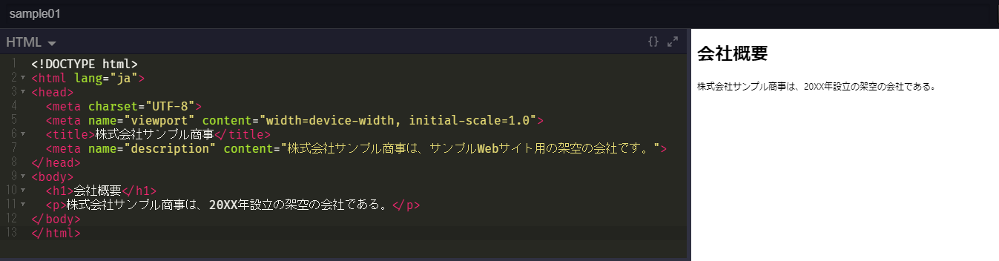

### HTMLの骨組み

#### `<!DOCTYPE html>`
文書が HTML5, HTML Living Standard であることを宣言するための DOCTYPE 宣言（DTD）

HTML4.01 などでは `<!DOCTYPE html public "-//W3C//DTD HTML 4.01//EN" "http://www.w3.org/TR/html4/strict.dtd">` のように複雑なDTDを記述していたが、これから先は HTML Living Standard が標準規格となるため、`<!DOCTYPE html>` だけ記述しておけば良い

**※ Web Maker では自動的に `<!DOCTYPE html>` が宣言されるため、HTMLエディタ内で別のDTDを宣言しても無視される**

#### `<html>...</html>`
DTDの直後に記述し、この文書がHTMLであることを表す

`<html>` タグには `lang` 属性を指定することができ、`lang="ja"` と指定すると日本語の文書であることを示すことが出来る

**※ Web Maker では `<html>` タグは無視されるため記述しても意味はない**

#### `<head>...</head>`
この部分はページのタイトルや説明文、使用する外部ファイルのリンクなど、ページの各種情報を記述する

あくまでページ情報を記述する部分であるため、実際にブラウザの画面には表示されない

**※ Web Maker では `<head>` タグ（とその中身の情報）は無視されるため、ページ情報を自分で設定したい場合は、HTMLファイルとして保存してエディタで編集する必要がある**

head情報として設定出来る項目は多岐にわたるが、ここでは主要な項目のみ見ていく

- `<meta charset="UTF-8">`
    - ページの文字コードを `UTF-8` に設定するタグ
    - VSCode を始めとするほとんどのコードエディタはデフォルトで UTF-8 文字コードでファイルを保存するため、基本的に UTF-8 を指定しておけば良い
    - この文字コードを `Shift_JIS` など正しくない値に設定してしまうと以下の画像のように文字化けしてしまう

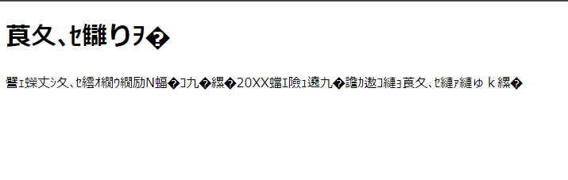

- `<meta name="viewport" content="width=device-width, initial-scale=1.0">`
    - スマートフォンやタブレット等のモバイル端末で最適にWeb表示させるための設定
    - viewport について詳しく知りたい場合: https://qiita.com/ryounagaoka/items/045b2808a5ed43f96607
- `<title>...</title>`
    - ページのタイトルをタグの中に記述する
    - ここで設定された名前がブラウザのタブや、検索されたときのページタイトルとして表示される
- `<meta name="description" content="...">`
    - ページについての説明文を `content` 属性の値として記述する
    - ユーザが検索したときにどのようなサイトなのかを瞬時に判断できるように、わかりやすく端的な説明文を設定すると良い

#### `<body>...</body>`
HTML文書の本体部分で、このタグの中に記述されたコンテンツが実際にブラウザで表示される

**Web Maker においては、基本的に `<body>` タグの中身のみ記述していくことになる**

### HTMLタグについて
HTMLでは基本的に `<〇〇>` や `</〇〇>` という形で記述される **タグ** を使って文字列を挟んで書いていく

タグには多くの種類があり、どのタグで挟むかによってその部分の役割が変わってくる

また `<〇〇>` を **開始タグ**、それに `/` が加えられた `</〇〇>` を **終了タグ** と呼ぶ

開始・終了タグは基本的にセットで使われるが、場合によっては終了タグのないものもある

開始タグから終了タグまでの1つのかたまりを **要素** という

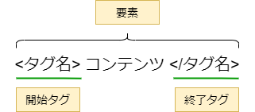

#### タグの記述ルール
- 半角英数字で記述する
    - タグに全角文字（日本語等）を使うことはできない
- 大文字と小文字
    - タグは大文字と小文字を区別しないが、通常は小文字で統一することを推奨

#### 入れ子タグ
HTMLでは開始タグと終了タグの間に別のタグが入ることがよくある

このような書き方を **入れ子** と呼ぶが、入れ子構造にする場合は必ず直前の開始タグに対応する終了タグから順に記述する

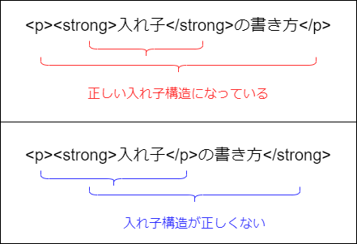

#### タグの付加情報
タグによっては、開始タグの中にそのタグの付加情報を書くことがある

この情報の種類のことを **属性** と呼び、タグ名の後ろにスペースを空けて記述する

属性に設定する内容のことを **値** と呼び、`属性="値"` という形で記述する（値はダブルクオーテーション `"` だけでなくシングルクオーテーション `'` で囲んでも良いし、そもそも囲まなくても良い場合もあるが、きほんてきにはダブルクオーテーションで囲むように統一しておくのが望ましい）

例えば `<a>` タグはハイパーリンクを作成するためのタグだが、リンク先は `href` 属性で指定する必要があり、`<a href="/about/">...</a>` のように記述することで `/about/` というパス（ページ）にリンクしたハイパーリンクを作成することが出来る

### HTMLにおけるコメントアウト
`<!--` と `-->` で文字列を挟むと、コメントとして解釈され、ブラウザ上では何の影響もない文字列となる

表示はしたくないけれど、覚え書き程度に残しておきたいメモなどを記述する際に使う

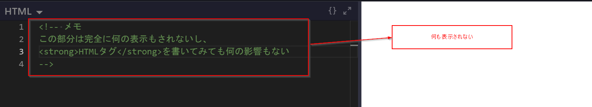

***

## 主要なHTMLタグ

### 見出しタグ
見出しには `<h1>` ～ `<h6>` タグを使う

`<h1>` が最も大きな見出しで、`h` の後ろの数字が大きくなるほど小さい見出しになっていく

```html
<h1>1番大きな見出し</h1>
<h2>2番目の見出し</h2>
<h3>3番目の見出し</h3>
<h4>4番目の見出し</h4>
<h5>5番目の見出し</h5>
<h6>6番目の見出し</h6>
```

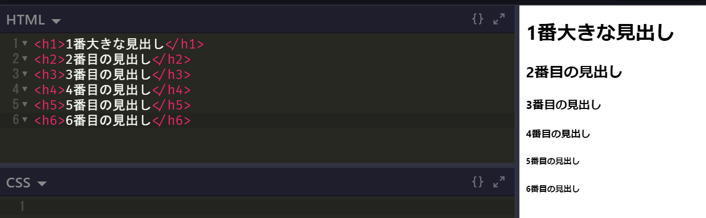

見出しはタグは大見出しとなる `<h1>` から順に使っていき、次の中見出しには `<h2>`、その次の小見出しには `<h3>` ... のように、数字の順番に沿って使っていくのが望ましい

文字の大きさなどの見た目を理由に突然 `<h5>` を使うのは、きれいなHTML文書とは言えない（見た目を変えたいのであればスタイルシートを使うべき）

また、`<h1>` は通常1つのページにつき1度の利用が良いとされており、そのページに何が書かれているかを表すための大見出しとして使うのが望ましい

### 段落タグ
文章の段落（まとまり）を記述したい場合は `<p>` タグを使う

`<p>...</p>` で囲まれた文章は段落となり、通常は段落ごとに改行されて段落間に少しのスペースが空けられる

なお、単純に文章の途中で改行したい場合は `<br>` タグを用いる

```html
<p>架空の存在である株式会社サンプル商事。
    その正体は何なのか。</p>
<p>それは・・・<br>誰も・・・<br>知らない・・・</p>
```

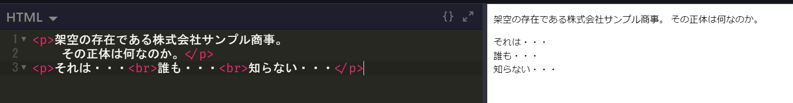

### 画像タグ
画像を表示したい場合は `` タグを使う

このタグには終了タグはなく、表示したい画像は `src` 属性で指定する

`src` で指定する画像ファイルへのパスは、現在のページ（HTMLファイル）からの相対パス、もしくはURLで指定する

また、指定の際は `alt` 属性も設定しておくのが望ましい

`alt` はWebブラウザで画像がうまく読み込めなかった場合に、画像に代わって表示するテキストになる

`alt` を指定することで画像の意味を正しく伝えることが出来るようになり、より良いWebページとなる

```html
<!--
    https://placehold.jp/150x150.png の画像を表示
    placehold.jp は様々なダミー画像を配信してくれるため便利
-->


<!-- 無効な画像ファイルを指定した場合 -->

```

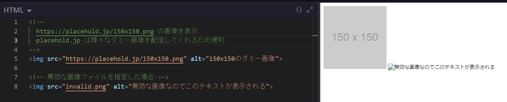

### ハイパーリンク
ハイパーリンクを作るには、リンクさせたいテキストを `<a>` タグで囲んで、`href` 属性でリンク先のURL（もしくは現在のページからの相対パス）を指定する

```html
<p>とりま<a href="https://www.google.co.jp">ググっとけ</a>！</p>

<!-- 画像にリンクを貼ることも出来る -->
<a href="https://placehold.jp"></a>
```

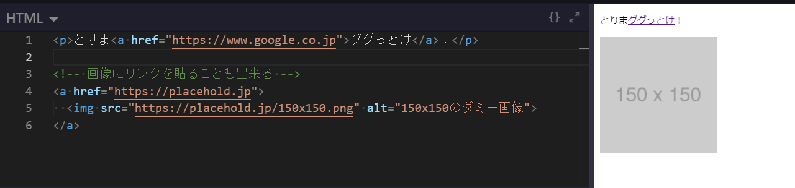

### リストタグ
箇条書きリストを表示するには `<ul>` タグと `<li>` タグを使う

`ul` は Unordered List (順序の決まっていないリスト) のことで、このタグの中に `<li>` (List Item) タグを使ってリスト項目を追加していくことになる

なお、番号付きのリストを作成したい場合は `<ol>` (Ordered List) タグと `<li>` タグを使う

```html
<ul>
    <li>卵（3個）</li>
    <li>醤油（大さじ1）</li>
    <li>みりん（大さじ1）</li>
    <li>塩（少々）</li>
</ul>

<ol>
    <li>卵を割りほぐし、調味料を加える</li>
    <li>卵焼き器に卵液を1/4量入れて広げる</li>
    <li>半熟状になったら箸で手前に巻き、奥に移動させる</li>
    <li>これを繰り返し、最後まで焼けたら完成</li>
</ol>
```

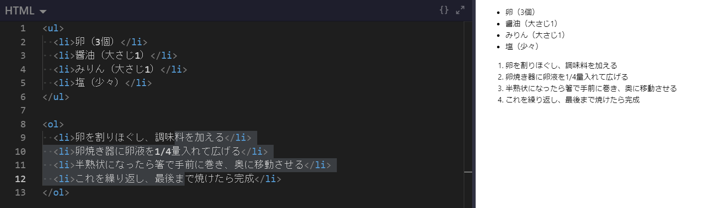

***

## HTMLで表を作成する

HTMLを書いていると、何らかのデータを縦横に並べて表示したい場合がよくある

こういった表形式の表示を行うために使えるのが `<table>` タグである

なお、CSSの表現力が弱かった頃は、`<table>` タグを駆使して複雑なページレイアウトを実現していたこともあった（CSS3 になって Flexbox 等が使えるようになった現在では、tableによる段組みレイアウトはバッドノウハウである）

### 表組みの主要なタグ
表組みでは、以下のような複数のタグを組み合わせて使用する

| タグ | 概要 |
| :--: | :-- |
|`<table>`|表を表すタグ。表全体を囲む|
|`<tr>`|Table Row: 表の1行を囲む|
|`<th>`|Table Header: 表の見出しとなるセルを作成|
|`<td>`|Table Data: 表のデータとなるセルを作成|

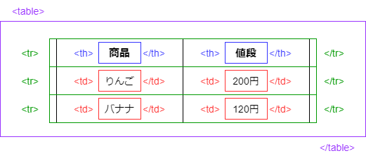

tr タグ内のセル数（th, td タグ数）は揃えないとレイアウトが崩れてしまうため注意

また、見出し不要の場合は th タグは省略して良い

```html
<!--
    デフォルトの table は区切り線がなく見づらい
    そのため、ここでは border 属性に 1 を指定している
    ※本来こういった見た目の装飾は CSS で行うべきである
-->
<table border="1">
    <tr>
        <th>商品</th>
        <th>値段</th>
    </tr>
    <tr>
        <td>りんご</td>
        <td>200円</td>
    </tr>
    <tr>
        <td>バナナ</td>
        <td>120円</td>
    </tr>
</table>
```

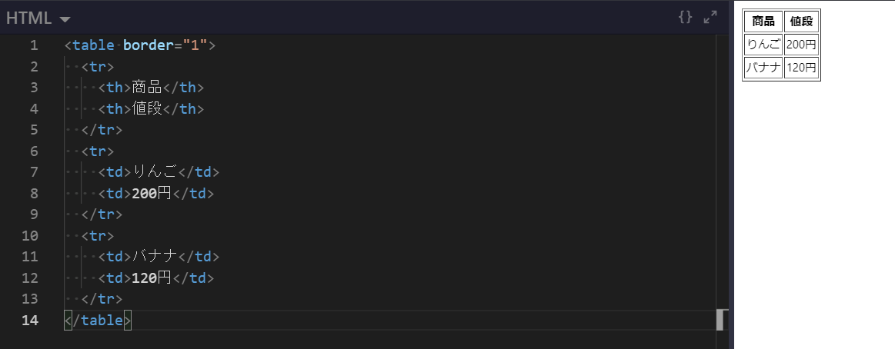

### セルをつなげる
複数のセルをつなげて一つのセルとして表示することも出来る

横方向につなげたい場合は、つなげたいセルの th, td タグに `colspan` 属性を追加し、つなげたいセルの数を値として設定する

```html
<table border="1">
    <tr>
        <!-- 横方向に2つのセルをつなげる -->
        <th colspan="2">商品＋値段</th>
    </tr>
    <tr>
        <td>りんご</td>
        <td>200円</td>
    </tr>
    <tr>
        <td>バナナ</td>
        <td>120円</td>
    </tr>
</table>
```

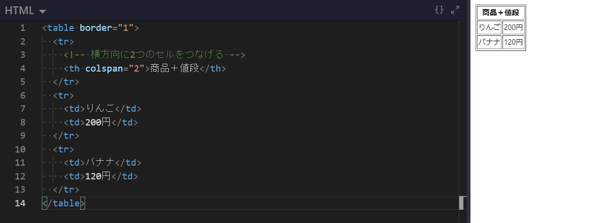

同様に、縦方向につなげたい場合は `rowspan` 属性で指定する

```html
<table border="1">
    <tr>
        <th>商品</th>
        <th>値段</th>
    </tr>
    <tr>
        <td>りんご</td>
        <!-- 縦方向に2つのセルをつなげる -->
        <td rowspan="2">150円</td>
    </tr>
    <tr>
        <td>バナナ</td>
        <!-- <td> 上の tr で rowspan されているため td 不要 </td> -->
    </tr>
</table>
```

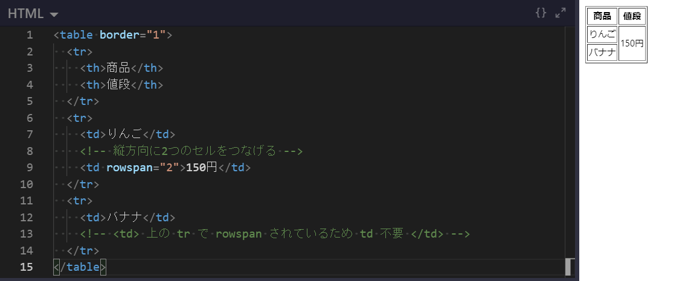
