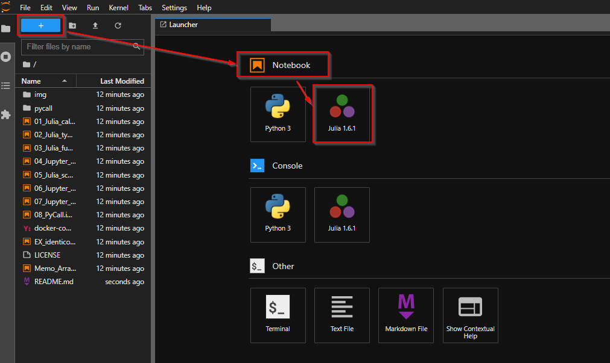
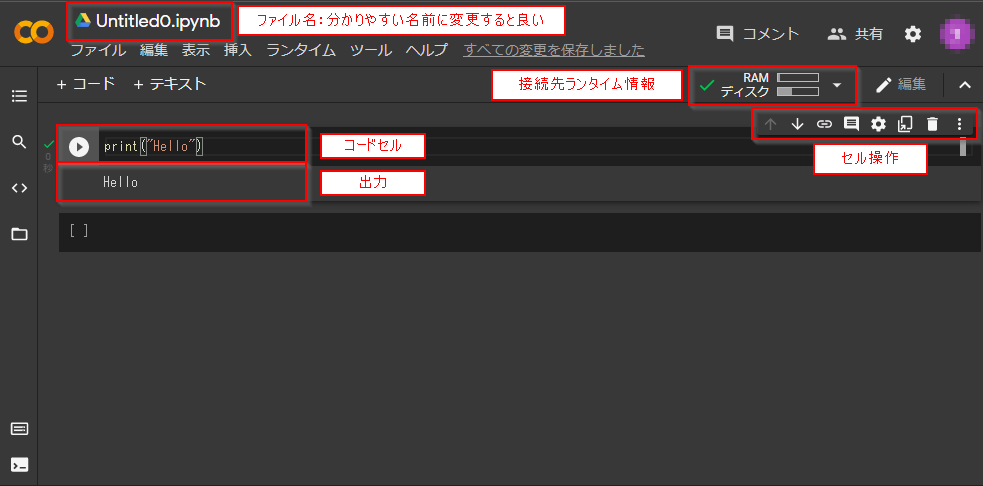
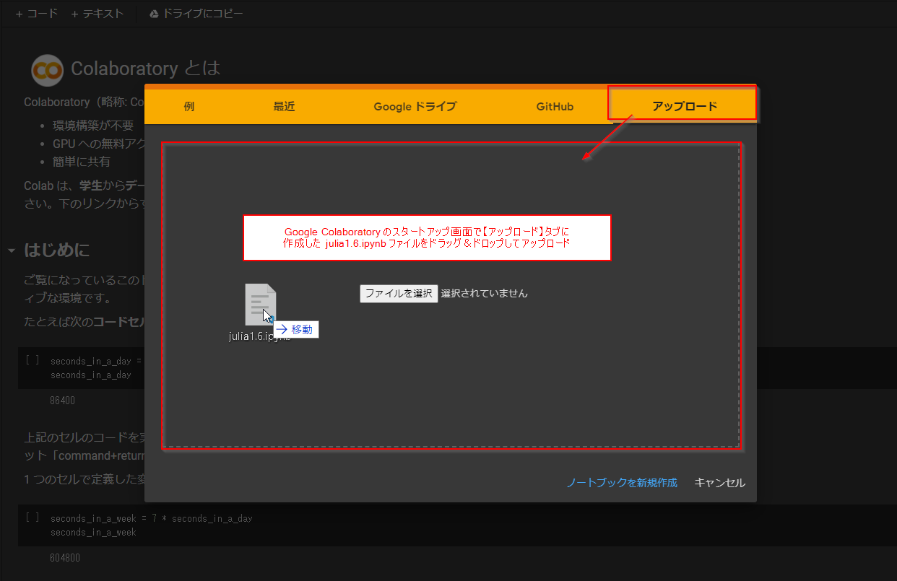
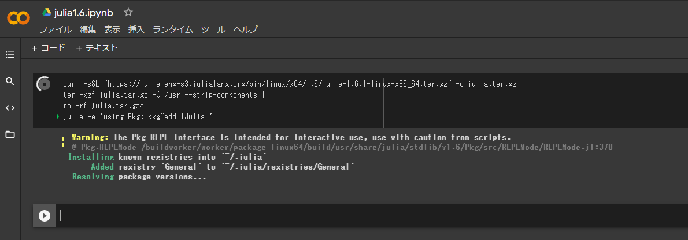
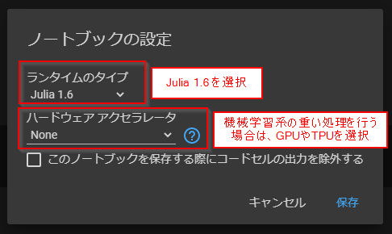
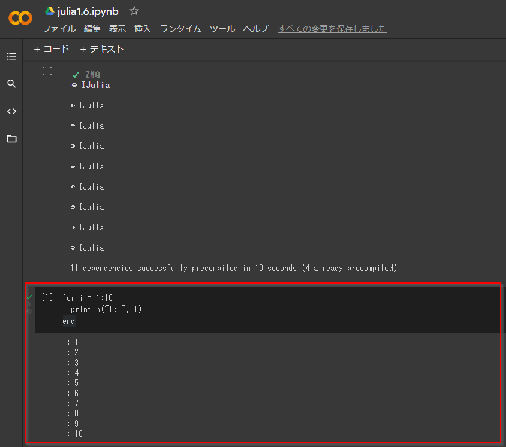

# これからのエンジニアが身につけるべき基礎知識・アルゴリズム

## 序論

本稿では、これからのエンジニアが身につけるべき基礎的な知識およびアルゴリズムを Jupyter Notebook 形式で掲載する

アルゴリズムの実装においては、筆者の好みにより [Julia](https://julialang.org/) 言語を採用している

そのため、ここでは Julia の開発環境構築および基本文法の習得を目指す

### 習得科目一覧
- 機械学習
    - 基礎数学入門
    - Juliaによる数値計算について
    - 機械学習アルゴリズムの実装
- ディープラーニング
    - ニューラルネットワーク実装
- 暗号理論
    - 古典暗号理論
    - 暗号化アルゴリズム実装
    - ブロックチェーン技術

***

## Juliaとは

- **Julia(ジュリア)**:
    - [x] 汎用プログラミング言語水準から高度の計算科学や数値解析水準まで対処するよう設計された高水準言語かつ仕様記述言語、及び動的プログラミング言語
    - [x] 標準ライブラリがJulia自身により作成されており、コア言語は極めてコンパクト
    - [x] オブジェクトの構築または記述する型の種類が豊富にある
    - [x] マルチディスパッチにより、引数の型の多くの組み合わせに対して関数の動作を定義することが可能
    - [x] 異なる引数の型の効率的な特殊コードの自動生成が可能
    - [x] C言語のような静的にコンパイルされた言語を使用しているかのような高いパフォーマンスを発揮する
    - [x] フリーオープンソース（MITライセンス）
    - [x] ユーザ定義の型は既存の型と同じくらい早くコンパクト
    - [x] 非ベクトル化コード処理が早いため、パフォーマンス向上のためにコードをベクトル化する必要がない
    - [x] 並列処理と分散計算ができるよう設計
    - [x] 軽く「エコ」なスレッド（コルーチン）
    - [x] 控えめでありながら処理能力が高いシステム
    - [x] 簡潔かつ拡張可能な数値および他のデータ型のための変換と推進
    - [x] 効率的なUnicodeへの対応（UTF-8を含む）
    - [x] C関数を直接呼び出すことが可能（ラッパーや特別なAPIは不要）
    - [x] 他のプロセスを管理するための処理能力が高いシェルに似た機能を有する
    - [x] Lispに似たマクロや他のメタプログラミング機能を有する
    - [ ] JITコンパイラで事前ビルドされるため、起動が遅い
        - 基本的に研究目的で使われるため、JupyterLab 等で常時起動状態で使われるのが現状の最適解かもしれない
        - ただし、起動速度の問題はここ1年ほどでどんどん改善されており、[PackageCompiler.jl](https://github.com/JuliaLang/PackageCompiler.jl) 等、起動速度を改善させるためのパッケージも出てきている
    - [ ] 配列の添字が 1 から始まるため、既存の言語に慣れている場合は違和感を感じる可能性がある
        - ただし、[Comparison of programming languages (array)](https://en.wikipedia.org/wiki/Comparison_of_programming_languages_%28array%29#Array_system_cross-reference_list) を見てみると添字が 1 で始まる言語は比較的多いことが分かる
        - 特に Fortran, Mathematica, MATLAB, R 等、数値計算においてよく使われる言語はほぼすべて 1 始まりである
        - そもそも Julia は任意の添字で始めることが可能なようにデザインされており、必ずしも 1 始まりで固定という訳ではない
            - 参考実装: https://github.com/JuliaArrays/OffsetArrays.jl
    - [ ] 活発に開発されており、バージョンにより言語仕様が大きく変わることがある
        - ただし2018年8月にリリースされたバージョン 1.0 以降についてはその限りではない
        - [開発者のコメント](https://discourse.julialang.org/t/psa-julia-is-not-at-that-stage-of-development-anymore/44872)を見ると、バージョン 1.0 から 2.0 までの間（つまりバージョン 1.x の間）はセマンティックバージョニングの標準に従い、破壊的な仕様変更は行わないと約束している
        - そのため、少なくともこれから Julia を使い始める場合は気にするようなデメリットではない

筆者の所感としては、PythonとRubyを足したような書き味で、実行速度の早い言語というイメージである

数学的な記述をしやすく、Pythonの資産を使うこともできるため、機械学習等のアルゴリズム実装に都合が良いと考えている

### Jupyter Notebook (JupyterLab) について
**Jupyter Notebook** はNotebook形式のドキュメントを作成・共有するためのPython製Webアプリケーションである

Jupyter Notebook ドキュメントは、プログラムコード（デフォルトではPythonコード）、Markdownテキスト、数式、図式等を含むことができる

これにより数値計算アルゴリズムとシミュレーション結果、統計解析コードとその実行結果グラフ、機械学習モデルと推論出力など、様々なプログラムとその結果を再実行可能な1つのドキュメントとして表現可能となっている

2021年8月現在では、Jupyter Notebook より使いやすい **JupyterLab** の開発が活発に行われており、本稿でもこちらをメインプラットフォームとして利用している

Jupyter は、「数十のプログラミング言語にわたるインタラクティブコンピューティング用のオープンソースソフトウェア 、オープンスタンダード、サービスを開発する」ために設立された非営利団体 **Project Jupyter** により開発されている

Jupyter でサポートしている主要な言語は Julia, Python, R である（これらの頭文字を合わせて Jupyter と命名されている）が、サードパーティ製のカーネルを追加することで Ruby, Haskel, Scala, Node.js, Go など数多くのプログラミング言語を実行することが可能である

Jupyter Notebook ファイルは、拡張子 `.ipynb` のドキュメントファイルであり、中身はJSON形式で保存されるため、Jupyter 環境がなくてもファイルの中身自体は確認可能となっている

### Anaconda について
Jupyter の導入には、Python環境が必要だが、特に理由がなければ Anaconda Python 環境の導入が推奨されている

Anaconda は、科学計算のためのPythonおよびR言語の無料のオープンソースディストリビューションであり、複数バージョンのPython環境の管理やより簡単なパッケージ管理を可能とする開発環境である

本稿では、JuliaからPython資産を使えるようにするパッケージである **PyCall.jl (Conda.jl)** に含まれる Anaconda を利用して JupyterLab 環境を構築する 

***

## 環境構築

Windows 10, Ubuntu 20.04 それぞれの環境での開発環境構築手順を以下に示す

Docker を使った環境構築については [こちら](./SetupDocker.md)

なお、環境構築に時間をかけたくない場合は、以下の手順をすべてスキップし、[Google Colaboratory](#google-colaboratory) の項に飛んでしまって良い

### Julia 1.6.1 on Windows 10
- OS: Windows 10
- Shell: PowerShell
- PackageManager: Chocolatey 0.10.15
- Julia: 1.6.1
    - Anaconda(Conda.jl): 1.5.2
        - JupyterLab: 3.0.15

`Win + X` |> `A` => 管理者権限 PowerShell を起動し、以下のコマンドを実行

```powershell
# chocolateyパッケージマネージャを入れていない場合は導入する
> Set-ExecutionPolicy Bypass -Scope Process -Force; iex ((New-Object System.Net.WebClient).DownloadString('https://chocolatey.org/install.ps1'))

# Julia インストール
> choco install -y julia

# => 環境変数を反映するために一度 PowerShell 再起動

# Julia バージョン確認
> julia -v
julia version 1.6.1

# Julia REPL 起動
> julia

# PyCall.jl, Conda.jl パッケージインストール
## PyCall.jl: Julia から Python を使うためのパッケージ
## Conda.jl: Anaconda python 環境を Julia 内に作成するパッケージ
## * PyCall をインストールすれば Conda は自動的に入る

# `]` キーでパッケージモードに切り替え
julia> ]

pkg> add PyCall
pkg> add Conda

# Ctrl + C => パッケージモード終了
pkg> ^C

# Conda.jl で JupyterLab インストール
## JupyterLab: Jupyter Notebook の後継
## * Jupyter Notebook: ノートブック形式でデータを可視化しながらプログラミング言語（主にPython）を実行できるIDE環境
## * 合わせて ipywidgets もインストールしておくと Jupyter 上で Rich UI を使えるようになる
# $ conda install -y -c conda-forge jupyterlab nodejs ipywidgets
julia> using Conda
julia> Conda.add(["jupyterlab", "ipywidgets"]; channel="conda-forge")

# JupyterLab で Julia カーネルを使えるようにするため IJulia パッケージインストール
julia> ]
pkg> add IJulia
pkg> ^C

# 一旦 Julia REPL 終了
julia> exit()

# ユーザ環境変数 PATH に Anaconda in Julia の PATH 追加
> [System.Environment]::SetEnvironmentVariable("PATH", [System.Environment]::GetEnvironmentVariable("PATH", "User") + ";${ENV:USERPROFILE}\.julia\conda\3\Scripts;${ENV:USERPROFILE}\.julia\conda\3\Library\bin", "User")
> [System.Environment]::SetEnvironmentVariable("JUPYTER_PATH", "${ENV:USERPROFILE}\.julia\conda\3\share\jupyter", "User")

# PowerShell起動時に Anaconda をアクティベーションするために
## PowerShell script (.ps1) を実行可能できるようにポリシー変更
> Set-ExecutionPolicy -ExecutionPolicy RemoteSigned

# PowerShell起動時に Anaconda をアクティベーションするプロファイル作成
> New-Item -ItemType Directory "$env:USERPROFILE\Documents\WindowsPowerShell"

> echo "(& `"$env:USERPROFILE\.julia`\conda\3\Scripts\conda.exe`" `"shell.powershell`" `"hook`") | Out-String | Invoke-Expression" | Out-File -Append -Encoding utf8 -FilePath "$env:USERPROFILE\Documents\WindowsPowerShell\profile.ps1"

# => 環境変数反映・プロファイル読み込みのため一度 PowerShell 再起動

# Jupyter カーネル確認
> jupyter kernelspec list
Available kernels:
  julia-1.6    C:\Users\<ユーザ名>\AppData\Roaming\jupyter\kernels\julia-1.6 # <= IJulia
  python3      C:\Users\<ユーザ名>\.julia\conda\3\share\jupyter\kernels\python3

# JupyterLab ipywidgets 拡張機能をインストール
> jupyter labextension install "@jupyter-widgets/jupyterlab-manager"

# Juliaチュートリアルプロジェクトディレクトリ作成・移動
> New-Item -ItemType Directory ~\julia-tuto
> cd ~\julia-tuto\

# Manifest.toml, Project.toml 作成
> New-Item Manifest.toml
> echo 'name = "JuliaTutorial"' | Out-File Project.toml

# JupyterLab 起動
## * 実行ポート: 8888
## * token不要
## * Project.toml へのパス: ./
###  + --project=<Project.tomlへのパス> を指定することで対応する仮想環境で作業できるようになる
###  + 指定しない場合、デフォルトのグローバル環境で作業することになるため、環境を汚してしまうデメリットがある
> jupyter lab --port=8888 --ServerApp.token='' --project=@.

# => http://localhost:8888/lab で JupyterLab が開く
```

Juliaのプログラムを実行できるノートを新規作成するためには `+` > `Notbook` > `Julia 1.6.1` を選択する



### Julia 1.6.1 on Ubuntu 20.04
- OS: Ubuntu 20.04
- Shell: bash
- Julia: 1.6.1
    - Anaconda: 1.5.2
        - JupyterLab: 3.0.15

```bash
# download julia-1.6.1 into ~/julua-1.6.1/
$ wget -qO- https://julialang-s3.julialang.org/bin/linux/x64/1.6/julia-1.6.1-linux-x86_64.tar.gz | tar -xzv -C ~/

# install julia binary
$ sudo ln -s ~/julia-1.6.1/julia /usr/local/bin/julia

# confirm julia version
$ julia -v
julia version 1.6.1

# install Conda.jl package
## Conda.jl: Anaconda python 環境を Julia 内に作成するパッケージ
## * 大抵の Linux 環境では最初から別に Python 環境が入っていると思われる
## * あまり既存の Python 環境を汚したくはないため、Julia からは極力 Conda.jl 内の Python 環境を使う方が良い
$ julia -e 'using Pkg; Pkg.add("Conda")'

# setup PATH to ~/.julia/conda/3/bin
$ echo 'export PATH="$PATH:$HOME/.julia/conda/3/bin"' >> ~/.bashrc
$ echo 'export JUPYTER_PATH="$HOME/.julia/conda/3/bin"' >> ~/.bashrc
$ . ~/.bashrc

# bash 用に Anaconda 環境を初期化
$ conda init bash
$ . ~/.bashrc

# => 以降、ターミナルに現在の Anaconda 環境が表示されるようになる

# install PyCall.jl package
## PyCall.jl: Julia から Python を使うためのパッケージ
## * Conda.jl 環境の Python (~/.julia/conda/2/bin/python) を使うように指定してインストールする
$ julia -e 'ENV["PYTHON"] = "~/.julia/conda/3/bin/python"; using Pkg; Pkg.add("PyCall"); Pkg.build("PyCall")'

# install JupyterLab by Conda.jl
## JupyterLab: Jupyter Notebook の後継
## * Jupyter Notebook: ノートブック形式でデータを可視化しながらプログラミング言語（主にPython）を実行できるIDE環境
## * 合わせて ipywidgets もインストールしておくと Jupyter 上で Rich UI を使えるようになる
# $ conda install -y -c conda-forge jupyterlab nodejs ipywidgets
$ julia -e 'using Conda; Conda.add(["jupyterlab", "ipywidgets"]; channel="conda-forge")'

# install IJulia.jl (Jupyter kernel for Julia)
$ julia -e 'using Pkg; Pkg.add("IJulia")'

# confirm jupyter kernels
$ jupyter kernelspec list
Available kernels:
  julia-1.6    ~/.local/share/jupyter/kernels/julia-1.6
  python3      ~/.julia/conda/3/share/jupyter/kernels/python3

# install JupyterLab ipywidgets extension
$ jupyter labextension install @jupyter-widgets/jupyterlab-manager

# Juliaチュートリアルプロジェクトディレクトリ作成・移動
$ mkdir ~/julia-tuto
$ cd ~/julia-tuto/

# Manifest.toml, Project.toml 作成
$ touch Manifest.toml
$ echo 'name = "JuliaTutorial"' > Project.toml

# launch jupyter lab
## * 実行ポート: 8888 (optional)
## * ブラウザの自動起動なし: optional
## * token不要: tokenなしにすれば http://localhost:<port>/lab に直接アクセスできる
## * Project.toml へのパス: ./
###  + --project=<Project.tomlへのパス> を指定することで対応する仮想環境で作業できるようになる
###  + 指定しない場合、デフォルトのグローバル環境で作業することになるため、環境を汚してしまうデメリットがある
$ jupyter lab --port=8888 --no-browser --ServerApp.token='' --project=@.

# => JupyterLab will be opened in http://localhost:8888/lab
```

Juliaのプログラムを実行できるノートを新規作成するためには `+` > `Notbook` > `Julia 1.6.1` を選択する


***

## Google Colaboratory

前述の方法で Julia + Jupyter 開発環境を構築することができるが、実際のところ、学習目的であれば環境構築に時間をかけたくないのが本音である

特に、機械学習系のプログラム実行には GPU 環境を整えないと時間がかかりすぎて効率が悪い場合も多く、環境構築のハードルが比較的高い

また、自分や他人の作成した Notebook を共有したい場合にも不便である

こういった場合に便利なのが、[Google Research](https://research.google/) が無償提供してくれている **Google Colaboratory** である

Google Colaboratory は、Google社が機械学習の教育、研究を目的として開発したWebアプリケーションで、無料で Jupyter Notebook 環境を使えるようになっている（ただし使用するにはGoogleアカウントが必要なため、もし持っていない場合は[Googleアカウントを一つ作っておく](https://www.google.com/intl/ja/account/about/)と良い。アカウントの作成も無料である）

### Get started
以下のURLにアクセスするとすぐに Google Colaboratory を使うことができる

https://colab.research.google.com/notebooks/intro.ipynb

Googleアカウントにログインしていない場合は、右上の「ログイン」ボタンからログインすること


新規Notebookを作るには、メニューバー > `ファイル` > `ノートブックを新規作成` を行う

すると以下の画像のように `Untitled0.ipynb` のようなNotebookが作成されるはずである（なお筆者環境は、メニューバー > `ツール` > `設定` から `dark` モードに変更しているため、全体の色が黒ベースになっている）



ファイル名は分かりやすい名前に変更すること推奨する

なお、Notebookは通常 [Googleマイドライブ](https://drive.google.com/drive/my-drive) の `Colab Notebooks` ディレクトリ内に作成される

### コードの実行
Notebookを作成したら、コードセルに `print("Hello")` というPythonコードを打ち込み、`Ctrl + Enter` キーでコードを実行してみる

するとPythonコードが実行され、下の出力セルに `Hello` という文字列が出力される

ここで、コード実行用のショートカットキーとしては以下のようなものが用意されており、これは JupyterLab でも同様である

- コードの実行: `Ctrl + Enter` キー
- コードを実行して次のセルに移動: `Shift + Enter` キー
- コードを実行して下にコードセルを追加しながら移動: `Alt + Enter` キー

### Google Colaboratory での Julia 実行
Google Colaboratory では、基本的に Python ランタイムのみ使用可能となっている

しかし、外部ランタイムを導入することで Julia コードを実行することが可能である（理論上は Jupyter 上で動かすことのできるすべての言語を動かせるはず）

Julia を使えるようにするためには、まずランタイムとして Julia を選択できるように ipynb ファイルを作る必要がある

ここでは Julia 1.6 ランタイムを選択可能にするため、`julia1.6.ipynb` というファイルをローカルで作成し、以下のようなJSONを記述する

```json
{
  "nbformat": 4,
  "nbformat_minor": 0,
  "metadata": {
    "colab": {
      "name": "julia1.6.ipynb",
      "version": "0.3.2",
      "provenance": []
    },
    "kernelspec": {
      "name": "julia-1.6",
      "display_name": "Julia 1.6"
    }
  },
  "cells": [
    {
      "metadata": {
        "id": "u8woq-Zbu_SK",
        "colab_type": "code",
        "colab": {}
      },
      "cell_type": "code",
      "source": []
    }
  ]
}
```

https://colab.research.google.com にアクセスして表示されるスタートアップ画面で【アップロード】タブを開き、上記の `julia1.6.ipynb` ファイルをドラッグ＆ドロップしてアップロードする



すると Google Colaboratory 上で `julia1.6.ipynb` が開かれるため、以下のマジックコマンド（Google Colaboratory で使えるシェルコマンド）をコードセルに入力する

```bash
!curl -sSL "https://julialang-s3.julialang.org/bin/linux/x64/1.6/julia-1.6.1-linux-x86_64.tar.gz" -o julia.tar.gz
!tar -xzf julia.tar.gz -C /usr --strip-components 1
!rm -rf julia.tar.gz*
!julia -e 'using Pkg; pkg"add IJulia"'
```

上記コマンドを `Shift + Enter` キー等で実行すると、Colaboratory 仮想マシンに Julia 1.6 本体がインストールされる



上記コマンド実行時点では Julia 1.6 ランタイムがまだ存在していないため、仮のランタイムとして Python で実行されている

そのため、メニューバー > `ランタイム` > `ランタイムを変更` から「ランタイムのタイプ」を `Julia 1.6` に変更（おそらく最初から選択されているため、実際には変更しなくても良い）して「保存」する

なお、機械学習系の重い処理を行う場合は「ハードウェアアクセラレータ」で GPU や TPU を選択しておくと良い



するとランタイムが再起動され、Julia 1.6 ランタイムで動く状態になる

ここまでできたら、コードセルに以下のような Julia コードを記入・実行してみる

```julia
for i = 1:10
    println("i: ", i)
end
```

これで問題なく実行できればOKである



### GitHub との連携
Google Colaboratory では、GitHub にアップロードされた Jupyter Notebook ファイルを直接開いて実行することができる

本稿ではこの機能を利用して、別に GitHub へアップロードしてある Julia のチュートリアルNotebookを開いて実行してもらうことを想定している

例えば GitHub に `https://github.com/amenoyoya/julia_ml-tuto/blob/master/01_tutorial/01_Julia_calculation.ipynb` という ipynb ファイルがあったとすると、先頭の `https://github.com/` を `https://colab.research.google.com/github/` に変更するだけでこの Notebook を Google Colaboratory で開くことができる

https://colab.research.google.com/github/amenoyoya/julia_ml-tuto/blob/master/01_tutorial/01_Julia_calculation.ipynb

### Google Colaboratory の制限
無料とは思えないほど高機能で便利な Google Colaboratory だが、無料ゆえの制限も当然ある

2021年8月時点で確認されている主な制限は次の通り

- RAM: 12GB
- ディスク容量:
    - CPU/TPC ランタイムの場合: 最大107GB
    - GPU ランタイムの場合: 最大68GB
- 90分ルール: ブラウザ上で何も操作せずに90分経過するとリセットされる
- 12時間ルール: インスタンス（Colaboratory 仮想マシン）が起動してから12時間経過するとリセットされる
- GPUの使用制限: GPUを使いすぎるとリセットされる（上限未公開）

機械学習など、実行時間の長いタスクを実行させたい場合、90分ルールと12時間ルールが大きな問題になる

90分ルールの方は、一定間隔でブラウザページのリロードを行うChrome拡張の [Easy Auto Refresh](https://chrome.google.com/webstore/detail/easy-auto-refresh/aabcgdmkeabbnleenpncegpcngjpnjkc?hl=ja) 等を使うことで回避できる

しかしながら、12時間ルールの方は回避手段がないため、実行時間を短くしたり実行途中で強制終了されても問題ないようにする等の工夫が必要である

どうしても制限がつらい場合は、ローカルPCで実行したり、有料の Colaboratory Pro や他のGPUサーバを使うことも検討した方が良いかもしれない

とは言え、個人が所有するようなレベルのPCよりはスペックが高いので、それほど重くない機械学習やその他のちょっとした用途に使うには必要十分だと考えている

***

## Julia 入門

1. [Juliaの基本](https://colab.research.google.com/github/amenoyoya/julia_ml-tuto/blob/master/01_tutorial/01_Julia_calculation.ipynb)
2. [Juliaのプリミティブ型](https://colab.research.google.com/github/amenoyoya/julia_ml-tuto/blob/master/01_tutorial/02_Julia_types.ipynb)
3. [関数について](https://colab.research.google.com/github/amenoyoya/julia_ml-tuto/blob/master/01_tutorial/03_Julia_function.ipynb)
4. [制御構文について](https://colab.research.google.com/github/amenoyoya/julia_ml-tuto/blob/master/01_tutorial/04_Julia_expression.ipynb)
5. [変数のスコープについて](https://colab.research.google.com/github/amenoyoya/julia_ml-tuto/blob/master/01_tutorial/05_Julia_scope.ipynb)
6. [Juliaの型システム](https://colab.research.google.com/github/amenoyoya/julia_ml-tuto/blob/master/01_tutorial/06_Julia_typing.ipynb)
7. [配列・行列関連操作まとめ](https://colab.research.google.com/github/amenoyoya/julia_ml-tuto/blob/master/01_tutorial/07_Julia_vector.ipynb)
8. [メタプログラミング](https://colab.research.google.com/github/amenoyoya/julia_ml-tuto/blob/master/01_tutorial/08_metaprogramming.ipynb)

### Juliaの基本
<a href="https://colab.research.google.com/github/amenoyoya/julia_ml-tuto/blob/master/01_tutorial/01_Julia_calculation.ipynb">
  
</a>

- **変数**:
    - 変数とは値に紐づく名前を示す
    - 計算によって得た値などを保存しておくために使う
    - 使用可能な変数名:
        - アルファベット（a-z, A-Z）
        - 数字（0-9）
        - `_`, `!`, ...等の記号
        - Unicode文字
        - ※ ただしビルドステートメントの名前（`if`, `else`, ...etc）は変数名として使用することはできない

```julia
# 変数 x に 値 10 を保存しておく
x = 10

# 変数 x に 1 を足す
x + 1

# 変数には別の型を入れ直すこともできる
## 現在、変数 x には 数値 10 が入っているが、文字列 "Hello!" を入れ直すことが可能
x = "Hello!"
```

- **println 関数**:
    - `println` 関数は、引数として与えられた値をそのまま出力する（最後に改行を付与する）
    - 変数を与えた場合は、変数に紐付けられた値を出力する

```julia
# "Hello" という文字列を出力する
println("Hello") # => "Hello"

# 変数 x に 値 10 を保存し、それを出力する
x = 10
println(x) # => 10
```

- **数値**:
    - 数値には整数と浮動小数点があり、演算処理の基本的要素となっている
    - コード内では、整数（`1`, `2`, ...）は **即値**、浮動小数点（`1.0`, `1.1`, ...）は **数値リテラル** と呼ばれる
        - 即値と数値リテラルを合わせて **数値プリミティブ** と呼ぶ
- **算術演算子**: 以下の演算子は全ての数値プリミティブ型でサポートされている
    - `+x`: 単一項加法（恒等作用素）
    - `-x`: 単一項減法（値を逆数と関連付ける）
    - `x + y`: 二項加法（加法を実施）
    - `x - y`: 二項減法（減法を実施）
    - `x * y`: 乗法（乗法を実施）
    - `x / y`: 除法（除法を実施）
    - `x \ y`: 逆数除法（`y / x` と同等）
    - `x ^ y`: 累乗（`x` を `y` 回掛ける）
    - `x % y`: 余り（`rem(x, y)` と同等）
- **ビット演算子**: 以下の演算子は全ての数値プリミティブ型でサポートされている
    - `~x`: ビット単位の否定
    - `x & y`: ビット単位の論理積
    - `x | y`: ビット単位の論理和
    - `x ⊻ y`: ビット単位の排他的論理和（`xor(x, y)` でもOK）
    - `x >>> y`: 論理右桁送り
    - `x >> y`: 算術右桁送り
    - `x << y`: 論理/算術左桁送り
- **比較演算子**: 以下の演算子は全ての数値プリミティブ型でサポートされている
    - `==`: 等しい
    - `!=`, `≠`: 等しくない
    - `<`: より小さい
    - `<=`, `≤`: より大きい
    - `>`: 以下
    - `>=`, `≥`: 以上
- **論理演算子**: 以下の演算子は `Bool` 型でサポートされている
    - `!x`: 否定形（`true` を `false` に, `false` を `true` に変換する）
    - `x && y`: AND（`x` と `y` が両方 `true` の場合に `true` として評価される）
    - `x || y`: OR（`x` と `y` のいずれかが `true` の場合に `true` として評価される）

### Juliaのプリミティブ型
<a href="https://colab.research.google.com/github/amenoyoya/julia_ml-tuto/blob/master/01_tutorial/02_Julia_types.ipynb">
  
</a>

- **複素数**:
    - グローバル変数 `im` は `√-1` を示す
- **有理数**:
    - Julia には、整数の正確な比率を表すために有理数型がある
    - 有理数は `//` 演算子で構成される（`2 // 3` => $\frac{2}{3}$）
- **文字列**:
    - 文字列は有限の記号の連続を意味し、ダブルクオーテーションで表す
    - Julia における文字列を扱うビルトインの型は `String` 型
    - UTF-8エンコーディング下で全てのUnicode文字列を使える
    - Javaと同様に文字列は変更不可能
        - 異なる文字列の値を作成したい場合は、他の文字列の一部から新しく作成する
    - 文字列の連結:
        文字列を連結する場合は `string(...)` もしくは `*` 演算子を使用する
    - 文字列の補完:
        - 文字列内で `$(変数名)` を使うことで変数埋め込みをすることができる
- **文字**:
    - 1文字を表す `Char` 値は、シングルクオテーションで表す
    - これは特殊なリテラル表現と算術演算を持つ32ビットのプリミティブ型であり、数値はUnicodeコードポイントとして解釈される
- **正規表現型**:
    - Julia では `r"..."` で正規表現パターンを表現し、正規表現は `Regex` 型として定義される
- **シンボル**:
    - Juliaには `:symbol` で表現される `Symbol` 型が存在する
    - これは、メタプログラミングにおける変数を表すもので、自身のコードをプログラムで操作することができる
    - `:(...)` もしくは `quote ... end` でコードラップすることで、そのコード自身を表現するデータ構造が生成される
- **連想配列**:
    - 特定の名前のキーに値が関連づいている型
    - `Pair` 型の配列（`Vector` 型）

```julia
# `Hello, world.` の後ろに改行コードのついた文字列
str = "Hello, world.\n"
println(str)

# 文字列の先頭文字を取得
## Juliaではインデックスは1から始まる（配列なども同様）
println(str[1]) # => 'H'

# 文字列の最後の文字を取得
println(str[end]) # => '\n'

# 文字列の最後から2番めの文字を取得
println(str[end-1]) # => '.'

# 4〜9文字目の文字列を抽出
println(str[4:9]) # => "lo, wo"

# ========================================

# ヒアドキュメント: 複数行文字列の表現
doc = """Hello, world.
This is "heredoc".
Contains "quote" characters"""

println(doc)

# ========================================

# 大文字小文字無視, 複数行マッチング
## 以下のような文字列にマッチ
### "a" or "A" から始まる
### その後ろのどこか（途中改行可）に "b" or "B" が含まれる
### 行末が "d" or "D" で終わる
pattern = r"a+.*b+.*d$"ism

target = """
Goodbye,
Oh,
angry,
Bad world
"""

println(match(pattern, target))
# => RegexMatch("angry,\nBad world")

# ========================================

println(:foo) # => foo
println(typeof(:foo)) # => Symbol

# ========================================

# 連想配列
dump(
    Dict(
        "name" => "Tom",
        "sex" => "Male"
    )
)
## => Dict{String, String} with 2 entries:
##     "name" => "Tom"
##     "sex" => "Male"

# 上記連想配列は Pair型の配列 とほぼ同じ構造をしている
dump(
    [
        Pair("name", "Tom"),
        Pair("sex" => "Male")
    ]
)
## => 2-element Vector{Pair{String, String}}:
##     "name" => "Tom"
##     "sex" => "Male"
```

### 関数について
<a href="https://colab.research.google.com/github/amenoyoya/julia_ml-tuto/blob/master/01_tutorial/03_Julia_function.ipynb">
  
</a>

- **関数**:
    - 複数の値を受け取り、戻り値を返すオブジェクト
    - Juliaにおける関数はグローバルな状態に影響を受け得るため、純粋に数学的な関数ではない
- **参照透過性**:
    - 同じ引数を受け取ったら必ず同じ戻り値を返すという性質
    - プログラムの見通しを良くするためには、グローバルな状態に影響されない純粋な関数を定義するべきである

```julia
"""
2つの引数 x, y を受け取って、その合計値を返す関数
"""

## 代入方式（単一の式を定義）
f(x, y) = x + y

## 関数呼び出し
println(f(1, 2)) # f(1, 2) = 1 + 2 -> 3

## 複数の手続きを定義する関数
### メッセージを出力してから 合計値を返す
function g(x, y)
    println("$x と $y を足すよ！")
    println("答えは $(x + y) だね！")
    x + y
end

## 関数呼び出し
println(g(9, 8))
```

- **無名関数**:
    - Juliaは関数型言語であるため、関数は第一級オブジェクトである
    - 関数は、変数に代入したり、代入した変数から標準的な構文で呼び出すことが可能
    - 関数の引数としても、戻り値としても関数を使うことができる
    - 名前をつけずに無名で生成することもできる（無名関数）

```julia
# 無名関数は主に別の関数を引数とする関数に渡すために使用される

# 例: map関数: 配列の各要素に対して渡された関数を適用する関数
## 配列 [1, 2, 3] の各要素を二乗する
map(x -> x^2, [1, 2, 3])
```

- **ドット構文**: 関数をベクトル化する
    - 既存の関数を配列の各要素に適用して新しい配列を作ること
    - `map` 関数でもベクトル化可能

```julia
f(x) = 3x

A = [1, 2, 3]
B = [4, 5, 6]

# map(f, A, B)
## 3 * [1, 2, 3] + 4 * [4, 5, 6]
## -> [19, 26, 33]
f.(A, B)
```

- **パイプ処理**:
    - ほとんどの関数型言語はパイプライン処理をサポートしているが、Juliaも同様にパイプ演算子を使った関数の連鎖が可能
    - Juliaのパイプ演算子は `|>` であり、左辺の戻り値を直接、右辺にある関数の引数に渡すことができる

```julia
# [3, 2, 1, 1, 3, 2, 4] を昇順並び替え => 重複削除
vec = unique(sort([3, 2, 1, 1, 3, 2, 4]))
println(vec) # => [1, 2, 3, 4]

# パイプ演算子でチェイン形式で記述
[3, 2, 1, 1, 3, 2, 4] |> sort |> unique |> println
## => [1, 2, 3, 4]
```

### 制御構文について
<a href="https://colab.research.google.com/github/amenoyoya/julia_ml-tuto/blob/master/01_tutorial/04_Julia_expression.ipynb">
  
</a>

Juliaには以下の6つの制御構文がある

1. 複合式
    - `begin ... end`
    - `(...; ...; ...)`
2. 条件評価
    - `if ... elseif ... else ... end`
    - 三項演算子: `... ? ... : ...`
3. 短絡評価
    - `&&`, `||`, 比較演算子 の連鎖
4. 繰り返し評価
    - `while ... end`
    - `for ... end`
5. 例外処理
    - `try ... catch ... finally ... end`
    - `error()`, `throw()`
6. タスク（コルーチン）
    - `yieldto()`

### 変数のスコープについて
<a href="https://colab.research.google.com/github/amenoyoya/julia_ml-tuto/blob/master/01_tutorial/05_Julia_scope.ipynb">
  
</a>

- **変数のスコープ**:
    - 変数のスコープとは、変数を参照できるコードの範囲のこと（**スコープブロック**）
    - 変数のスコープは、変数の名前が衝突するのを避けるのに役立つ
    - 同じ変数名が、いつ同じものを参照し、いつそうではないかを決める規則は **スコープ規則** と呼ばれる

```julia
# Barモジュール定義（import .Bar で使えるようになるブロック）
module Bar
    x = 1 # この x は Bar.x で参照可能な変数
    foo() = x # foo関数は x を返す（この x は Bar.x を参照）
end

# カレントディレクトリで定義された Bar モジュールを import
import .Bar

x = -1 # この x はグローバルな x（Bar.x とは無関係）

# Barモジュール内にある foo() 関数
## -> Barモジュール内の x が返る => 1
Bar.foo()
```

- **定数**:
    - 特定の変数に不変の値を与えたい場合 `const` キーワードを使い、定数を作ることができる
    - 定数への代入は一度きりであるが、配列などの可変なオブジェクトに変数を束縛した場合に、そのオブジェクトが不変になるわけではないことに注意する

### Juliaの型システム
<a href="https://colab.research.google.com/github/amenoyoya/julia_ml-tuto/blob/master/01_tutorial/06_Julia_typing.ipynb">
  
</a>

- Julia の型システムの特徴
    - オブジェクトか非オブジェクトかという値の区別がない
        - Juliaでは、すべての値は型を持つ真のオブジェクト
        - Juliaの型は、すべてのノードが型として等しく第一級である、完全に連結した単一の型のグラフに属している
    - 値のとる型はただ一つであり、実行時に実際にとるものだけである
        - これはオブジェクト指向言語では「実行時型」と呼ばる
        - オブジェクト指向言語において多相型の静的コンパイルを行うときは、この型の違いは重要になる
    - 変数ではなく、値だけが型を持つ
        - 変数は値に束縛された単なる名前である
    - 抽象型と具象型は両方とも、他の型によるパラメータ化が可能
        - 型以外にも、シンボル、値でその型が isbits() で真となるもの、及びこれらのタプルなどによってパラメータ化が可能
        - 参照や制限をする必要がない場合は、型パラメータは省略することができる
- Julia の型システムまとめ
    - 宣言型: `DataType` のインスタンス
        - 抽象型: `abstract type`
        - 原始型: `primitive type`
        - 複合型: `struct`
    - 全合併型: `{T} where T`
        - 合併型: `Union{}`
        - パラメトリック型:
            - パラメトリック抽象型
            - パラメトリック原始型
            - パラメトリック複合型
        - タプル型: `Tuple{}`

### 配列・行列関連操作まとめ
<a href="https://colab.research.google.com/github/amenoyoya/julia_ml-tuto/blob/master/01_tutorial/07_Julia_vector.ipynb">
  
</a>

配列・行列関連操作は機械学習において非常に重要な操作である

そのため、この項目は特に重点的に学習することを推奨する

ここで行列の演算処理や変形操作に精通しておくと今後便利である

- **一次元配列**:
    - Juliaにおいて、配列とは一次元配列であり、`[要素, 要素, ...]` のように `,` 区切りで表現される
    - なお、一次元配列とは列ベクトルを表しているため注意が必要（Julia以外の大抵の言語では、一次元配列は行ベクトルとなっている）

```julia
[1, 3, 4]

"""
=> 3-element Vector{Int64}:
    1
    3
    4
"""
```

- **二次元配列**:
    - 一次元以上の配列もまた、一次元配列と同様の方法で作成できる
    - ただし、各要素（列）は空白で区切り、行を追加するなら `;` または 改行 を使う
    - なお、バージョン 1.6.1 時点で、多次元配列は `Array` 型ではなく `Matrix` 型として定義されている

```julia
a = [1 3 4]
println("a: $(size(a,1))×$(size(a,2)) $(typeof(a)) $(a)")
# => a: 1×3 Matrix{Int64} [1 3 4]

b = [1; 3; 4]
println("b: $(size(b,1))×$(size(b,2)) $(typeof(b)) $(b)")
# => b: 3×1 Vector{Int64} [1, 3, 4]

c = [1 2 3; 4 5 6]
println("c: $(size(c,1))×$(size(c,2)) $(typeof(c)) $(c)")
# => c: 2×3 Matrix{Int64} [1 2 3; 4 5 6]

d = [1 2 3
    4 5 6]
println("d: $(size(d,1))×$(size(d,2)) $(typeof(d)) $(d)")
# => d: 2×3 Matrix{Int64} [1 2 3; 4 5 6]
```

### メタプログラミング
<a href="https://colab.research.google.com/github/amenoyoya/julia_ml-tuto/blob/master/01_tutorial/08_metaprogramming.ipynb">
  
</a>

Juliaは、Lispのような強力なメタプログラミングをサポートしている

Lispと同様に、Juliaは自身のコードを言語自体のデータ構造として表すことができる

Juliaコードは言語内から作成・操作可能なオブジェクトとして表されるため、プログラムが独自のコードを変換・生成することができる

これにより、追加のビルド手順なしで高度なコード生成が可能になり、抽象構文木（AST）レベルで動作する真の Lisp スタイルマクロが記述できるようになっている（対照的に、CやC++のようなプリプロセッサマクロシステムは、実際の解析や解釈が行われる前にテキストの操作と置換を実行する）

- **Exprオブジェクト**:
    - `Expr` は以下の2つの部分から構成されている
        - `head`:
            - 式の種類を表す `Sysmbol` 型
        - `args`:
            - 式の引数として渡される記号、リテラル値、または他の式が `Vector` 型で格納されている
- **マクロ**:
    - マクロは、生成されたコードをプログラムの最終的な本文に含める方法を提供する
    - マクロは引数のタプルを返された式にマップし、結果の式は `eval` 呼び出しを必要とせずに直接コンパイルされる
    - マクロ引数には、式、リテラル値、および記号を含めることができるが、これらは、マクロ内においては `Symbol` として扱われることに注意

```julia
x = 123
println(x) # => 123

ex = :(x = 1) # => Expr(head: ..., args: ...)
eval(ex) # => `x = 1` 式が評価され、グローバルスコープの x の値が変更される

println(x) # => 1

# ========================================

# マクロ定義は macro ... end ブロックで行う
## マクロが返す Expr オブジェクトは、マクロ呼び出し時に直接コンパイルされて実行される
macro sayhello()
    return :( println("Hello, macro!!") )
end

# マクロ実行は `@` 接頭辞をつけることで行われる
## マクロが返す Expr オブジェクトが即時 eval される
@sayhello # => "Hello, macro!!"
```
