# AWS入門

- **AWS**: Amazon Web Services
    - Amazon が提供するクラウドコンピューティングサービスの総称
    - 物理サーバコンピュータとは異なり、クラウド上に用意された仮想サーバコンピュータを使って柔軟にコンピュータリソースを調達することが可能
    - 100以上のサービスが提供されており、サービスを自由に組み合わせて独自のWEBシステムを構築することが可能
    - 代表的なサービス:
        - WEBサーバ: `AWS EC2`
        - クラウドストレージ（データ保存）: `AWS S3`
        - データベースサーバ: `AWS RDS`
        - メールサーバ: `AWS SES`
        - DNSサーバ: `AWS Route 53`
        - CDNサーバ: `AWS CloudFront`
        - SSL/TLS証明書管理: `AWS Certificate Manager (ACM)`
        - サーバレスプログラム実行環境: `AWS Lambda`
        - 機械学習モデル構築: `AWS SageMaker`
        - 環境構築オートメーション: `AWS CloudFormation`

## LocalStack

LocalStack を使って AWS サービスのモック環境で AWS の使い方を学ぶ

- [LocalStack](https://github.com/localstack/localstack):
    - 開発環境においてAWSのサービスを擬似的に使用できるモックフレームワーク
    - pip (python package manager) および Docker を用いて簡単に環境構築が可能
    - 無料で擬似的な AWS サービスを利用し、動作確認が可能
    - 以下のような AWS サービス（モック環境）を利用可能
        - ACM
        - API Gateway
        - CloudFormation
        - CloudWatch
        - CloudWatch Logs
        - DynamoDB
        - DynamoDB Streams
        - EC2
        - Elasticsearch Service
        - EventBridge (CloudWatch Events)
        - Firehose
        - IAM
        - Kinesis
        - KMS
        - Lambda
        - Redshift
        - Route53
        - S3
        - SecretsManager
        - SES
        - SNS
        - SQS
        - SSM
        - StepFunctions
        - STS
        - ※ 有料版を使うと更に様々なサービスを利用可能

***

## Environment

- Docker: `19.03.12`
    - docker-compose: `1.26.0`
- anyenv: `1.1.1`
    - pyenv: `1.2.19`
        - python2: `2.7.18`
        - python3: `3.7.7`
- aws-cli: `1.18.93`
- LocalStack: `0.12.1`

### Setup
```bash
# Python3.X を使って環境構築

# pip を最新版にアップデート
$ pip3 install --upgrade pip setuptools

# AWS CLI インストール
$ pip3 install --upgrade aws

# AWS CLI で localstack 用のプロファイルを設定
## AccessKeyID, SecretAccessKey は適当な文字列で良い
$ aws configure --profile=localstack
AWS Access Key ID [None]: dummy
AWS Secret Access Key [None]: dummy
Default region name [None]: ap-northeast-1
Default output format [None]: json

# localstack インストール
$ pip3 install --upgrade localstack

# バージョン確認
$ localstack -v
0.12.1
```

### Execution
```bash
# 自分で Dockerfile, docker-compose.yml を書いて localstack/localstack イメージをコンテナとして起動してもよいが、
# localstack start コマンドを使うと簡単に持っく環境を起動できる
## PORT_WEB_UI 環境変数: Webユーザインタフェースを起動するポートを指定（デフォルト: 8080）
## EDGE_PORT 環境変数: 各 AWS サービスへの API エンドポイントポートを指定（デフォルト: 4566）
## DEFAULT_REGION 環境変数: AWS サービスのデフォルトリージョンを指定（デフォルト: us-east-1）
## ...その他環境変数については https://github.com/localstack/localstack 参照
$ PORT_WEB_UI=5080 EDGE_PORT=5066 DEFAULT_REGION=ap-northeast-1 docker-compose 

# => WebUI: http://localhost:5080
##   最新版では廃止されているためアクセス不可
##   ただしポートだけは専有されるため、コンフリクトしないポートを指定する必要はある
# => API: tcp://localhost:5066
# => Region: ap-northeast-1
```

***

## 動作確認

以下のようなWEBシステムを作成する

- クラウド上の関数: `test-function`
    - 実行すると `{実行日時}.txt` というファイルを生成
        - ファイルの中身は `This file generated at {実行日時}.` とする
    - 上記ファイルをクラウド上のストレージ (`test-bucket`) に保存する



### S3バケットの作成
- AWS S3 は、クラウド上にファイルデータを保存するクラウドストレージサービス
- S3 の中に **バケット** と呼ばれるリソースを確保し、その中にファイルデータを保存することができる

```bash
# AWS CLI を使って localstack 環境の AWS S3 に test-bucket バケットを作成
# $ aws s3 mb s3://<バケット名> --endpoint-url=<APIエンドポイント> --profile=<使用する設定プロファイル>
$ aws s3 mb s3://test-bucket --endpoint=http://localhost:5066 --profile=localstack
make_bucket: test-bucket

# 確認
$ aws s3 ls --endpoint-url=http://localhost:5066 --profile=localstack
2020-11-03 18:08:26 test-bucke
```

### Lambda関数の作成
- AWS Lambda は、クラウド上にサーバ不要なプログラム（関数）を登録するサービス
- Lambda関数は、様々なイベントをトリガーとして任意のプログラムを実行できる
- プログラムの実装言語としては以下のような言語をサポートしている
    - Java, Go, PowerShell, Node.js, C#, Python, Ruby 

#### test-function.py
```python
# boto3: AWS SDK for Python
import boto3
from boto3.session import Session
from datetime import datetime

# AWS サービスへアクセスするためのセッションを作成
## localstack モック環境のため、AccessKeyID, SecretAccessKey は dummy で良い
session = Session(
    aws_access_key_id='dummy',
    aws_secret_access_key='dummy',
    region_name='ap-northeast-1'
)

# AWS S3 に接続
s3 = session.resource(
    service_name='s3',
    # localstack 実行時の EDGE_PORT (今回の場合: 5066) をエンドポイントURLのポートに指定
    endpoint_url='http://localhost:5066'
)

# エントリー関数
## 以下の場合、handler に lambda_handler を指定する
def lambda_handler(event, context):
    now = datetime.now().strftime('%Y-%m-%d-%H-%M-%S') # 現在日時
    filename = now + '.txt' # ファイル名: {現在日時}.txt
    contents = f'This file generated at {now}.' # ファイルの内容
    bucket = 'test-bucket' # 保存先のS3バケット名

    # s3://test-bucket/{現在日時}.txt にファイル保存
    s3.Bucket(bucket).put_object(Key=filename, Body=contents)
    
    # Lambda関数実行後の戻り値
    return f'Saved: s3://{bucket}/{filename}'
```

#### Lambda関数として登録
```bash
# 作成したプログラムを zip に圧縮
$ zip test-function.zip test-function.py

# AWS CLI を使って AWS Lambda に test-function.zip を test-function 関数として登録
# $ aws lambda create-function
##    --function-name=<関数名>
##    --runtime=<プログラム言語>
##    --role=<関数を実行できるIAMロール> ※今回の場合、適当なIAMロールを設定すれば良い
##    --handler=<ファイル名>.<エントリー関数>
##    --zip-file=fileb://<zip圧縮したプログラムファイル>
##    --endpoint-url=<APIエンドポイント>
##    --profile=<使用する設定プロファイル>
$ aws lambda create-function \
    --function-name='test-function' \
    --runtime=python3.7 \
    --role='arn:aws:iam::123456789012:role/service-role/test-exec-role' \
    --handler='test-function.lambda_handler' \
    --zip-file='fileb://./test-function.zip' \
    --endpoint-url=http://localhost:5066 \
    --profile=localstack
{
    "FunctionName": "test-function",
    "FunctionArn": "arn:aws:lambda:ap-northeast-1:000000000000:function:test-function",
    "Runtime": "python3.7",
    "Role": "arn:aws:iam::123456789012:role/service-role/test-exec-role",
    "Handler": "test-function.lambda_handler",
    "CodeSize": 949,
    "Description": "",
    "Timeout": 3,
    "LastModified": "2020-11-03T10:32:40.426+0000",
    "CodeSha256": "EwYCkhQVCY0JyCbczUwVXHTKdBzxJjrzrAIVdmErVX0=",
    "Version": "$LATEST",
    "VpcConfig": {},
    "TracingConfig": {
        "Mode": "PassThrough"
    },
    "RevisionId": "561385d0-af23-4f21-9a76-ca0db502cec6",
    "State": "Active",
    "LastUpdateStatus": "Successful"
}
```

### Lambda関数実行
```bash
# AWS CLI を使って Lambda 関数を実行する
# $ aws lambda invoke --function-name=<関数名> <ログファイル名>
$ aws lambda invoke \
    --function-name='test-function' result.log \
    --endpoint-url=http://localhost:4566 \
    --profile=localstack 
```
