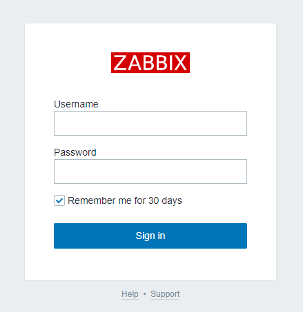

# Zabbixサーバ監視入門

## Environment

- Docker: `19.03.12`
    - docker-compose: `1.26.0`

### Structure
```bash
./
|_ .env # 環境変数設定ファイル
|_ docker-compose.yml # dockerコンテナ設定ファイル
```

### Docker containers
- networks:
    - **appnet**: `bridge`
        - 本プロジェクトにおけるすべてのコンテナはこのネットワークに所属する
- volumes:
    - **db-data**: `local`
        - db service container 用永続化ボリューム
- services:
    - **web**: `zabbix/zabbix-web-nginx-mysql:alpine-5.2-latest`
        - Zabbix Web UI サーバ
        - http://localhost:{$WEB_PORT} => service://web:8080
            - `.env` の設定: http://localhost:3080
        - 管理画面:
            - ユーザ: `Admin`
            - パスワード: `zabbix`
    - **db**: `mysql:5.7`
        - MySQLデータベースサーバ
        - TCP: service://db:3306
            - ユーザ: `root`
            - パスワード: `root`
            - データベース: `zabbix`
    - **zabbix**: `zabbix/zabbix-server-mysql:alpine-5.2-latest`
        - Zabbixサーバ
        - TCP: service://zabbix:10051
    - **gateway**: `zabbix/zabbix-server-mysql:alpine-5.2-latest`
        - Zabbix用Gateway
        - TCP: service://gateway:10052

### Setup
```bash
# Dockerコンテナ構築
$ docker-compose build

# Dockerコンテナをバックグラウンドで起動
$ docker-compose up -d

# 各コンテナの起動状況確認（それぞれ起動確認したら Ctrl + C で抜ける）
$ docker-compose logs -f web
$ docker-compose logs -f db
$ docker-compose logs -f zabbix
```

http://localhost:3080 から Zabbix 管理画面にログイン

- ユーザ: `Admin`
- パスワード: `zabbix`


