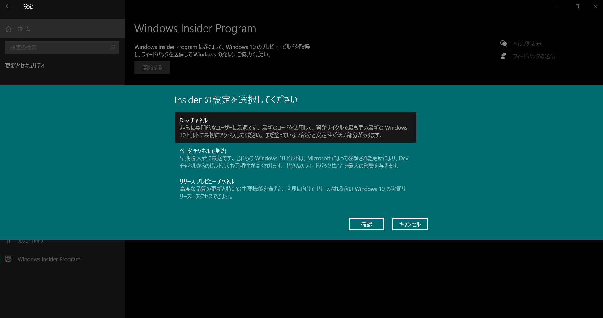

# 機械学習・ディープラーニング入門

## Environment

- Host
    - OS: `Windows 10`
        - ビルド 20150 以上
    - GPU: nVidia GeForce RTX 2060
- Guest
    - OS: `Ubuntu 20.04`
    - Linuxbrew: `2.4.2`
    - anyenv: `1.1.1`
        - pyenv: `1.2.19`
            - Python2: `2.7.18`
            - Python3: `3.7.7`
            - pip package manager: `20.1.1`
            - AWS CLI: `1.18.93`
        - nodenv: `1.3.2`
            - Node.js: `10.17.0`
            - Yarn package manager: `1.22.4`
            - Gulp task runner: `2.3.0`
    - Docker: `19.03.12`
        - docker-compose: `1.26.0`

まずは WSL2 で GPU (CUDA) を使えるようにする

- 参考:
    - https://qiita.com/ksasaki/items/ee864abd74f95fea1efa
    - https://qiita.com/yukoba/items/c4a45435c6ee5d66706d

### Windows10 Setup
Windows 10 Build 20150 の環境が必要なため、2020年10月時点では Windows Insider Preview に参加する必要がある

1. `Win + X` |> `N` キー => Windows設定ダイアログ
2. 更新とセキュリティ > Window Insider Preview > 開始する
3. 「DEVチャンネル」に参加する
    - 
4. 再起動する
5. `Win + X` |> `N` => 設定 > 更新とセキュリティ > Windows Update
    - 更新のチェックから最新ビルドバージョンをダウンロード＆インストールする
6. Updateのインストールが完了して OS Build version 20150 以降になればOK
    - OS Build version は 設定 > システム > 詳細情報 から確認

### WSL2 Update
WSL2 内で GPU を使うためには、WSL2 Linux カーネルバージョンが `4.9.121` 以上である必要がある

まずは https://wslstorestorage.blob.core.windows.net/wslblob/wsl_update_x64.msi から最新の WSL2 Linux カーネルをダウンロードし、インストールしておく

その後、`Win + X` |> `A` キー => 管理者権限 PowerShell 起動して、カーネルバージョン確認＆アップデートを行う

```powershell
# カーネルバージョン確認
## 規定ディストロ以外のLinuxカーネルバージョンを確認したい場合は
## > wsl -d <ディストロ名> uname -r
> wsl uname -r
4.19.121-microsoft-standard

# 上記で確認したバージョンが 4.19.121 未満である場合はアップデートする
## 規定ディストロ以外のLinuxカーネルバージョンをアップデートしたい場合は
## > wsl -d <ディストロ名> --update
> wsl --update
```

### WSL2 起動時にマウントエラーが起こる場合
Ubuntu 20.04 on WSL2 を起動したときに、「ファイル システムの 1 つをマウント中にエラーが発生しました。」という旨のエラーメッセージが出ることがある

この場合は https://wslstorestorage.blob.core.windows.net/wslblob/wsl_update_x64.msi から最新の WSL2 Linux カーネルをダウンロードし、インストールする

その後、`wsl --shutdown` コマンドで一旦 WSL2 をシャットダウンし、再び `wsl` を起動すれば大抵直る

### Setup
- 参考:
    - [待ってました CUDA on WSL2](https://qiita.com/ksasaki/items/ee864abd74f95fea1efa) で上手くインストールできなかったため、[WSL 2 で GPU を使う](https://www.kkaneko.jp/tools/wsl/wsl_tensorflow2.html) を参考
    - [ついにWSL2+docker+GPUを動かせるようになったらしいので試してみる](https://qiita.com/yamatia/items/a70cbb7d8f5101dc76e9)

まずは、WSL2 環境を一旦シャットダウンする

`Win + X` |> `A` キー => 管理者権限 PowerShell

```powershell
# WSL2 環境をシャットダウン
> wsl --shutdown
```

その後 [NVIDIA Drivers for CUDA on WSL](https://developer.nvidia.com/cuda/wsl/download) から WSL2 用の CUDA ドライバをダウンロード＆インストールする（※ nVidia Developer メンバー登録が必要）

CUDA on WSL ドライバをインストールしたら WSL2 環境を起動し CUDA Toolkit 等をインストールする

```bash
# -- Ubuntu 20.08 on WSL2
## PowerShell から起動する場合は > wsl コマンドで起動

# CUDA Toolkit インストール
## Ubuntu 20.04 では CUDA 10.1 がインストールされる
$ sudo apt -yV install nvidia-cuda-dev nvidia-cuda-toolkit nvidia-cuda-toolkit-gcc

# Python バージョン確認
$ python3 -V
Python 3.7.7

# GPU版 Tensorflow 導入
$ pip3 install --upgrade pip setuptools
$ pip3 install tensorflow-gpu tensorflow_datasets

# GPUが認識できているか確認
$ python3 -c "from tensorflow.python.client import device_lib; print(device_lib.list_local_devices())"
 :
physical_device_desc: "device: XLA_CPU device"
, name: "/device:XLA_GPU:0" # <= GPUを認識していることを確認
device_type: "XLA_GPU"
memory_limit: 17179869184
 :
```

### Dockerで動かす
```bash
# nvidia-docker2 導入
## 現在 nvidia-docker2 は非推奨で nvidia-container-toolkit を導入するほうが良いが、
## nvidia-docker2 インストール時に nvidia-container-toolkit も一緒にインストールされるため
## とりあえず以下のインストールコマンドでOK
$ distribution=$(. /etc/os-release;echo $ID$VERSION_ID)
$ curl -s -L https://nvidia.github.io/nvidia-docker/gpgkey | sudo apt-key add -
$ curl -s -L https://nvidia.github.io/nvidia-docker/$distribution/nvidia-docker.list | sudo tee /etc/apt/sources.list.d/nvidia-docker.list
$ curl -s -L https://nvidia.github.io/libnvidia-container/experimental/$distribution/libnvidia-container-experimental.list | sudo tee /etc/apt/sources.list.d/libnvidia-container-experimental.list
$ sudo apt update && sudo apt install -y nvidia-docker2

# docker 再起動
$ sudo service docker restart

# 動作確認
$ docker run --gpus all nvcr.io/nvidia/k8s/cuda-sample:nbody nbody -gpu -benchmark
 :
> Windowed mode
> Simulation data stored in video memory
> Single precision floating point simulation
> 1 Devices used for simulation
MapSMtoCores for SM 7.5 is undefined.  Default to use 64 Cores/SM
GPU Device 0: "GeForce RTX 2060" with compute capability 7.5 # <= GPU認識

> Compute 7.5 CUDA device: [GeForce RTX 2060]
30720 bodies, total time for 10 iterations: 62.380 ms
= 151.285 billion interactions per second
= 3025.707 single-precision GFLOP/s at 20 flops per interaction
```
