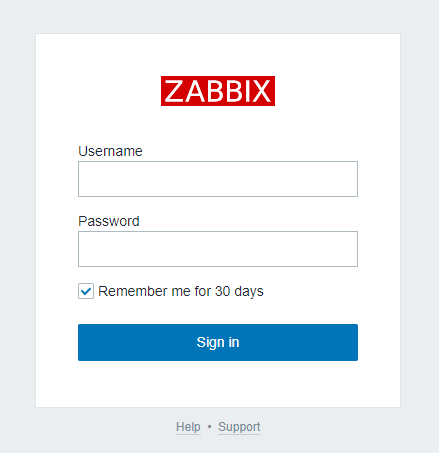

# Zabbixサーバ監視入門

## Environment

- Docker: `19.03.12`
    - docker-compose: `1.26.0`

### Structure
```bash
./
|_ aws/
|  |_ Dockerfile # aws service container 構築設定
|
|_ .env # 環境変数設定ファイル
|_ docker-compose.yml # dockerコンテナ設定ファイル
```

### Docker containers
- networks:
    - **appnet**: `bridge`
        - 本プロジェクトにおけるすべてのコンテナはこのネットワークに所属する
- volumes:
    - **db-data**: `local`
        - db service container 用永続化ボリューム
- services:
    - **web**: `zabbix/zabbix-web-nginx-mysql:alpine-5.2-latest`
        - Zabbix Web UI サーバ
        - http://localhost:{$WEB_PORT} => service://web:8080
            - `.env` の設定: http://localhost:3080
        - 管理画面:
            - ユーザ: `Admin`
            - パスワード: `zabbix`
    - **db**: `mysql:5.7`
        - MySQLデータベースサーバ
        - TCP: service://db:3306
            - ユーザ: `root`
            - パスワード: `root`
            - データベース: `zabbix`
    - **zabbix**: `zabbix/zabbix-server-mysql:alpine-5.2-latest`
        - Zabbixサーバ
        - TCP: service://zabbix:10051
    - **gateway**: `zabbix/zabbix-server-mysql:alpine-5.2-latest`
        - Zabbix用Gateway
        - TCP: service://gateway:10052
    - **aws**: `amazonlinux:2`
        - 動作確認用の監視対象サーバ
            - Apache 2.24 + PHP 7.3
        - HTTP: http://localhost:{$AWS_WEB_PORT} => service://aws:80
            - `.env` の設定: http://localhost:3380
        - SSH: ssh://localhost:{$AWS_SSH_PORT} => service://aws:22
            - `.env` の設定: ssh://localhost:3322

### Setup
```bash
# Dockerコンテナ構築
$ docker-compose build

# Dockerコンテナをバックグラウンドで起動
$ docker-compose up -d

# 各コンテナの起動状況確認（それぞれ起動確認したら Ctrl + C で抜ける）
$ docker-compose logs -f web
$ docker-compose logs -f db
$ docker-compose logs -f zabbix
```

http://localhost:3080 から Zabbix 管理画面にログイン

- ユーザ: `Admin`
- パスワード: `zabbix`



***

## Zabix エージェント導入

AWS EC2 サーバを監視対象と想定し、AmazonLinux2 イメージから構築した `aws` コンテナに Zabbix エージェントを導入する

```bash
# aws コンテナにアタッチ
$ docker-compose exec aws bash

# -- root@service://aws

# logrotate パッケージ導入
% yum update -y && yum install -y logrotate

# zabbix-agent 5.2.0 のリポジトリ取得
% rpm -ivh https://repo.zabbix.com/zabbix/5.2/rhel/7/x86_64/zabbix-agent-5.2.0-1.el7.x86_64.rpm
% yum install -y zabbix-agent

# zabbix-agent の設定ファイル (/etc/zabbix/zabbix_agentd.conf) 確認
## コメントアウトされていない部分のみ表示
% grep -v -e '^\s*#' -e '^\s*$' /etc/zabbix/zabbix_agentd.conf

PidFile=/var/run/zabbix/zabbix_agentd.pid
LogFile=/var/log/zabbix/zabbix_agentd.log
LogFileSize=0
Server=127.0.0.1
ServerActive=127.0.0.1
Hostname=Zabbix server
Include=/etc/zabbix/zabbix_agentd.d/*.conf

# Zabbixサーバのアドレス設定
## 今回は同一Dockerネットワーク内にあるため、Dockerサービス名（zabbix）で通信可能
% sed -i 's/^Server\s*=.*/Server=zabbix/g' /etc/zabbix/zabbix_agentd.conf
% sed -i 's/^ServerActive\s*=.*/ServerActive=zabbix/g' /etc/zabbix/zabbix_agentd.conf

# ホスト名設定 => 今回は `AWS test server`
## ホスト名: Zabbixサーバで監視するときにエージェントのいるサーバを特定するための名称
% sed -i 's/^Hostname\s*=.*/Hostname=AWS test server/g' /etc/zabbix/zabbix_agentd.conf

# 設定を再確認
% grep -v -e '^\s*#' -e '^\s*$' /etc/zabbix/zabbix_agentd.conf

PidFile=/var/run/zabbix/zabbix_agentd.pid
LogFile=/var/log/zabbix/zabbix_agentd.log
LogFileSize=0
Server=zabbix
ServerActive=zabbix
Hostname=AWS test server
Include=/etc/zabbix/zabbix_agentd.d/*.conf

# zabbix-agent のスタートアップ登録＆起動
% systemctl enable zabbix-agent && systemctl start zabbix-agent
```
