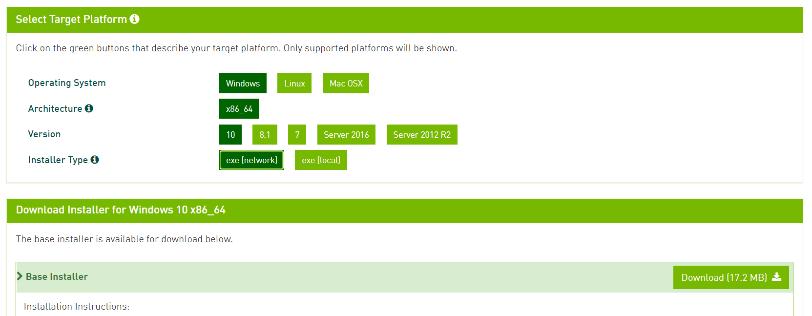
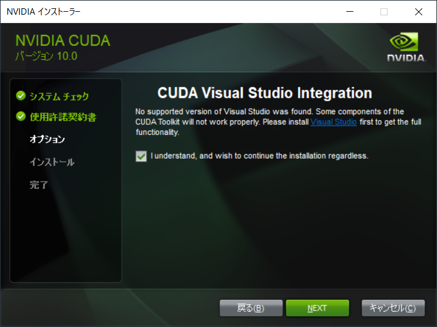
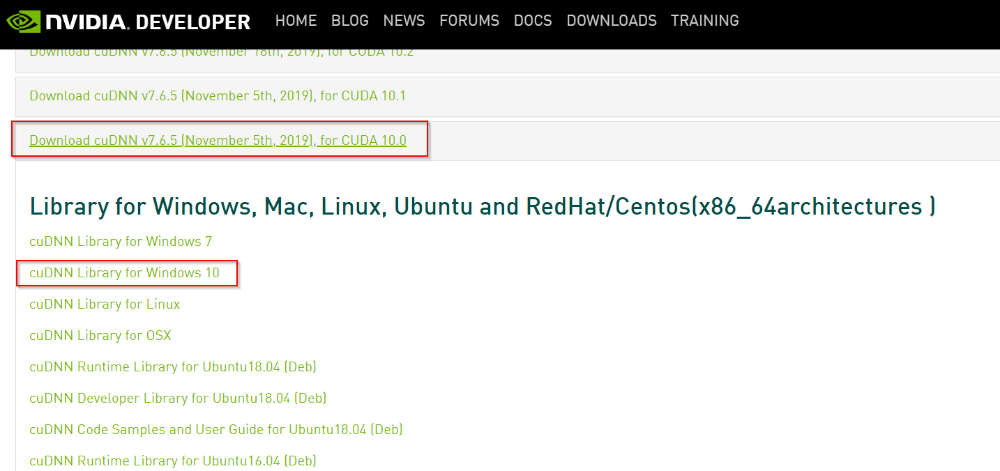
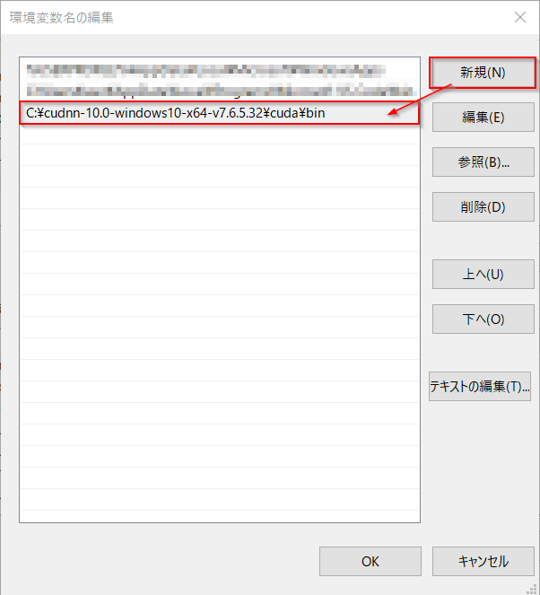

# Windows 10: GPU + Python 環境構築

## Environment

- OS: Windows 10
    - Shell: `PowerShell`
    - PackageManager: `chocolatey`
- GPU: nVidia RTX 2060
    - CUDA Toolkit: `10.0`
    - cuDNN: `7.6.5`

### Setup
- [Visual Studio 2019（コミュニティ版）](https://visualstudio.microsoft.com/ja/downloads/) をダウンロード・インストール
    - **Vidual Studio**:
        - Microsoft Windows の統合開発環境
    - ※追加パッケージは何もインストールしなくてよい
- [CUDA Toolkit 10.0](https://developer.nvidia.com/cuda-10.0-download-archive) をダウンロード・インストール
    - **CUDA Toolkit**:
        - nVidia が提供している GPU 向けプログラミングプラットフォーム
    - Windows > x86_64 > version: 10 をダウンロードしてインストールする
        - 
    - 推奨インストールで進めていき、**Visual Studio Integration** もインストールすること
        - 
        - 先に Visual Studio 2019 をインストールしておかないと、上記インストール画面が出てこないため、要注意
- [cuDNN Archives](https://developer.nvidia.com/rdp/cudnn-archive) から CUDA 10.0 用の cuDNN (執筆時点の最新バージョンは `7.6.5`) をダウンロード
    - **cuDNN**:
        - CUDA Toolkit をディープニューラルネットワークに使うためのライブラリ
        - nVidia Developer への会員登録が必要なためやや面倒だが、各種機械学習用のPythonフレームワークから GPU を使うために必須
    - 
    - Zipファイルをダウンロードしたら、`C:`ドライブ直下などに解凍する
        - cudnn.dll へのパス（例）: `C:\cudnn-10.0-windows10-x64-v7.6.5.32\cuda\bin\cudnn64_7.dll`
- cudnn.dll のパス設定
    - `Win + Pause/Break` キー > システム詳細設定 > 環境変数
        - ユーザ環境変数 > Path:
            - `C:\cudnn-10.0-windows10-x64-v7.6.5.32\cuda\bin\cudnn64_7.dll` を追加
            - 

#### CUDA + cuDNN インストール確認
`Win + X` |> `A` => 管理者権限 PowerShell 起動

```powershell
# CUDA Toolkit 環境変数確認
> echo $env:CUDA_PATH
C:\Program Files\NVIDIA GPU Computing Toolkit\CUDA\v10.0

> echo $env:CUDA_PATH_V10_0
C:\Program Files\NVIDIA GPU Computing Toolkit\CUDA\v10.0

# nvcc (nVidia CUDA Compiler) のバージョン確認
> nvcc --version
Copyright (c) 2005-2018 NVIDIA Corporation
Built on Sat_Aug_25_21:08:04_Central_Daylight_Time_2018
Cuda compilation tools, release 10.0, V10.0.130

# cuDNN dll へのパスが通っているか確認
> Get-Command cudnn64_7.dll

CommandType    Name             Version    Source
-----------    ----             -------    ------
Application    cudnn64_7.dll    6.3.960... C:\cudnn-10.0-windows10-x64-v7.6.5...
```

### Minicondaインストール
- **Miniconda**:
    - 科学計算のための Python 統合開発環境である Anaconda のミニマム版
        - Anaconda との比較: https://insilico-notebook.com/anaconda-vs-miniconda/
    - 複数の Python バージョンを切り替えて使うことができる
    - 各種機械学習用のフレームワークのインストールを容易に行うことができる

`Win + X` |> `A` => 管理者権限 PowerShell 起動

```powershell
# chocolatey を使って miniconda3 をインストール
> choco install -y miniconda3

# => C:\tools\miniconda3 にインストールされる

# Anaconda Prompt を起動
## Windowsスタートメニュー > Anaconda Powershell Prompt (miniconda3) から起動しても良い
> powershell -ExecutionPolicy ByPass -NoExit -Command "& 'C:\tools\miniconda3\shell\condabin\conda-hook.ps1' ; conda activate 'C:\tools\miniconda3' "

# --- user@anaconda

# Python 3.6 環境を `py36` という名前で作成
(base) > conda create --name py36 python=3.6

## 環境を確認する場合は conda info -e
## 環境を削除する場合は conda remove --name py36

# py36 環境にスイッチ
(base) > conda activate py36

# TensorFlow GPU をインストール
(py36) > conda install tensorflow-gpu

# Python + TensorFlow から GPU を認識できているか確認
(py36) > python -c "from tensorflow.python.client import device_lib; device_lib.list_local_devices()"

 :
... -> physical GPU (device: 0, name: GeForce RTX 2060, pci bus id: 0000:01:00.0, compute capability: 7.5)
# -> GPUデバイスを認識していればインストール成功
```
