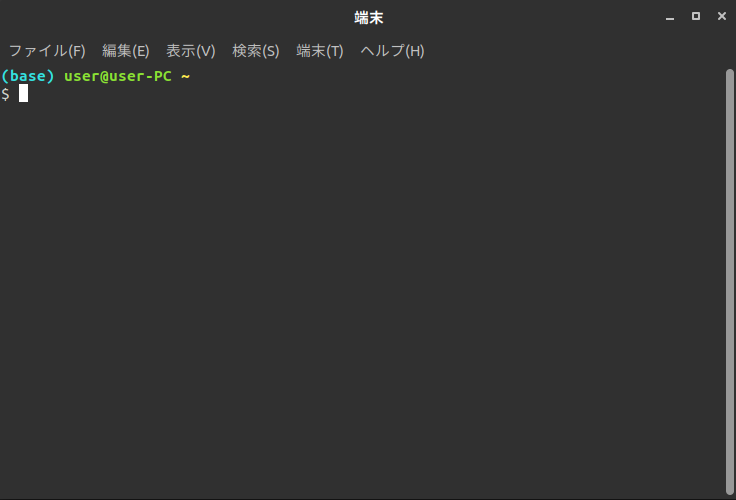

# server-manual

サーバ構築・運用｜私的マニュアル

## 前提: コマンドの記法

### 接頭記号について

#### ターミナル上のコマンドを表す接頭記号
ターミナルとは、コマンドを実行するためのいわゆる「黒い画面」のこと



本ドキュメントにおいては、基本的にターミナル上で実行するコマンドは `$` から始まるように記述している

例として、以下のような記述があった場合は「ターミナル上で `sudo apt update` という文字列を打ち込んで ENTER キーを押す」という操作を表す（`$` という文字は打ち込まない）

```bash
$ sudo apt update
```

また、ターミナル上のコマンドを表す記号として `%` を使うこともあるが、これは root権限（管理者権限）で実行するコマンドを表す

root は通常 `sudo su` というコマンドで昇格できる特殊なユーザであり、システムに関するすべての操作が可能な管理者である（管理者パスワードの入力を要求される場合もある）

例として、以下のような記述があった場合は「`sudo su` というコマンドで rootユーザになった後 `apt update` というコマンドを実行する」という操作を表す（`$` 同様 `%` という文字を打ち込むことはない）

```bash
$ sudo su
% apt update
```

#### コメントを表す接頭記号
コマンドの意味を解説するため、本ドキュメントでは多めにコメントを入れるようにしている

`#` から始まる文字列はコメントを表し、実際にコマンドとして打ち込む必要のない行である

例として、以下のような形で記述される

```bash
# これは単なる解説用のコメントです
## 実際にコマンドとして実行する必要はありません
```

#### PowerShellのコマンドを表す接頭記号
PowerShellとはWindowsにおけるターミナルのようなものである

本ドキュメントでは、Linuxターミナル上での実行コマンドと区別するため `>` から始まる文字列をPowerShell上でのコマンドとして表記している

```powershell
# 以下はPowerShell上で「Restart-Computer」というコマンドを実行するという意味
## $ % と同様に > も実際に打ち込む必要はない
> Restart-Computer
```

### コマンドの引数について
大抵のコマンドは**引数**をとる

引数とはコマンドに渡す特殊なパラメータのことである

例として、ファイルの中身をターミナル上に出力する `cat` コマンドは、これ単体では「どのファイルを見るか」ということが分からない

そういった場合に使うのが引数である

言い換えると、「ぼんやりとした命令を具体的にするための追加命令」が引数であると言っても良い

#### 必須引数
本ドキュメントでは必須引数（必ず指定しなければならない引数）であることを明示的に表すために `<>` という記号を用いている箇所がある

先程の `cat` コマンドを例にとると、「どのファイルを見るのか」ということは必ず指定しないと動きようがないため、以下のようなコマンド記法で必須引数を明示している

```bash
$ cat <ファイル名>
```

上記コマンドは「`cat` コマンドの引数として『ファイル名』を渡さなければならない」ことを意味しており、`<>` を直接ターミナルに打ち込むことはない

#### オプション引数
必須引数とは逆に、必ずしも指定しなくても良い引数をオプション引数と呼ぶ

本ドキュメントではこういった引数を `[]` という記号を用いて記述している箇所がある

例えば `cat` コマンドには行番号を出力するための `-n` というオプションがあるため、それを明示的に示すために以下のように記述している場合がある

```bash
$ cat [-n: 行番号表示] <ファイル名>
```

ただし、全てのオプション引数を常に網羅しようとすると非常に見づらくなるため、主要なオプション引数のみ記述していることがほとんどである

***

## Environment

本マニュアルは、以下の環境を基本として解説している

そのため、異なる環境においては、適宜読み替えて対応すること

- Host:
    - OS:
        - `Ubuntu 20.04`
    - Shell:
        - `bash`
    - Editor: `VSCode`
        - Plugins:
            - `Japanese Language Pack`
            - `Remote WSL`
            - `Git Graph`
            - `gitflow`
            - `Draw.io Integration`
            - `Emoji`
    - Provisioning Tool:
        - `ansible`
    - Development Tool:
        - `docker`
        - `nodejs`
        - `php`
        - `python`
- Server:
    - OS:
        - `CentOS 7`
    - Middleware:
        - Server: `Apache 2.7`
        - Script: `PHP 7.3`
        - Database: `MySQL 5.7`

### Setup
通常、Ubuntu などの Linux 系OSを普段使いしている人は少なく、Windows を使用している人が大多数であると思われる

しかし Windows は、WEB開発を行うホストOSとしては少々扱いづらい

そのため、Windows に何らかの仮想化ソフトウェアを導入し、その上に Linux 系OSをインストールして使うのが基本になる

一昔前までは、VirtualBox + Vagarant で Linux 仮想環境を構築することが多かったが、2020年5月の Windows Update で WSL2 が正式リリースされたため、本マニュアルでは WSL2 の上に Ubuntu Linux 環境を構築することを前提にしている
