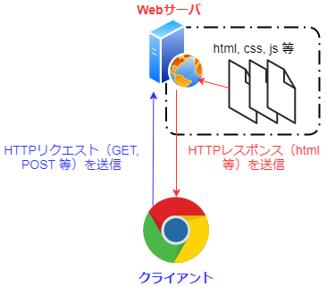
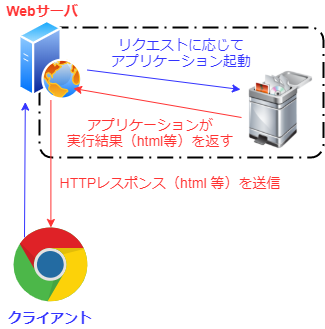
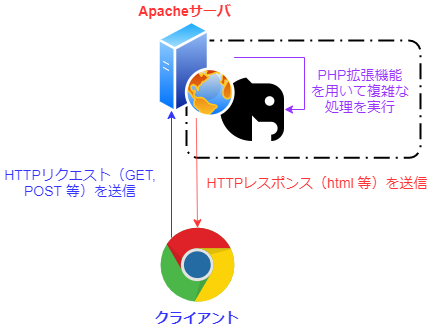
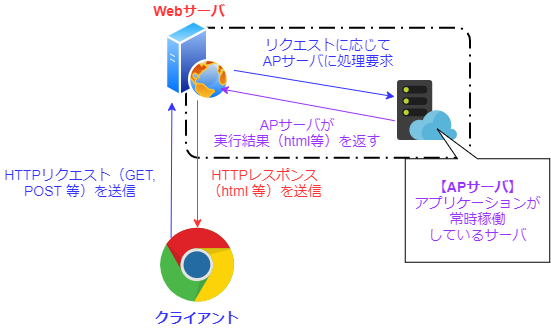
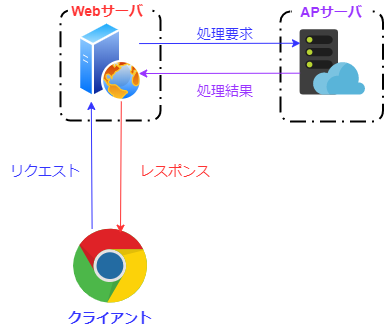

# WebサーバとAPサーバ

- **Webサーバ**
    - クライアント（ユーザーのブラウザ等）から送られてきた自サイトへのリクエストを受け取り、HTML等のレスポンスを返すプログラム
- **APサーバ（アプリケーションサーバ）**
    - アプリケーションをメモリ上に保持しているサーバ
    - Webサーバからリクエストを受け取ると、アプリケーションにそのことを知らせる
    - アプリケーションがリクエストを処理すると、そのレスポンスをWebサーバに返す

## サーバ概念図

### 最も単純なサーバ
HTML, JavaScript, CSS等の静的ファイルのみを配置したサーバは、以下の通り単純な**2層構造**をしている

- もっとも単純で高速
- このサーバでは、動的な処理（ログイン、チャット等）をすることができない

### CGI
2層構造のサーバでは、複雑な処理を行うことができなかった

そのためサーバサイド（サーバコンピュータ内部）でアプリケーションを実行する必要性が出てきた

CGIでは、以下のような**2層構造＋アプリケーション**の組み合わせで複雑な処理を実現する

- 動的な処理が可能
- リクエストの度にアプリケーションを起動するため遅い

### Apache＋PHPモジュール
CGI のようにリクエストの度にアプリケーションを起動するのでは効率が悪い

そのため、Webサーバ（Apache）そのものにアプリケーション（PHP）の機能を追加することにした

これが、Apacheの**mod_php**（PHPモジュール）である

- CGIよりシームレスな動的処理が可能
- Webサーバとアプリケーションがくっついているため、柔軟性に欠ける
    - 例えば、PHPの設定を変える度にApacheを再起動しなければならない

### Webサーバ＋APサーバ
Apache/mod_php のように Webサーバそのものにアプリケーションの機能を実装すると柔軟性に欠ける

そこで、アプリケーション部分を別のサーバ（**APサーバ**）に分離し、**3層構造**としたサーバが現れた

CGIとの違いは、リクエストの度にアプリケーションを起動するのではなく、**アプリケーションがAPサーバ上で常に動作している**という部分である

PHP-FPM に代表される FastCGI も APサーバの一つであると言っても良い

FastCGI などは基本的に同一のマシン内にWebサーバとAPサーバが稼働している構成であるが、WwebサーバとAPサーバが完全に別のマシンで稼働している構成もある

最近のマイクロサービスの流れで現れてきたサーバレスアーキテクチャなどは、各システムが完全に別のマシンで稼働している例の典型である

- CGIよりシームレスな動的処理が可能
- ApacheのPHPモジュールより柔軟な運用が可能

#### APサーバがWebサーバを兼任するパターン
**Node.js**や**Go言語**など、サーバサイドで動くアプリケーションは大抵の場合、HTTPリクエストの処理もできるため、Webサーバの役割を兼任することがある

この場合、APサーバがクライアントと直接通信する**2層構造**となる

- APサーバがWebサーバを兼任するため、処理効率が高い
- 自前でWebサーバの機能を実装する必要がある

***

## Webサーバ

### Apacheとnginxの違い
Apacheとnginxの大きな違いは駆動方式の違い

#### Apache（アパッチ）
- プロセス駆動アーキテクチャ
- マルチプロセス

リクエストが来る度にプロセスを起動し、並列処理を行う

CPUの速度依存性は少ないが、リクエストが大量に来た際、プロセスが同時に起動するのでオーバーヘッドが非常に大きくなるというデメリットがある

- **C10K問題**
    - ハード性能的には問題ないが、クライアントの数が多くなるとサーバがパンクする場合がある
    - 正確に言うと、プロセス番号が足りなくなる
        - UNIX系OSだと最大 32767

#### Nginx（エンジンエックス）
- イベント駆動アーキテクチャ
- シングルスレッドモデル

リクエストをキューに溜めていき、シングルスレッドでループ処理をまわす（**イベントループ方式**）

プロセス数はCPUコア数と基本的には同じに設定

イベントループ方式を採用することで、少量のプロセスだけで大量のリクエストを処理することが可能となり、C10K問題が解決される

一方で、CPUリソースがたくさん必要な処理には向いていない

処理時間が長くなる処理を実行した際、そこでプロセスがブロックされてしまい処理能力が落ちてしまう

***

## Ruby on Rails におけるサーバ

### Webサーバとアプリケーションサーバの違い（翻訳）
[A web server vs. an app server - Justin Weiss（元記事）](http://www.justinweiss.com/articles/a-web-server-vs-an-app-server/)

Railsアプリケーションのデプロイ方法を調べていると、いろんな名前を目にする（Apache, Unicorn, Puma, Phusion Passenger, Nginx, Rainbows ... etc）

こうした名前はどれも「Railsのデプロイ」というカテゴリに関連しているが、重要な違いが一つだけある

一方は「Webサーバ」で、もう一方は「アプリケーションサーバ」である

どれがどのカテゴリに関連し、そのカテゴリがシステムにどう関連するかを理解できないと、自分が何のデプロイをしているのか分からなくなる

### Webサーバとは？
webサーバはユーザーから送られてきた自サイトへのリクエストを受け取り、なんらかの処理を加えるプログラムである

そして、場合によってはRailsアプリケーションにリクエストを投げる

NginxとApacheは最も有名なWebサーバである

CSSやJavaScript、画像など、頻繁に変化しないファイルへのリクエストであれば、Railsアプリケーションがそのリクエストを処理する必要はあまりない

こうした場合、WebサーバはRailsアプリケーションに処理を移譲することなく、そのリクエストを自分で処理できるし、その方が通常は速く処理できる

WebサーバはSSLリクエストや静的なファイル、アセット、圧縮されたリクエスト等を処理したり、その他大半のWebサイトが必要としそうな数多くの処理をこなすことができる

もし、Railsアプリケーションがリクエストを処理しなければならない場合は、WebサーバはリクエストをRailsアプリケーションサーバにパスする

### アプリケーションサーバとは？
アプリケーションサーバはRailsアプリケーションを動かしているものである

アプリケーションサーバは Ruby on Rails のソースコードを読み込み、アプリケーションをメモリに保持する

アプリケーションサーバはWebサーバからリクエストを受け取ると、Railsアプリケーションにそのことを知らせる

アプリケーションがリクエストを処理すると、アプリケーションサーバはそのレスポンスをWebサーバに返す（そのレスポンスは最終的にユーザーへ届く）

大半のアプリケーションサーバはWebサーバを使わずに単体で実行できる（これは開発者がdevelopmentモードでやっていることである）

しかしproduction環境ではWebサーバを手前に置くことが多いはずである

Webサーバは複数のアプリケーションを一度に処理したり、アセットを素早くレンダリングしたり、リクエストごとに発生する多くの処理をさばいてくれるからである

Rails用のアプリケーションサーバは山ほどある

例えば、Mongrel（ただし最近はほとんど使われていない）、Unicorn、Thin、Rainbows、Pumaなどである

それぞれに異なる長所があり、異なる設計思想を持っているが、基本的に全て行っていることは一緒である

つまり、どのアプリケーションサーバもあなたのRailsアプリケーションを動かし、リクエストを処理し続けている

### Passengerの場合は？
Phusion Passengerは少し変わっている

Passengerは「スタンドアローンモード」ではアプリケーションサーバのように動作するが、Webサーバに組み込むこともできる

その場合、Railsアプリケーションを動作させるためにアプリケーションサーバを別に用意する必要はない

この機能はとても便利な場合があります

特に、大量のアプリケーションを実行し、ひとつずつアプリケーションサーバをセットアップするのが面倒な場合に便利である

Passengerをインストールしたら、Webサーバを（アプリケーションサーバでなく）直接Railsアプリケーションに接続してしまえば良い

このように、Passengerはとても便利な選択肢である

とはいえ、アプリケーションサーバは独立して用意する方が良い

アプリケーションサーバを独立して用意しておくと、要件に最も適したアプリケーションサーバを自由に選択できる上、アプリケーションサーバだけを個別に実行したりスケールしたりすることも可能である

### Rackとは？
Rackは魔法である

Rackを使えばどのアプリケーションサーバであってもRailsアプリケーションを動かすことができる（Railsに限らず、SinatraやPadrinoであっても同様に動かすことができる）

RackはRailsのようなRuby製のWebフレームワークとアプリケーションサーバの両方が話せる共通言語のようなものだと考えると分かりやすい

両者が共通言語を理解できるので、RailsはUnicornと話せるし、UnicronはRailsと話せる

しかも、RailsもUnicornも相手のことを知っておく必要は全くない

### Webサーバとアプリケーションサーバはどういう関係なのか？
まず、WebリクエストはWebサーバが受け取る

そのリクエストがRailsで処理できるものであれば、Webサーバはリクエストに簡単な処理を加えてアプリケーションサーバに渡す

アプリケーションサーバはRackを使ってRailsアプリケーションに話しかける

Railsアプリケーションがリクエストの処理を終えると、Railsはレスポンスをアプリケーションサーバに返す

そして、Webサーバはリクエストしてきたユーザーにレスポンスを返す

以上が、Webサーバとアプリケーションサーバの関係である
