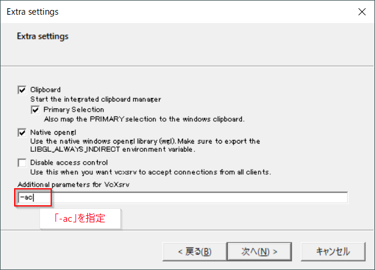
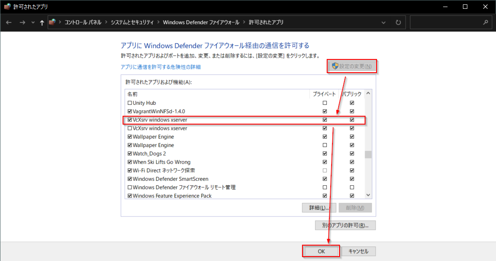
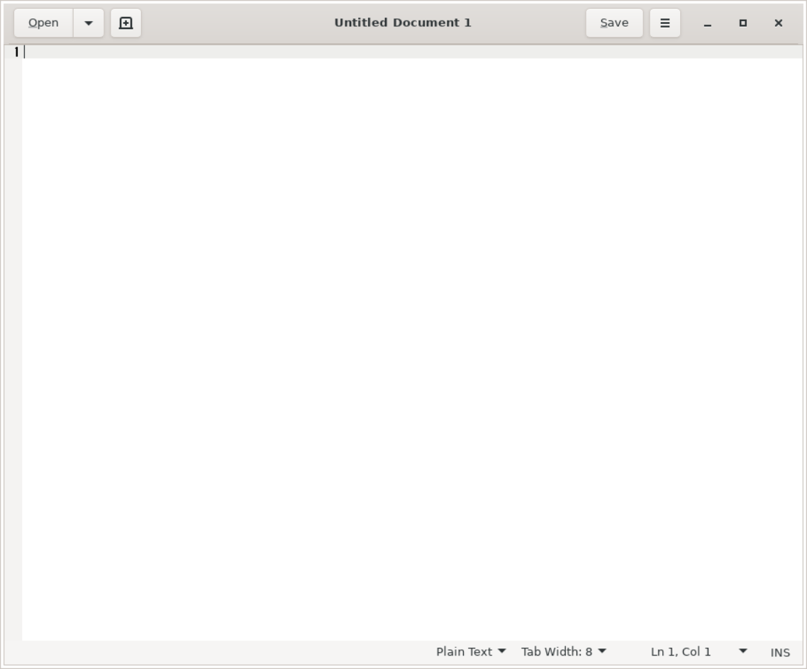
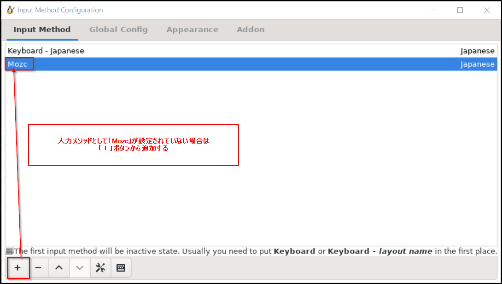

# WSL2 Tips

## WSL2 でスタートアップスクリプトを実行する Hack

WSL2 では起動時に systemd を自動スタートさせたり、`/etc/rc.local` によるスタートアップスクリプトの実行ができない

そのため、Windowsスケジューラによるサービス登録などでなんとかする必要がある

しかし、[WSL2 が起動時に /sbin/mount -a を呼び出すことを利用した Hack](https://linux.srad.jp/story/20/06/25/1855205/) もある

### WSL2用スタートアップスクリプト作成
WSL2 では起動時に `/sbin/mount -a` コマンドが呼び出されるため、これをフックすることで `/sbin/mount.rc` をスタートアップスクリプトとして使うことができる

```bash
# /sbin/mount -a 実行時に rc ファイルシステムをマウントするように設定
$ echo 'none none rc defaults 0 0' | sudo tee -a /etc/fstab

# => これにより起動時に /sbin/mount.rc ファイルが呼び出されるようになる

# /sbin/mount.rc ファイルを実行可能スクリプトとして作成
$ echo '#!/bin/bash' | sudo tee /sbin/mount.rc
$ sudo chmod +x /sbin/mount.rc
```

### 起動時に Docker サービスを開始するように設定
```bash
# service docker start を /sbin/mount.rc に追記
$ echo 'service docker start' | sudo tee -a /sbin/mount.rc

# WSL2 には cgroup 用ディレクトリがデフォルトで作られていないため、これもスタートアップスクリプトに登録しておく
## これをしておかないと Docker でプロセスのグループ化が必要になったときにエラーが起きる
$ echo 'mkdir -p /sys/fs/cgroup/systemd && mount -t cgroup -o none,name=systemd cgroup /sys/fs/cgroup/systemd' | sudo tee -a /sbin/mount.rc
```

***

## VPN 接続

現状、Windows の VPN クライアントを使って VPN 接続すると、WSL2 のネットワークが上手く動かないことが多い

そのため、ルータ等の VPN クライアントを使って VPN 接続することを推奨する

***

## ネットワークドライブ接続

ネットワークドライブをマウントして、WSL2 からネットワークドライブ内ファイルにアクセスできるように設定する

ここでは、ネットワークドライブの共有ディレクトリを `//192.168.1.10/share/`, 接続ユーザを `nas`, 接続パスワードを `pwd` として接続設定を行う

```bash
# -- Ubuntu 20.04 on WSL2

# cifs マウントできるように必要ツールを導入
$ sudo apt install -y cifs-utils

# マウント用ディレクトリ: /mnt/192.168.1.10/ を作成
$ sudo mkdir -p /mnt/192.168.1.10/

# //192.168.1.10/share/ を /mnt/192.168.1.10/ に cifs マウント
$ sudo mount -t cifs -o 'username=nas,password=pwd,sec=ntlm,iocharset=utf8,vers=1.0' //192.168.1.10/share/ /mnt/192.168.1.10/

# => 以降 /mnt/192.168.1.10/ を通して //192.168.1.10/share/ にアクセスできるようになる
# => マウントを解除する場合は
## $ sudo umount /mnt/192.168.1.10/

# システム再起動時に自動でマウントするように設定
## ネットワークドライブに接続できない場合、WSL2 が起動しなくなるので設定しない方が良い
# $ sudo tee -a /etc/fstab << EOS
# //192.168.1.10/share/ /mnt/192.168.1.10/ cifs username=nas,password=pwd,sec=ntlm,iocharset=utf8,vers=1.0
# EOS
```

***

## bashプロンプトの表示設定

bashプロンプトの表示は環境変数 `PS1` で変更可能

例えば、以下のように設定するとプロンプトの表示が`>`のみになる

```bash
$ PS1="> "
> # いつものプロンプトの表示が消え、 > のみが表示されるようになるはず
```

`~/.bashrc` に書いておけば、ログインするたびに設定が有効になる

```bash
$ tee -a ~/.bashrc << EOS
PS1="> "
EOS
```

### PS1に設定できる特殊文字

#### 特殊文字
特殊文字    | 説明
:--         | :--
`\u`        | ユーザ名
`\h`        | ホスト名
`\W`        | カレントディレクトリ
`\w`        | カレントディレクトリ(フルパス)
`\n`        | 改行
`\$`        | 一般ユーザなら`$`／rootユーザなら`#`
`\[`        | 表示されない文字列の開始(端末制御シーケンスをプロンプトに埋め込む)
`\]`        | 表示されない文字列の終了
`\e[...`    | テキストやバックグラウンドの色等の属性を設定する
`\$(...)`   | 文字列展開時に()内のスクリプトを実行する

#### テキスト属性設定
基本的に `"\[\e[属性;色m\]"` という制御構文で指定する

属性番号 | フォント属性
:--      | :--
0        | すべての属性をリセット
1        | 太字
4        | 下線
5        | 点滅
7        | 反転
8        | 非表示

色番号   | フォントカラー
:--      | :--
30       | 黒
31       | 赤
32       | 緑
33       | 黄
34       | 青
35       | マゼンタ
36       | シアン
37       | 白

色番号   | バックグラウンドカラー
:--      | :--
40       | 黒
41       | 赤
42       | 緑
43       | 黄
44       | 青
45       | マゼンタ
46       | シアン
47       | 白

### 使用例
青色太字で`ユーザー名@ホスト名`と表示し、改行して白文字で`$ `と表示したい場合
```bash
PS1="\[\e[1;34m\]\u@\h\n\[\e[0;37m\]\$ "
```

### bashプロンプトにgitブランチ名を表示する
これまでの応用で、bashプロンプトにgitブランチ名を表示できる

以下のようなスクリプトを `~/.bashrc` に追記する
```bash
# gitブランチ名を取得する関数
function parse_git_branch {
    git branch --no-color 2> /dev/null | grep '^\*' | sed -e 's/^\*\s*//'
}
# gitブランチ名を表示する関数
function display_git_branch {
    local branch=$(parse_git_branch)
    # ブランチ名がある場合は" (ブランチ名)"と表示
    if [ "${branch}" != "" ]; then
        echo " (${branch})"
    fi
}
# プロンプトの表示設定
## 緑色太字で`ユーザー名@ホスト名`を表示
## 黄色太字で`カレントディレクトリ(フルパス)`を表示
## 青色太字で`display_git_branch`関数の実行結果を表示
## 白文字に戻したあと改行して`$ `を表示
PS1="\[\e[1;32m\]\u@\h \[\e[1;33m\]\w\[\e[1;34m\]\$(display_git_branch)\[\e[0;37m\]\n\$ "
```

設定したら、シェルを再起動するか `source ~/.bashrc` で .bashrc を再読み込みすれば反映される

***

## WSL2 で GUI アプリケーション実行

VcXsrv を使うことで WSL2 上で Linux GUI アプリケーションを実行することが可能

### Windows側の設定
`Win + X` |> `A` => 管理者権限 PowerShell 起動

```powershell
# Chocolatey パッケージマネージャを導入していない場合は導入
> Set-ExecutionPolicy Bypass -Scope Process -Force; [System.Net.ServicePointManager]::SecurityProtocol = [System.Net.ServicePointManager]::SecurityProtocol -bor 3072; iex ((New-Object System.Net.WebClient).DownloadString('https://chocolatey.org/install.ps1'))

# VcXsrv をインストール
> choco install -y vcxsrv
```

- Windows スタートメニューから `XLaunch` を起動
    - 起動時のダイアログ設定
        - Select display settings: `Multiple Display`
        - Select how to start clients: `Start no client`
        - Extra settings:
            - [x] Clipboard (Primary Selection)
            - [x] Native opengl
            - [ ] Disable access control
            - Additional parameters for VcXsrv: `-ac`



- ファイアウォールの設定
    - VcXsrv の初回起動時にファイアウォールを聞かれたら**パブリックネットワーク**で許可する
        - ※ プライベートネットワークでは WSL2 と通信できず上手く行かない
- 初回起動時のファイアウォールの設定に失敗した場合:
    - `Win + X` |> `N` => Windows 設定 > 更新とセキュリティ
        - Windowsセキュリティ > ファイアウォールとネットワーク保護 > ファイアウォールによるアプリケーションの許可
            - 「設定の変更」ボタンを押して設定編集する
            - `VcXsrv windows xserver` の「プライベート」「パブリック」両方にチェックを入れる



### WSL2 (Ubuntu) 側の設定
```bash
# Xorg GUI 環境をインストール
## Ubuntu では様々な GUI 環境を利用できるため、好みに応じてインストールすれば良い
$ sudo apt update && sudo apt install -y libgl1-mesa-dev xorg-dev

# DISPLAY 環境変数を Windows 側 VcXsrv IP にする
## ログイン時に一度だけ実行されれば良いため ~/.profile に設定
## << \EOS と書くことで内部テキストを変数展開せずに echo 可能
$ tee -a ~/.profile << \EOS
# WSL2 VcXsrv setting
export DISPLAY=$(cat /etc/resolv.conf | grep nameserver | awk '{print $2}'):0.0
EOS

# シェル再起動
$ exec $SHELL -l
```

### 動作確認
動作確認用に gedit (GNOMEデスクトップの標準テキストエディタ) をインストールして起動してみる

```bash
# gedit インストール
$ sudo apt install -y gedit

# gedit 起動
## 後ろに & をつけないと、GUI アプリケーション終了までコマンドを受け付けなくなる
$ gedit &
```

gedit が起動すれば OK



### VcxSrv のスタートアップ登録
上記設定をすると、VcxSrv が起動していないと WSL2 も起動しない状態になる

そのため、Windows 起動時に VcXsrv が起動するようにする

```powershell
# `Win + X` |> `A` => 管理者権限 PowerShell

# WSH を使って Windows スタートアップディレクトリに VcxSrv のショートカット作成
> $wsh = New-Object -ComObject WScript.Shell
> $shortcut = $wsh.CreateShortcut("$env:USERPROFILE\AppData\Roaming\Microsoft\Windows\Start Menu\Programs\Startup\vcxsrv.lnk")

# ショートカット: vcxsrv.exe -multiwindow -ac
> $shortcut.TargetPath = "C:\Program Files\VcXsrv\vcxsrv.exe"
> $shortcut.IconLocation = "C:\Program Files\VcXsrv\vcxsrv.exe"
> $shortcut.Arguments = "-multiwindow -ac"
> $shortcut.Save()
```

これで、Windows 起動時に VcxSrv が `-multiwindow -ac` オプションで起動するようになる

### GUI 日本語化
```bash
$ sudo apt install -y fontconfig

# Windows側のフォントをシンボリックリンクすることで日本語フォントを使用できるようになる
$ sudo ln -s /mnt/c/Windows/Fonts /usr/share/fonts/windows

# フォントキャッシュクリア
$ sudo fc-cache -fv

# 日本語言語パックのインストール
$ sudo apt -y install language-pack-ja

# ロケールを日本語に設定
$ echo 'export LANGUAGE=ja_JP.UTF-8' >> ~/.profile
$ echo 'export LC_ALL=ja_JP.UTF-8' >> ~/.profile
$ exec $SHELL -l
$ sudo update-locale LANG=ja_JP.UTF-8

# いったん終了して再起動すればアプリケーションで日本語が使えるようになる
$ exit

# --- 再起動後 ---

$ exec $SHELL -l

# タイムゾーンをJSTに設定
$ sudo dpkg-reconfigure tzdata
## TUI で設定: Asia > Tokyo

# 日本語 man をインストール
$ sudo apt install -y manpages-ja manpages-ja-dev
```

### GUI で日本語入力可能にする
```bash
# mozc と fcitx を導入
## mozc: 日本語変換エンジン
## fcitx: 入力インタフェース
$ sudo apt -y install fcitx-mozc dbus-x11 x11-xserver-utils
$ dbus-uuidgen | sudo tee /var/lib/dbus/machine-id

# fcitx 設定
$ set -o noclobber

# 必要な環境変数等を ~/.profile に追記
$ tee -a ~/.profile << \EOS
# fcitx 設定
export GTK_IM_MODULE=fcitx
export QT_IM_MODULE=fcitx
export XMODIFIERS="@im=fcitx"
export DefaultIMModule=fcitx
if [ $SHLVL = 1 ] ; then
    # 半角全角点滅防止
    xset -r 49 1>/dev/null 2>/dev/null
    # fcitx 起動
    fcitx-autostart 1>/dev/null 2>/dev/null
fi
EOS

# シェル再起動
$ exec $SHELL -l

# 入力設定確認のため fcitx-config-gtk3 を実行
$ fcitx-config-gtk3
```



入力メソッドとして「Mozc」が設定されているか確認し、「Mozc」が存在しない場合は、下の「＋」ボタンから追加する（日本語化してからインストールした場合は既に設定されているはず）

#### 動作確認
gedit を起動して、日本語入力できるか確認してみる

（入力メソッドを Mozc に切り替えるには `Ctrl + Space` キーを押す）


***

## Google Chrome by Puppeteer on WSL2

せっかく WSL2 上で GUI アプリケーションを実行できるようになったため、Google Chrome ブラウザをインストールしてみる

```bash
# リポジトリ登録
$ echo 'deb http://dl.google.com/linux/chrome/deb/ stable main' | sudo tee /etc/apt/sources.list.d/google-chrome.list
$ wget -q -O - https://dl-ssl.google.com/linux/linux_signing_key.pub | sudo apt-key add -

# google-chrome インストール
$ sudo apt update && sudo apt install google-chrome-stable

# google-chrome 起動
$ google-chrome &

# => Google Chrome ブラウザが起動すればOK
```


### Puppeteer でブラウザ操作してみる
```bash
# puppeteer インストール
$ yarn add puppeteer
```

```javascript
// app.js
const puppeteer = require('puppeteer')
const fs = require('fs')

const main = async () => {
  // headless: false => GUIブラウザ起動モードで puppeteer 起動
  const browser = await puppeteer.launch({
    headless: false
  })
  const page = await browser.newPage();
  // google.com に移動
  await page.goto('https://www.google.com', {waitUntil: 'domcontentloaded'})
  // スクリーンショット保存
  fs.writeFileSync('screenshot.png', await page.screenshot({fullPage: true}))
  // 終了
  await browser.close()
}

main()
```

```bash
# 実行
$ node app.js
```

***

## Calibre (電子書籍読み込み・編集ソフト)

### 導入
普通に apt でインストールすると、上手く動かない古いバージョンがインストールされてしまうため、[公式の手順](https://calibre-ebook.com/download_linux) に沿って導入する

```bash
$ sudo -v && wget --no-check-certificate -nv -O- https://download.calibre-ebook.com/linux-installer.sh | sudo sh /dev/stdin
```

### ebook-convert コマンドを使った電子書籍変換
```bash
# epub形式の電子書籍をpdfに変換
$ ebook-convert book.epub book.pdf
```
