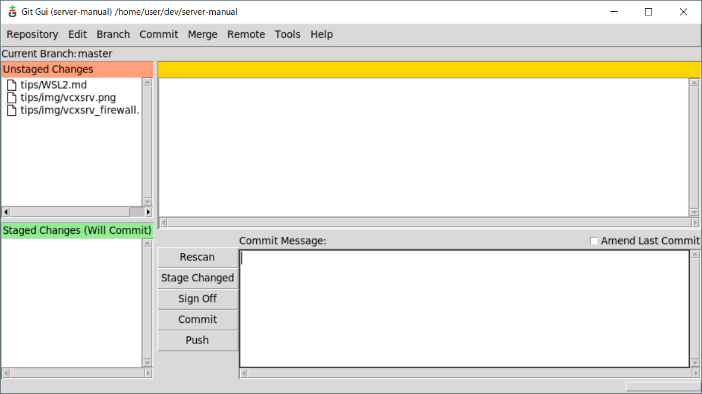
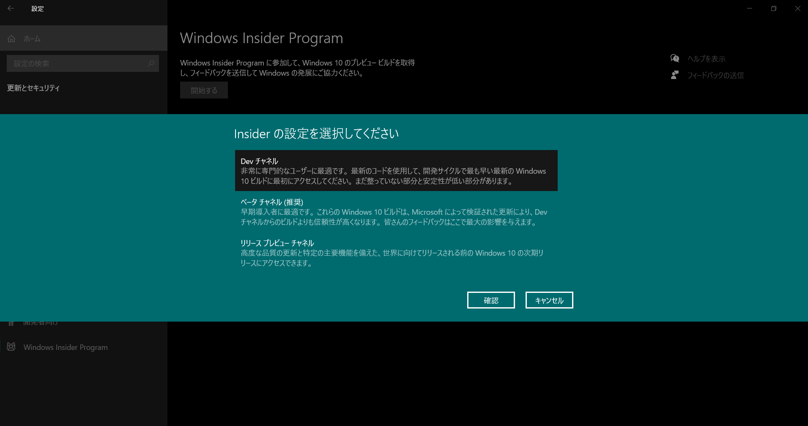

# WSL2 Tips

## VPN 接続

現状、Windows の VPN クライアントを使って VPN 接続すると、WSL2 のネットワークが上手く動かないことが多い

そのため、ルータ等の VPN クライアントを使って VPN 接続することを推奨する

***

## ネットワークドライブ接続

ネットワークドライブをマウントして、WSL2 からネットワークドライブ内ファイルにアクセスできるように設定する

ここでは、ネットワークドライブの共有ディレクトリを `//192.168.1.10/share/`, 接続ユーザを `nas`, 接続パスワードを `pwd` として接続設定を行う

```bash
# -- Ubuntu 20.04 on WSL2

# cifs マウントできるように必要ツールを導入
$ sudo apt install -y cifs-utils

# マウント用ディレクトリ: /mnt/192.168.1.10/ を作成
$ sudo mkdir -p /mnt/192.168.1.10/

# //192.168.1.10/share/ を /mnt/192.168.1.10/ に cifs マウント
$ sudo mount -t cifs -o 'username=nas,password=pwd,sec=ntlm,iocharset=utf8,vers=1.0' //192.168.1.10/share/ /mnt/192.168.1.10/

# => 以降 /mnt/192.168.1.10/ を通して //192.168.1.10/share/ にアクセスできるようになる
# => マウントを解除する場合は
## $ sudo umount /mnt/192.168.1.10/

# システム再起動時に自動でマウントするように設定
## ネットワークドライブに接続できない場合、WSL2 が起動しなくなるので設定しない方が良い
# $ sudo tee -a /etc/fstab << EOS
# //192.168.1.10/share/ /mnt/192.168.1.10/ cifs username=nas,password=pwd,sec=ntlm,iocharset=utf8,vers=1.0
# EOS
```

***

## bashプロンプトの表示設定

bashプロンプトの表示は環境変数 `PS1` で変更可能

例えば、以下のように設定するとプロンプトの表示が`>`のみになる

```bash
$ PS1="> "
> # いつものプロンプトの表示が消え、 > のみが表示されるようになるはず
```

`~/.bashrc` に書いておけば、ログインするたびに設定が有効になる

```bash
$ tee -a ~/.bashrc << EOS
PS1="> "
EOS
```

### PS1に設定できる特殊文字

#### 特殊文字
特殊文字    | 説明
:--         | :--
`\u`        | ユーザ名
`\h`        | ホスト名
`\W`        | カレントディレクトリ
`\w`        | カレントディレクトリ(フルパス)
`\n`        | 改行
`\$`        | 一般ユーザなら`$`／rootユーザなら`#`
`\[`        | 表示されない文字列の開始(端末制御シーケンスをプロンプトに埋め込む)
`\]`        | 表示されない文字列の終了
`\e[...`    | テキストやバックグラウンドの色等の属性を設定する
`\$(...)`   | 文字列展開時に()内のスクリプトを実行する

#### テキスト属性設定
基本的に `"\[\e[属性;色m\]"` という制御構文で指定する

属性番号 | フォント属性
:--      | :--
0        | すべての属性をリセット
1        | 太字
4        | 下線
5        | 点滅
7        | 反転
8        | 非表示

色番号   | フォントカラー
:--      | :--
30       | 黒
31       | 赤
32       | 緑
33       | 黄
34       | 青
35       | マゼンタ
36       | シアン
37       | 白

色番号   | バックグラウンドカラー
:--      | :--
40       | 黒
41       | 赤
42       | 緑
43       | 黄
44       | 青
45       | マゼンタ
46       | シアン
47       | 白

### 使用例
青色太字で`ユーザー名@ホスト名`と表示し、改行して白文字で`$ `と表示したい場合
```bash
PS1="\[\e[1;34m\]\u@\h\n\[\e[0;37m\]\$ "
```

### bashプロンプトにgitブランチ名を表示する
これまでの応用で、bashプロンプトにgitブランチ名を表示できる

以下のようなスクリプトを `~/.bashrc` に追記する
```bash
# gitブランチ名を取得する関数
function parse_git_branch {
    git branch --no-color 2> /dev/null | grep '^\*' | sed -e 's/^\*\s*//'
}
# gitブランチ名を表示する関数
function display_git_branch {
    local branch=$(parse_git_branch)
    # ブランチ名がある場合は" (ブランチ名)"と表示
    if [ "${branch}" != "" ]; then
        echo " (${branch})"
    fi
}
# プロンプトの表示設定
## 緑色太字で`ユーザー名@ホスト名`を表示
## 黄色太字で`カレントディレクトリ(フルパス)`を表示
## 青色太字で`display_git_branch`関数の実行結果を表示
## 白文字に戻したあと改行して`$ `を表示
PS1="\[\e[1;32m\]\u@\h \[\e[1;33m\]\w\[\e[1;34m\]\$(display_git_branch)\[\e[0;37m\]\n\$ "
```

設定したら、シェルを再起動するか `source ~/.bashrc` で .bashrc を再読み込みすれば反映される

***

## WSL2 で GUI アプリケーション実行

VcXsrv を使うことで WSL2 上で Linux GUI アプリケーションを実行することが可能

### Windows側の設定
`Win + X` |> `A` => 管理者権限 PowerShell 起動

```powershell
# Chocolatey パッケージマネージャを導入していない場合は導入
> Set-ExecutionPolicy Bypass -Scope Process -Force; [System.Net.ServicePointManager]::SecurityProtocol = [System.Net.ServicePointManager]::SecurityProtocol -bor 3072; iex ((New-Object System.Net.WebClient).DownloadString('https://chocolatey.org/install.ps1'))

# VcXsrv をインストール
> choco install -y vcxsrv
```

- Windows スタートメニューから `XLaunch` を起動
    - 起動時のダイアログ設定
        - Select display settings: `Multiple Display`
        - Select how to start clients: `Start no client`
        - Extra settings:
            - [x] Clipboard (Primary Selection)
            - [x] Native opengl
            - [ ] Disable access control
            - Additional parameters for VcXsrv: `-ac`


- ファイアウォールの設定
    - VcXsrv の初回起動時にファイアウォールを聞かれたら**パブリックネットワーク**で許可する
        - ※ プライベートネットワークでは WSL2 と通信できず上手く行かない
- 初回起動時のファイアウォールの設定に失敗した場合:
    - `Win + X` |> `N` => Windows 設定 > 更新とセキュリティ
        - Windowsセキュリティ > ファイアウォールとネットワーク保護 > ファイアウォールによるアプリケーションの許可
            - 「設定の変更」ボタンを押して設定編集する
            - `VcXsrv windows xserver` の「プライベート」「パブリック」両方にチェックを入れる


### WSL2 (Ubuntu) 側の設定
```bash
# Xorg GUI 環境をインストール
## Ubuntu では様々な GUI 環境を利用できるため、好みに応じてインストールすれば良い
$ sudo apt install -y libgl1-mesa-dev xorg-dev

# DISPLAY 環境変数を Windows 側 VcXsrv IP にする
## シェルログイン時に一度設定されればよいため ~/.profile に設定を記述
## << \EOS と書くことで内部テキストを変数展開せずに echo 可能
$ sudo tee -a ~/.profile << \EOS
# WSL2 VcXsrv 設定
export DISPLAY=$(cat /etc/resolv.conf | grep nameserver | awk '{print $2}'):0.0
EOS

# シェル再起動
$ exec $SHELL -l
```

### 動作確認
動作確認用に Git GUI をインストールして起動してみる

```bash
# git gui インストール
$ sudo apt install -y git-gui

# git gui 起動
## 後ろに & をつけないと、GUI アプリケーション終了までコマンドを受け付けなくなる
$ git gui &
```

Git GUI が起動すれば OK



### VcxSrv のスタートアップ登録
上記設定をすると、VcxSrv が起動していないと WSL2 も起動しない状態になる

そのため、Windows 起動時に VcXsrv が起動するようにする

```powershell
# `Win + X` |> `A` => 管理者権限 PowerShell

# WSH を使って Windows スタートアップディレクトリに VcxSrv のショートカット作成
> $wsh = New-Object -ComObject WScript.Shell
> $shortcut = $wsh.CreateShortcut("$env:USERPROFILE\AppData\Roaming\Microsoft\Windows\Start Menu\Programs\Startup\vcxsrv.lnk")

# ショートカット: vcxsrv.exe -multiwindow -ac
> $shortcut.TargetPath = "C:\Program Files\VcXsrv\vcxsrv.exe"
> $shortcut.IconLocation = "C:\Program Files\VcXsrv\vcxsrv.exe"
> $shortcut.Arguments = "-multiwindow -ac"
> $shortcut.Save()
```

これで、Windows 起動時に VcxSrv が `-multiwindow -ac` オプションで起動するようになる

### GUI 日本語化
```bash
$ sudo apt install -y fontconfig

# Windows側のフォントをシンボリックリンクすることで日本語フォントを使用できるようになる
$ sudo ln -s /mnt/c/Windows/Fonts /usr/share/fonts/windows

# フォントキャッシュクリア
$ sudo fc-cache -fv

# 日本語言語パックのインストール
$ sudo apt -y install language-pack-ja

# ロケールを日本語に設定
$ sudo update-locale LANG=ja_JP.UTF8

# いったん終了して再起動すればアプリケーションで日本語が使えるようになる
$ exit

# --- 再起動後 ---

# タイムゾーンをJSTに設定
$ sudo dpkg-reconfigure tzdata
## TUI で設定: Asia > Tokyo

# 日本語 man をインストール
$ sudo apt install -y manpages-ja manpages-ja-dev
```

### GUI で日本語入力可能にする
```bash
# mozc と fcitx を導入
## mozc: 日本語変換エンジン
## fcitx: 入力インタフェース
$ sudo apt -y install fcitx-mozc dbus-x11 x11-xserver-utils
$ dbus-uuidgen | sudo tee /var/lib/dbus/machine-id

# fcitx 設定
$ set -o noclobber

# 必要な環境変数等を ~/.profile に追記
$ sudo tee -a ~/.profile << \EOS
# fcitx 設定
export GTK_IM_MODULE=fcitx
export QT_IM_MODULE=fcitx
export XMODIFIERS="@im=fcitx"
export DefaultIMModule=fcitx
if [ $SHLVL = 1 ] ; then
    # 半角全角点滅防止
    xset -r 49 1>/dev/null 2>/dev/null
    # fcitx 起動
    fcitx-autostart 1>/dev/null 2>/dev/null
fi
EOS

# シェル再起動
$ exec $SHELL -l
```

設定後、適当な GUI アプリケーションを実行し、日本語入力できるようになっていれば OK

***

## Google Chrome by Puppeteer on WSL2

せっかく WSL2 上で GUI アプリケーションを実行できるようになったため、Google Chrome ブラウザをインストールしてみる

```bash
# リポジトリ登録
$ echo 'deb http://dl.google.com/linux/chrome/deb/ stable main' | sudo tee /etc/apt/sources.list.d/google-chrome.list
$ wget -q -O - https://dl-ssl.google.com/linux/linux_signing_key.pub | sudo apt-key add -

# google-chrome インストール
$ sudo apt update && sudo apt install google-chrome-stable

# google-chrome 起動
$ google-chrome

# => Google Chrome ブラウザが起動すればOK
```

### Puppeteer でブラウザ操作してみる
```bash
# puppeteer インストール
$ yarn add puppeteer
```

```javascript
// app.js
const puppeteer = require('puppeteer')
const fs = require('fs')

const main = async () => {
  // headless: false => GUIブラウザ起動モードで puppeteer 起動
  const browser = await puppeteer.launch({
    headless: false
  })
  const page = await browser.newPage();
  // google.com に移動
  await page.goto('https://www.google.com', {waitUntil: 'domcontentloaded'})
  // スクリーンショット保存
  fs.writeFileSync('screenshot.png', await page.screenshot({fullPage: true}))
  // 終了
  await browser.close()
}

main()
```

```bash
# 実行
$ node app.js
```

***

## CUDA on WSL2

WSL2 で GPU (CUDA) を使えるようにする

- 参考:
    - https://qiita.com/ksasaki/items/ee864abd74f95fea1efa
    - https://qiita.com/yukoba/items/c4a45435c6ee5d66706d

### Environment
- OS: Windows 10 Insider Preview Build 20150 以降
    - Insider Preview に参加していない場合:
        1. `Win + X` |> `N` => 設定ダイアログ
        2. 更新とセキュリティ > Window Insider Preview > 開始する
        3. 「DEVチャンネル」に参加する
            - 
        4. 再起動する
        5. `Win + X` |> `N` => 設定 > 更新とセキュリティ > Windows Update
            - 更新のチェックから最新ビルドバージョンをダウンロード＆インストールする
        6. Updateのインストールが完了して OS Build version 20150 以降になればOK
            - OS Build version は 設定 > システム > 詳細情報 から確認
- GPU: nVidia GeForce RTX 2060

### WSL2 起動時にマウントエラーが起こる場合
Ubuntu 20.04 on WSL2 を起動したときに、「ファイル システムの 1 つをマウント中にエラーが発生しました。」という旨のエラーメッセージが出ることがある

この場合は https://wslstorestorage.blob.core.windows.net/wslblob/wsl_update_x64.msi から最新の WSL2 Linux カーネルをダウンロードし、インストールする

その後、`wsl --shutdown` コマンドで一旦 WSL2 をシャットダウンし、再び `wsl` を起動すれば大抵直る

### Update
WSL2 Linux カーネルバージョンが `4.9.121` 以上である必要があるため、バージョン確認＆アップデートを行う

`Win + X` |> `A` => 管理者権限 PowerShell 起動

```powershell
# カーネルバージョン確認
## 規定ディストロ以外のLinuxカーネルバージョンを確認したい場合は
## > wsl -d <ディストロ名> uname -r
> wsl uname -r
4.19.121-microsoft-standard

# 上記で確認したバージョンが 4.19.121 未満である場合はアップデートする
## 規定ディストロ以外のLinuxカーネルバージョンをアップデートしたい場合は
## > wsl -d <ディストロ名> --update
> wsl --update
```

### Setup
- 参考:
    - [待ってました CUDA on WSL2](https://qiita.com/ksasaki/items/ee864abd74f95fea1efa) で上手くインストールできなかったため、[WSL 2 で GPU を使う](https://www.kkaneko.jp/tools/wsl/wsl_tensorflow2.html) を参考
    - [ついにWSL2+docker+GPUを動かせるようになったらしいので試してみる](https://qiita.com/yamatia/items/a70cbb7d8f5101dc76e9)

[NVIDIA Drivers for CUDA on WSL](https://developer.nvidia.com/cuda/wsl/download) から WSL2 用の CUDA ドライバをダウンロード＆インストールする（nVidia Developer メンバー登録が必要）

CUDA on WSL ドライバをインストールしたら WSL2 環境で CUDA Toolkit 等をインストールする

```bash
# -- Ubuntu 20.08 on WSL2

# CUDA Toolkit インストール
## Ubuntu 20.04 では CUDA 10.1 がインストールされる
$ sudo apt -yV install nvidia-cuda-dev nvidia-cuda-toolkit nvidia-cuda-toolkit-gcc

# pyenv で Python 3.8.5 インストール
$ pyenv install 3.8.5

# python => 2.7.18
# python3 => 3.8.5
$ pyenv global 2.7.18 3.8.5

# GPU版 Tensorflow 導入
$ pip3 install --upgrade pip setuptools
$ pip3 install tensorflow-gpu tensorflow_datasets

# GPUが認識できているか確認
$ python3 -c "from tensorflow.python.client import device_lib; print(device_lib.list_local_devices())"
 :
physical_device_desc: "device: XLA_CPU device"
, name: "/device:XLA_GPU:0" # <= GPUを認識していることを確認
device_type: "XLA_GPU"
memory_limit: 17179869184
 :
```

### Dockerで動かす
```bash
# nvidia-docker2 導入
## 現在 nvidia-docker2 は非推奨で nvidia-container-toolkit を導入するほうが良いが、
## nvidia-docker2 インストール時に nvidia-container-toolkit も一緒にインストールされるため
## とりあえず以下のインストールコマンドでOK
$ distribution=$(. /etc/os-release;echo $ID$VERSION_ID)
$ curl -s -L https://nvidia.github.io/nvidia-docker/gpgkey | sudo apt-key add -
$ curl -s -L https://nvidia.github.io/nvidia-docker/$distribution/nvidia-docker.list | sudo tee /etc/apt/sources.list.d/nvidia-docker.list
$ curl -s -L https://nvidia.github.io/libnvidia-container/experimental/$distribution/libnvidia-container-experimental.list | sudo tee /etc/apt/sources.list.d/libnvidia-container-experimental.list
$ sudo apt update && sudo apt install -y nvidia-docker2

# docker 再起動
$ sudo service docker restart

# 動作確認
$ docker run --gpus all nvcr.io/nvidia/k8s/cuda-sample:nbody nbody -gpu -benchmark
 :
> Windowed mode
> Simulation data stored in video memory
> Single precision floating point simulation
> 1 Devices used for simulation
MapSMtoCores for SM 7.5 is undefined.  Default to use 64 Cores/SM
GPU Device 0: "GeForce RTX 2060" with compute capability 7.5 # <= GPU認識

> Compute 7.5 CUDA device: [GeForce RTX 2060]
30720 bodies, total time for 10 iterations: 62.380 ms
= 151.285 billion interactions per second
= 3025.707 single-precision GFLOP/s at 20 flops per interaction
```

### GPU対応 ffmpeg 導入
- 参考:
    - https://qiita.com/yamakenjp/items/7474f210efd82bb28490
    - https://kinakoankon.net/ubuntu-20-04-ffmpeg-4-3-nvenc-hevc-h265-gtx-1050/

```bash
# nvidia-driver 440 (API v9.1) インストール
$ sudo apt install -y libnvidia-encode-440

# nasm, yasm, automake, cmake インストール
$ brew install nasm yasm automake cmake

# /usr/local/src/ のパーミッションを自分所有にする
$ sudo chown -R $USER /usr/local/src/

# libx264 導入
$ cd /usr/local/src/
$ git clone https://code.videolan.org/videolan/x264
$ cd x264
$ ./configure --enable-static --enable-pic
$ make -j$(nproc)
$ sudo make install

# libvpx 導入
$ cd /usr/local/src/
$ git clone https://chromium.googlesource.com/webm/libvpx
$ cd libvpx
$ ./configure --disable-examples --disable-unit-tests --enable-vp9-highbitdepth --as=yasm
$ make -j$(nproc)
$ sudo make install

# libfdk-aac 導入
$ cd /usr/local/src/
$ git clone https://github.com/mstorsjo/fdk-aac
$ cd fdk-aac
$ brew install
$ autoreconf -fiv
$ ./configure --disable-shared
$ make -j$(nproc)
$ sudo make install

# libmp3lame 導入
$ cd /usr/local/src/
$ wget -O - https://downloads.sourceforge.net/project/lame/lame/3.100/lame-3.100.tar.gz | tar -xzvf -
$ cd lame-3.100
$ ./configure --disable-shared --enable-nasm
$ make -j$(nproc)
$ sudo make install

# libopus 導入
$ cd /usr/local/src/
$ git clone  https://github.com/xiph/opus
$ cd opus
$ ./autogen.sh && ./configure --disable-shared
$ make -j$(nproc)
$ sudo make install

# libaom 導入
$ cd /usr/local/src/
$ git clone https://aomedia.googlesource.com/aom
$ mkdir aom_build
$ cd aom_build
$ cmake -G "Unix Makefiles" -DENABLE_SHARED=off -DENABLE_NASM=on ../aom
$ make -j$(nproc)
$ sudo make install

# nv-codec-headers 導入
$ cd /usr/local/src/
$ git clone https://git.videolan.org/git/ffmpeg/nv-codec-headers
$ cd nv-codec-headers
## libnvidia-encode-440 の API バージョンは 9.1 のため、それ用のブランチに checkout
$ git checkout sdk/9.1
$ make -j$(nproc)
$ sudo make install

# ffmpeg 4.3.1 導入
$ cd /usr/local/src/
$ wget -O - http://ffmpeg.org/releases/ffmpeg-4.3.1.tar.gz | tar -xzvf -
$ cd ffmpeg-4.3.1
## nv-codec-headers は /usr/local/lib/ にインストールされるため
## PKG_CONFIG_PATH に /usr/local/lig/pkgconfig を指定してセットアップ
$ PKG_CONFIG_PATH='/usr/local/lib/pkgconfig' ./configure \
    --pkg-config-flags='--static' \
    --extra-cflags='-I/usr/local/include' \
    --extra-ldflags='-L/usr/local/lib' \
    --extra-libs='-lpthread -lm' \
    --enable-openssl \
    --enable-gpl \
    --enable-libaom \
    --enable-libass \
    --enable-libfdk-aac \
    --enable-libfreetype \
    --enable-libmp3lame \
    --enable-libopus \
    --enable-libvorbis \
    --enable-libvpx \
    --enable-libx264 \
    --enable-libx265 \
    --enable-static \
    --enable-cuda \
    --enable-cuvid \
    --enable-nvenc \
    --enable-libnpp \
    --enable-nonfree
$ make -j$(nproc)
$ sudo make install

# ffmpeg のエンコーダとして nvenc が使えるか確認
$ ffmpeg -encoders | grep nvenc

# GPUを使って（hevc_nvenc encoder）適当な mp4 動画を webm に変換
$ ffmpeg -i 'test.mp4' -vcodec hevc_nvenc 'test.webm'

## => WSL2 環境だと上手くGPUを認識してくれず失敗
```
