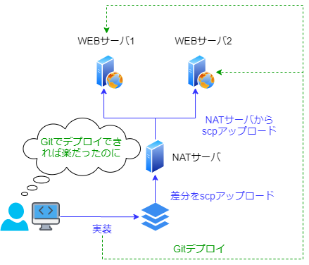

# git差分ファイル抽出

## 背景

- とある二次請けの案件（Laravelフレームワークで作られたシステムの改修）
- 2つのWEBサーバに冗長化されている
- STGサーバはPRDと乖離していて使えない
- Gitによるデプロイは使えない
    - 手動で差分ファイルをアップロードしなければならない
    - 差分ファイルは一次請けのシステム会社に納品しなければならない
    - 一次請けのシステム会社が作業した場合は、その差分ファイルがzipで送られてくるため、手動でマージする必要がある
- デプロイ方法:
    1. NATサーバに差分ファイルを scp でアップロード
    2. NATサーバから2つのWEBサーバに scp でファイルアップロード
    3. 差分ファイルを一次請けのシステム会社に納品



### 問題点
- 手動で差分ファイルを抽出すると、漏れが発生する
    - 結果、本番環境でシステムエラーを起こしてしまうという事故が発生
- 片方のWEBサーバで scp アップロードし忘れたファイルがあったりして、やはり事故が発生

***

## 解決方法

- ローカル開発用の Git リポジトリを作成
- `git diff` コマンドを駆使して差分ファイルを抽出
- 差分ファイル抽出から scp アップロードまでの作業をシェルスクリプト化して、人力でのアップロードを回避

参考: [忘れやすい人のための git diff チートシート](https://qiita.com/shibukk/items/8c9362a5bd399b9c56be)

### 作成したシェルスクリプト
```bash
#!/bin/bash
# Usage: ./diff-scp <commit_sha> <upload_dest_dir>

# 差分ファイルを抽出したいgitコミットSHAを引数から取得
sha=$1

# scpアップロード先ディレクトリ（ドキュメントルート）を引数から取得
dest=$2

# 差分ファイル格納用ディレクトリ作成
## ※ 古いものは削除
if [ -d './diff' ]; then
    rm -rf ./diff
fi
mkdir ./diff

# 当該コミットで差分の生じたファイルを列挙
# |> ./diff/ にコピー（--parent オプションでディレクトリ構造を維持）
git diff $sha^..$sha --name-only | while read file; do
    cp --parent "$file" ./diff/
done

# ./diff/ をNATサーバにscpアップロード
## あらかじめ ~/.ssh/config で nat 接続情報を設定しておく
scp -r ./diff/ nat:/tmp/

# NATサーバにSSH接続して、そこから web1, web2 サーバにscpアップロード
## ↓は Pseudo-terminal will not be allocated の警告メッセージが出るが、
## 今回はコマンドを打ち逃げするだけのための無視
### 参考: https://takat.exblog.jp/12216326/
ssh nat << CMD
    # diff/ の中身だけ web1, web2 サーバにアップロード
    scp -r /tmp/diff/* web1:$dest
    scp -r /tmp/diff/* web2:$dest

    # diff/ 削除
    rm -rf /tmp/diff
CMD
```
