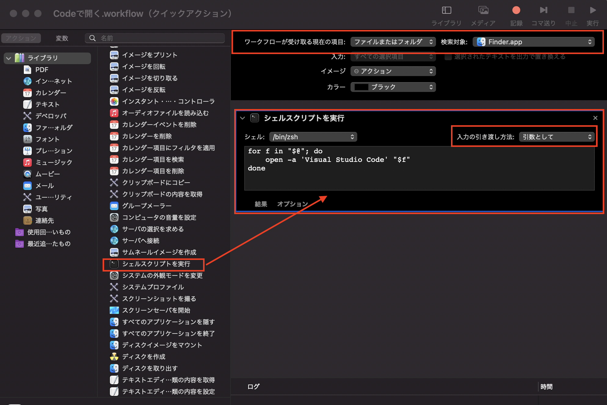

# macOS初期設定

## システムアップデート

- ソフトウェアアップデート
    - Apple > このMacについて > ソフトウェアアップデート
- App Store アップデート
    - Apple > App Store > すべてアップデート

***

## 各種システム関連設定・開発環境構築

`Command` + `Space` |> `terminal.app` => ターミナル起動

```bash
# シェルの確認
## macOS Catalina からデフォルトシェルが zsh に変わっている
## ~/.zshrc 等の代わりに ~/.zshrc 等がプロファイラになるため注意
$ echo $SHELL
/bin/zsh

# --- システム設定 ---

# バッテリー残量を％表記に
## 元に戻したい場合: defaults write com.apple.menuextra.battery ShowPercent
$ defaults write com.apple.menuextra.battery ShowPercent -string "YES"

# ネットワークフォルダに.DS_Storeを作らない
$ defaults write com.apple.desktopservices DSDontWriteNetworkStores -bool true

# --- Finder 設定 ---

# 隠しファイル表示
## 元に戻したい場合: defaults write com.apple.finder AppleShowAllFiles
$ defaults write com.apple.finder AppleShowAllFiles -boolean true

# 拡張子を常に表示
$ defaults write NSGlobalDomain AppleShowAllExtensions -bool true

# タイトルバーにフルパスを表示
$ defaults write com.apple.finder _FXShowPosixPathInTitle -bool true

# ステータスバーを表示
$ defaults write com.apple.finder ShowStatusBar -bool true

# パスバーを表示
$ defaults write com.apple.finder ShowPathbar -bool true

# --- Homebrew 導入 ---
## Homebrew: macOS CLI用のパッケージマネージャ
### WindowsにおけるChocolatey, LinuxにおけるLinuxbrewのようなもの

# Homebrew インストール
## 最近のインストーラは自動的に Xcode Command Line Tools も入れてくれるため、一通りの開発環境は簡単に整う
$ /bin/bash -c "$(curl -fsSL https://raw.githubusercontent.com/Homebrew/install/master/install.sh)"

# Homebrew を一応アップデート
$ brew update

# Homebrew でインストールしたパッケージのアップデート
$ brew upgrade

# Homebrew バージョン確認
$ brew --version
Homebrew 3.2.6

# --- GUI アプリケーションのインストール ---
## 基本的に GUI アプリケーションのインストールは Homebrew Cask で入れたほうが管理が楽
## Homebrew Cask: GUI用パッケージマネージャ
### 以前は `brew cask` という別コマンドだったが、2.8 以降 Homebrew に統合され `brew --cask` というオプションとなった

# Google Chrome ブラウザインストール
$ brew --cask install google-chrome

# VSCode エディタインストール
$ brew --cask install visual-studio-code
```

### Homebrew で「Could not resolve HEAD to a revision」エラーが出る場合
基本的に Homebrew で何かしらエラーが出た場合は `brew doctor` コマンドを打って、その指示に従えば良い

以下は問題解決の例

```bash
# エラー解決法を検索
$ brew doctor

# homebrew/core が正しく tap されていないのを修正
$ rm -rf "/opt/homebrew/Library/Taps/homebrew/homebrew-core"
$ brew tap homebrew/core

# git の default origin を修正
$ git -C $(brew --repo homebrew/core) checkout master
```

### Finder のコンテキストメニューに「Codeで開く」を追加
- `Command` + `Space` |> `automator.app`
    - 新規書類 > クイックアクション
        - ワークフローが受け取る現在の項目: `ファイルまたはフォルダ`
        - 検索対象: `Finder.app`
        - ワークフローに `シェルスクリプトを実行` を追加
            - シェル: `/bin/zsh`
            - 入力の引き渡し方法: `引数として`
            - スクリプトは以下の通り

```bash
for f in "$@"; do
    open -a 'Visual Studio Code' "$f"
done
```



- 続き:
    - `Commad` + `S` (保存) |> `Codeで開く`
        - => `~/Library/Services/Codeで開く.workflow` に保存される
    - => Finder でファイル・フォルダを右クリックしたときに「Codeで開く」メニューが表示されるようになる


### anyenv 環境構築
以降、シェルは zsh である前提のため、シェルプロファイルは `.zshrc` としている

デフォルトシェルを変更している場合は適宜読み替えること

```bash
# Linuxbrew で anyenv 導入
$ brew install anyenv
$ anyenv install --init
## Do you want to checkout ? [y/N]: <= y

# anyenv 初期化スクリプトを .zshrc に記述
$ echo 'eval "$(anyenv init -)"' >> ~/.zshrc
$ source ~/.zshrc

# anyenv update plugin の導入
$ mkdir -p $(anyenv root)/plugins
$ git clone https://github.com/znz/anyenv-update.git $(anyenv root)/plugins/anyenv-update
$ anyenv update

# バージョン確認
$ anyenv -v
anyenv 1.1.4
```

### Node.js 環境構築
フロントエンド開発で Node.js は導入必須のため、nodenv を使って Node.js 環境を構築する

```bash
# anyenv を使って nodenv 導入
## nodenv を使うことで、複数バージョンの Node.js 環境を構築できる
$ anyenv install nodenv
$ exec $SHELL -l

## nodenv-yarn-install プラグイン導入: nodenv install 時に yarn もインストールする
$ mkdir -p "$(nodenv root)/plugins"
$ git clone https://github.com/pine/nodenv-yarn-install.git "$(nodenv root)/plugins/nodenv-yarn-install"
$ echo 'export PATH="$HOME/.yarn/bin:$PATH"' >> ~/.zshrc

# Node.js インストール可能なバージョンを確認
$ nodenv install --list

# Node.js 14.17.4 インストール
$ touch $(nodenv root)/default-packages
$ nodenv install 14.17.4

# Node.js 14.17.4 に切り替え
$ nodenv global 14.17.4

# 現在選択されているバージョンを確認
$ nodenv versions
* 14.17.4 (set by ~/.anyenv/envs/nodenv/version)

# 一度シェルを再起動しないと Node.js が使えない
$ exec $SHELL -l

# バージョン確認
$ node -v
v14.17.4

$ yarn -v
1.22.10
```

### VSCode で Swift 開発環境を整える
基本的に macOS での開発（主に Swift 言語）は Xcode 環境を前提としているが、VSCode で開発したい場合は **sourcekit-lsp** (Swift 用の Language Server Protocol) を使う

sourcekit-lsp のビルドに Xcode Command Line Tools と Node.js が必要なため、未導入の場合には導入しておく

- Xcode Command Line Tools:
    - 最新の Homebrew を導入する際に自動的に入るはず
    - 入っていない場合は `xcode-select --install` コマンドで導入可能
- Node.js:
    - 基本的には nodenv や nvm のような複数バージョンの Node.js 管理ができる環境を導入すると良い
    - Node.js のバージョンは基本的に 12.x 以降を入れておけば間違いないはず

```bash
# sourcekit-lsp リポジトリを ~/sourcekit-lsp/ に clone
$ git clone https://github.com/apple/sourcekit-lsp.git ~/sourcekit-lsp

# VSCode extension をビルド
$ cd ~/sourcekit-lsp/Editors/vscode/
$ npm install
$ npm run dev-package

# VSCode に sourcekit-lsp extension インストール
$ code --install-extension sourcekit-lsp-development.vsix
```
